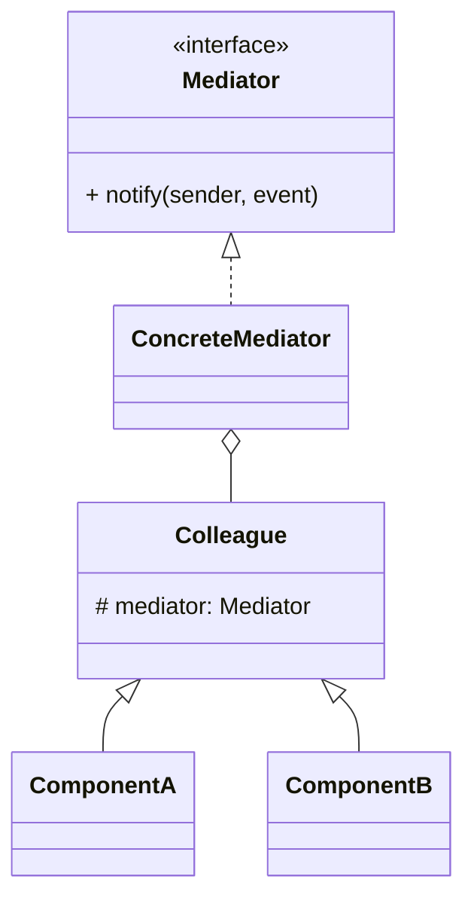

# 中介者模式（Mediator）

> 所属分类：**行为型** 　|　 返回：[设计模式分类](../设计模式分类.md)


## 意图
用一个中介对象来封装一系列的对象交互，使得各对象不需要显式地相互引用，从而降低耦合，并可以独立改变它们之间的交互。

## 结构（类图）


## 示例代码
```java
interface Mediator { void notify(Colleague s, String e); }
class ChatRoom implements Mediator {        // 中介者集中协调
    public void notify(Colleague s, String e){ System.out.println(s.name + ":" + e); }
}
abstract class Colleague {
    String name; Mediator m;
    Colleague(Mediator m, String n){ this.m = m; this.name = n; }
}
```

## 适用场景
- UI 控件的联动（表单校验、按钮启用）、聊天室、空中交通管制、微服务编排。

## 与相似模式区别
- 与**观察者**：中介者**双向/集中协调**；观察者**单向广播**且订阅关系松散。
- 与**外观**：中介者双向交互；外观单向封装。
