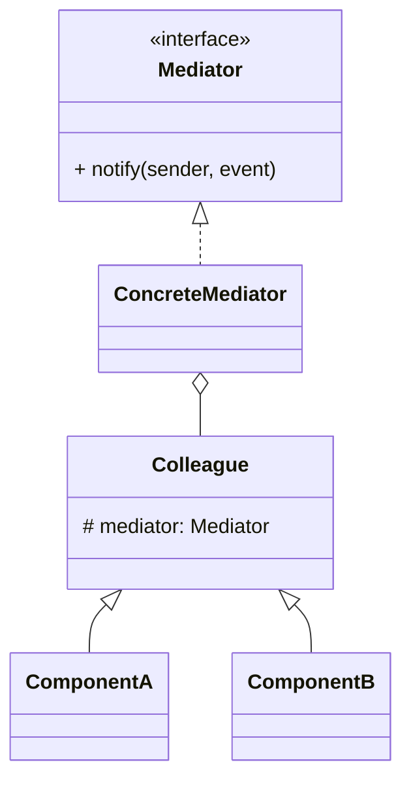

# 中介者模式（Mediator）

> 所属分类：**行为型** 　|　 返回：[设计模式分类](../设计模式分类.md)

> **一句话定义**：用一个**中介对象**封装一组对象间的交互，把对象间的**网状耦合**变成**星型协调**——各对象不再直接互相引用。

## 意图

用一个中介对象来封装一系列的对象交互，使得各对象不需要显式地相互引用，从而降低耦合，并可以独立改变它们之间的交互。

## 结构（类图）



## 示例代码

```java
interface Mediator { void notify(Colleague s, String e); }
class ChatRoom implements Mediator {        // 中介者集中协调
    private List<Colleague> members = new ArrayList<>();
    public void register(Colleague c){ members.add(c); }
    public void notify(Colleague s, String e){
        for (Colleague m : members) if (m != s) m.receive(s, e);
    }
}
abstract class Colleague {
    String name; Mediator m;
    Colleague(Mediator m, String n){ this.m = m; this.name = n; }
    abstract void receive(Colleague from, String msg);
}
```

### 深挖：网状耦合 → 星型协调（中介者的核心收益）

```mermaid
graph TD
    subgraph 直接耦合(网状)
        A1[A] --> B1[B]
        A1 --> C1[C]
        B1 --> C1
    end
    subgraph 中介者(星型)
        A2[A] --> M2[Mediator]
        B2[B] --> M2
        C2[C] --> M2
    end
```

- **n 个对象直接互调**：关系数 O(n²)，改一个牵全身；**经中介者**：关系数 O(n)，交互逻辑集中一处。
- 典型：表单控件联动（输入框内容改变 → 按钮可用性/校验提示联动）、航班预订流程（多子系统协作）、微服务编排。
- **与观察者对比**：观察者『主题广播，订阅者被动』；中介者『任意同事可主动发起，中介协调』——Spring 事件总线两者兼有。

## 适用场景

- UI 控件的联动（表单校验、按钮启用）、聊天室、空中交通管制、微服务编排。

## 与相似模式区别

- 与**观察者**：中介者**双向/集中协调**；观察者**单向广播**且订阅关系松散。
- 与**外观**：中介者双向交互；外观单向封装。

## 不适用场景（反例）

- 对象间**本来就只耦合一两个**——直接调用更简单，中介者反而多一层。
- 中介者膨胀成**上帝对象**（所有逻辑都在里面）——应把行为下放到各同事或拆多个中介者。
- 同事对象**完全无复用必要**且生命周期短——成本不划算。

## 在 JDK / Spring / 开源中的真实应用

- **JDK**：`Timer` 内部单线程统一调度 `TimerTask`（任务不直接互调，经 Timer 中介）；`ExecutorService` 调度任务。
- **Spring**：`ApplicationEventPublisher` 事件总线（发布者与监听者互不直接依赖）；`DispatcherServlet` 居中协调。
- **GUI**： Swing 组件通过 `Mediator` 协调（如按钮禁用联动文本框）。
- **MQ Broker**：生产/消费通过 Broker 中介，互不感知——分布式中介者。

## 实现要点与常见坑

- **防止中介者变庞大**：把可独立的行为下沉到同事类，中介者只做『协调/路由』。
- **与外观区别**：外观是『对外封装子系统』单向；中介者是『同事间互相通信』的协调中心。
- **松耦合代价**：调试时消息流向不直观，需要清晰的事件/方法命名。

## 生产实践与重构信号

1. **重构信号**：一个组件的变化导致 3 个以上组件联动、引用四处散落 → 抽中介者。
2. **事件类型枚举化**：`notify(sender, OrderEvent)` 用枚举 + 类型化参数，避免字符串魔法值。
3. **分层中介**：多个小中介者（表单协调器/流程编排器）优于一个上帝中介者。
4. **编排（Orchestration）即中介者**：微服务编排器协调多个服务调用——分布式版中介者。

## 面试高频追问（20+ 条）

1. Q：中介者解决什么？ A：集中封装一组对象间的交互，降低对象间网状耦合为星型。
2. Q：中介者 vs 观察者？ A：中介者让对象通过它互相调用（双向协调）；观察者是一方发布、多方被动接收（一对多）。
3. Q：中介者 vs 外观？ A：外观单向封装供外部；中介者双向协调同事间通信。
4. Q：Spring 事件机制算中介者吗？ A：ApplicationEventPublisher 是发布-订阅，偏向观察者；但都起到解耦作用。
5. Q：中介者反模式？ A：逻辑全堆进 Mediator 变成上帝类。
6. Q：何时用中介者？ A：对象间引用复杂、改动一处牵连多处（如表单控件联动）。
7. Q：中介者与消息队列关系？ A：MQ Broker 是跨进程中介者：生产者/消费者互不感知。
8. Q：中介者降低耦合的代价？ A：中介者成为单点（变胖）、消息流向不直观、调试难度上升。
9. Q：如何避免中介者膨胀？ A：行为下沉到同事、按场景拆多个小中介者、事件类型化。
10. Q：中介者在微服务里？ A：编排服务（Orchestrator）协调各服务，Saga 编排模式即中介者思想。
11. Q：与「门面」一起用会冲突吗？ A：不冲突：门面对外封装、中介者对内协调。
12. Q：中介者模式性能？ A：多一次间接调用，可忽略；瓶颈通常是中介者内的集中逻辑。
13. Q：事件名怎么设计？ A：用枚举 + 参数对象，类型安全；避免裸字符串。
14. Q：中介者需要单例吗？ A：通常一个协调实例（注入单例）；按业务域拆多个。
15. Q：观察者 vs 中介者怎么选？ A：『一方广播、多方订阅』选观察者；『多方互相通知、交互复杂』选中介者。
16. Q：中介者里的循环调用怎么防？ A：事件触发同事方法时，同事不应再反向经中介发同类事件，避免死循环。
17. Q：中介者 vs 责任链？ A：中介者协调多方；责任链是请求沿链传递。
18. Q：GUI 表单联动怎么实现中介者？ A：每个控件持有中介者引用，值变化时 notify 中介者，中介者统一更新其他控件状态。
19. Q：中介者符合什么原则？ A：迪米特法则（最少知识）、单一职责（协调集中）。
20. Q：中介者能否和状态模式结合？ A：能，中介者内部用状态机管理协调流程的不同阶段。

## 速记口诀

> **「网状耦合乱如麻，中介星型收一家；同事互调经它转，上帝膨胀要分家。」**
> 中介者（双向协调）≠ 观察者（单向广播）≠ 外观（单向封装）。
