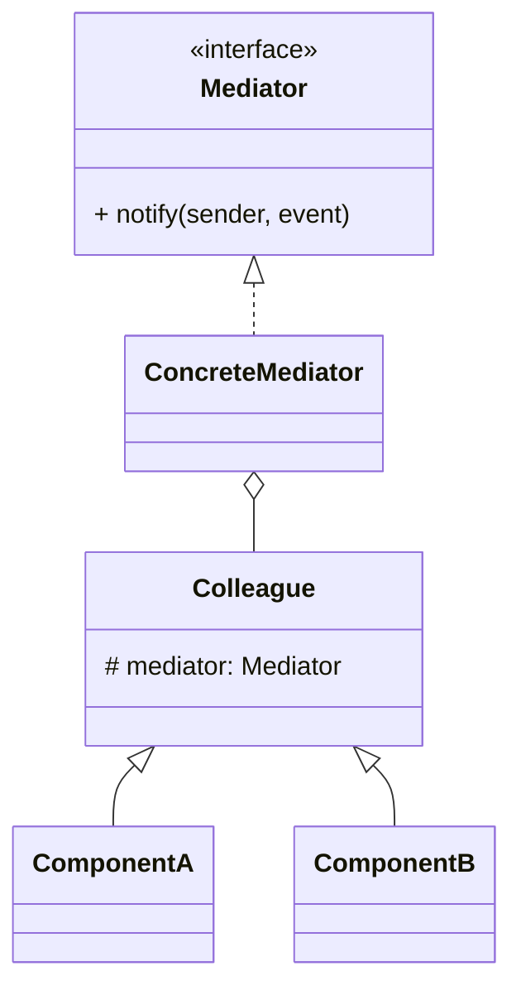

# 中介者模式（Mediator）

> 所属分类：**行为型** 　|　 返回：[设计模式分类](../设计模式分类.md)


## 意图
用一个中介对象来封装一系列的对象交互，使得各对象不需要显式地相互引用，从而降低耦合，并可以独立改变它们之间的交互。

## 结构（类图）


## 示例代码
```java
interface Mediator { void notify(Colleague s, String e); }
class ChatRoom implements Mediator {        // 中介者集中协调
    public void notify(Colleague s, String e){ System.out.println(s.name + ":" + e); }
}
abstract class Colleague {
    String name; Mediator m;
    Colleague(Mediator m, String n){ this.m = m; this.name = n; }
}
```

## 适用场景
- UI 控件的联动（表单校验、按钮启用）、聊天室、空中交通管制、微服务编排。

## 与相似模式区别
- 与**观察者**：中介者**双向/集中协调**；观察者**单向广播**且订阅关系松散。
- 与**外观**：中介者双向交互；外观单向封装。

## 不适用场景（反例）

- 对象间**本来就只耦合一两个**——直接调用更简单，中介者反而多一层。
- 中介者膨胀成**上帝对象**（所有逻辑都在里面）——应把行为下放到各同事或拆多个中介者。
- 同事对象**完全无复用必要**且生命周期短——成本不划算。

## 在 JDK / Spring / 开源中的真实应用

- **JDK**：`Timer` 内部单线程统一调度 `TimerTask`（任务不直接互调，经 Timer 中介）；`java.util.concurrent.ExecutorService` 调度任务。
- **Spring**：`ApplicationEventPublisher` 事件总线（发布者与监听者互不直接依赖）；`DispatcherServlet` 居中协调。
- **GUI**： Swing 组件通过 `Mediator` 协调（如按钮禁用联动文本框）。

## 实现要点与常见坑

- **防止中介者变庞大**：把可独立的行为下沉到同事类，中介者只做『协调/路由』。
- **与外观区别**：外观是『对外封装子系统』单向；中介者是『同事间互相通信』的协调中心。
- **松耦合代价**：调试时消息流向不直观，需要清晰的事件/方法命名。

## 面试高频追问

1. Q：中介者解决什么？ A：集中封装一组对象间的交互，降低对象间网状耦合为星型。
2. Q：中介者 vs 观察者？ A：中介者让对象通过它互相调用（双向协调）；观察者是一方发布、多方被动接收（一对多）。
3. Q：中介者 vs 外观？ A：外观单向封装供外部；中介者双向协调同事间通信。
4. Q：Spring 事件机制算中介者吗？ A：ApplicationEventPublisher 是发布-订阅，偏向观察者；但都起到解耦作用。
5. Q：中介者反模式？ A：逻辑全堆进 Mediator 变成上帝类。
6. Q：何时用中介者？ A：对象间引用复杂、改动一处牵连多处（如表单控件联动）。
