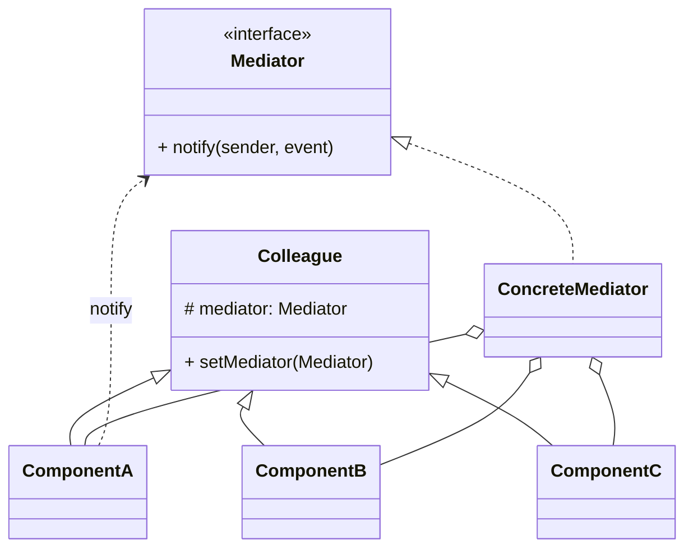

# 中介者模式（Mediator）

> 所属分类：**行为型** 　|　 返回：[设计模式分类](../设计模式分类.md)

> **一句话定义**：用一个**中介对象**封装一组对象间的交互，把对象间的**网状耦合**变成**星型协调**——各对象不再直接互相引用，改由中介者统一路由。
> **英文**：Mediator Pattern 　|　 **意图（GoF）**：Define an object that encapsulates how a set of objects interact. Promotes loose coupling by keeping objects from referring to each other explicitly, and lets you vary their interaction independently.

---

## 一、意图与解决的问题

当系统中 n 个对象彼此直接引用、互相调用时，依赖关系会爆炸成 O(n²) 的网：

```java
// 坏味道：A 直接调 B、B 直接调 C、C 又回头调 A，牵一发动全身
class A { B b; C c;
  void f() { b.g(); c.h(); }   // A 知道 B、C 的存在与接口
}
class B { A a; C c; void g() { a.f(); c.h(); } }
```

痛点：
1. **耦合度高**：改一个对象的接口，所有直接引用它的对象都要改。
2. **复用困难**：对象被"绑死"在特定的协作方上，无法单独拿出去复用。
3. **逻辑分散**：交互规则散落在每个对象的代码里，没有"一处可看全貌"的地方。

中介者把"对象之间怎么交互"收口到一个中心对象，每个同事对象只认识中介者，不再认识彼此：

> 💡 核心思想：**用"中心协调"替代"点对点网状依赖"，让交互规则集中、可独立演进。**

---

## 二、结构（类图）



- **Mediator（抽象中介者）**：定义同事对象之间通信的接口（通常 `notify(sender, event)`）。
- **ConcreteMediator（具体中介者）**：实现协调逻辑，持有所有同事对象引用，知道"谁该响应谁"。
- **Colleague（同事/组件）**：只持有中介者引用，自身变化通过 `notify` 上报，不直接调其他同事。

---

## 三、经典 Java 实现（聊天室）

```java
interface Mediator { void register(Colleague c); void notify(Colleague sender, String evt); }

abstract class Colleague {
    protected String name;
    protected Mediator mediator;
    Colleague(Mediator m, String n) { this.mediator = m; this.name = n; }
    abstract void receive(Colleague from, String msg);
    public void send(String evt) { mediator.notify(this, evt); }
}

class ChatRoom implements Mediator {
    private final List<Colleague> members = new ArrayList<>();
    public void register(Colleague c) { members.add(c); }
    public void notify(Colleague sender, String evt) {
        for (Colleague m : members)
            if (m != sender) m.receive(sender, evt);   // 由中介者决定转发给谁
    }
}

class User extends Colleague {
    User(Mediator m, String n) { super(m, n); }
    void receive(Colleague from, String msg) {
        System.out.println(name + " 收到 " + from.name + " 的消息: " + msg);
    }
}

// 使用：用户只认识 ChatRoom，不认识彼此
ChatRoom room = new ChatRoom();
User alice = new User(room, "Alice");  room.register(alice);
User bob   = new User(room, "Bob");    room.register(bob);
alice.send("大家好");   // Bob 收到，Alice 自己是发送方不收
```

> 关键收益：User 类完全不知道还有哪些 User，新增一个 User 只需 `register`，**零改已有代码**。

---

## 四、深挖：网状耦合 → 星型协调（核心收益图）

```mermaid
graph TD
    subgraph 直接耦合:网状 O(n2)
        A1[A] --> B1[B]
        A1 --> C1[C]
        A1 --> D1[D]
        B1 --> C1
        B1 --> D1
        C1 --> D1
    end
    subgraph 中介者:星型 O(n)
        A2[A] --> M2[Mediator]
        B2[B] --> M2
        C2[C] --> M2
        D2[D] --> M2
    end
```

- **n 个对象直接互调**：关系数 O(n²)，改一个牵全身；**经中介者**：关系数 O(n)，交互逻辑集中一处。
- 典型：表单控件联动（输入框内容改变 → 按钮可用性/校验提示联动）、航班预订流程（多子系统协作）、微服务编排（Orchestrator）。
- **与观察者对比**：观察者『主题广播，订阅者被动接收』；中介者『任意同事可主动发起，中介协调谁响应』——Spring 事件总线两者思想兼有，但重心不同。

---

## 五、深挖：事件类型化与防循环

```java
// 事件用枚举 + 参数对象，避免裸字符串魔法值，类型安全
enum UiEvent { TEXT_CHANGED, BUTTON_CLICKED, VALIDATION_FAILED }

interface UiMediator {
    void notify(Colleague sender, UiEvent evt, Object payload);
}

class FormMediator implements UiMediator {
    private final TextField nameField;
    private final Button submitBtn;
    public FormMediator(TextField f, Button b) { this.nameField = f; this.submitBtn = b; }

    public void notify(Colleague sender, UiEvent evt, Object payload) {
        switch (evt) {
            case TEXT_CHANGED -> submitBtn.setEnabled(!nameField.isEmpty());  // 联动禁用
            case BUTTON_CLICKED -> {
                if (nameField.isEmpty()) { /* 触发校验失败事件，不回发同事件防循环 */ }
                else System.out.println("提交: " + nameField.text());
            }
        }
    }
}
```

> **防循环调用铁律**：同事在 `notify` 处理里**绝不能**再发"同类事件"给自己，否则会形成 `A→中介→B→中介→A` 的死循环。若需要链式反应，应使用**不同的事件类型**或显式 `depth` 计数器。

---

## 六、深挖：分层中介者（避免上帝中介）

当把"所有交互"塞进一个 Mediator 时，它会变成上帝对象。正确做法是**按业务域拆多个小中介者**：

| 写法 | 做法 | 评价 |
|------|------|------|
| 上帝中介 | 一个 `SystemMediator` 处理所有交互 | ❌ 膨胀成 God Object，改一处全变 |
| 用例中介 | `FormMediator`（表单联动）、`OrderMediator`（下单编排） | ✅ 按场景拆分，高内聚 |
| 分层中介 | 子系统自带中介，上层再组合 | ✅ 复杂系统首选 |

---

## 七、与相似模式区别

| 对比 | 中介者 | 观察者 | 外观 | 责任链 |
|------|--------|--------|------|--------|
| 关系 | 双向/集中协调 | 一对多广播 | 单向封装 | 单请求串行 |
| 方向 | 多同事经它互调 | 主题→订阅者 | 外→子 | 链传递 |
| 典型 | 表单联动、编排器 | 事件总线 | JdbcTemplate | Filter 链 |

- 与**观察者**：中介者**双向/集中协调**；观察者**单向广播**且订阅关系松散。
- 与**外观**：中介者双向协调同事间通信；外观单向封装子系统供外部用。

---

## 八、适用场景

- UI 控件联动（表单校验、按钮启用、多步骤向导）。
- 聊天室、空中交通管制、多子系统协作流程。
- 微服务**编排器（Orchestrator）**——Saga 编排模式即分布式版中介者。
- MQ Broker 也是跨进程的中介者：生产者/消费者互不感知。

---

## 九、不适用场景（反例）

- 对象间**本来就只耦合一两个**——直接调用更简单，中介者反而多一层间接。
- 中介者膨胀成**上帝对象**（所有逻辑都在里面）——应把行为下放到各同事或拆多个中介者。
- 同事对象**完全无复用必要**且生命周期短——成本不划算。

---

## 十、在 JDK / Spring / 开源中的真实应用

- **JDK**：`Timer` 内部单线程统一调度 `TimerTask`（任务不直接互调，经 Timer 中介）；`ExecutorService` 调度任务。
- **Spring**：`ApplicationEventPublisher` 事件总线（发布者与监听者互不直接依赖，偏向观察者，但解耦目标一致）；`DispatcherServlet` 居中协调 HandlerMapping/HandlerAdapter/ViewResolver。
- **GUI**：Swing 组件通过 `Mediator` 协调（按钮禁用联动文本框）。
- **MQ Broker**：生产/消费经 Broker 中介，互不感知——分布式中介者。

---

## 十一、实现要点与常见坑

1. **防止中介者变庞大**：把可独立的行为下沉到同事类，中介者只做『协调/路由』。
2. **与外观区别**：外观是『对外封装子系统』单向；中介者是『同事间互相通信』的协调中心。
3. **松耦合代价**：调试时消息流向不直观，需要清晰的事件/方法命名与 tracing。
4. **循环调用**：同事在 notify 中再发同类事件 → 死循环，必须靠事件类型隔离或深度计数。

---

## 十二、生产实践与重构信号

1. **重构信号**：一个组件的变化导致 3 个以上组件联动、引用四处散落 → 抽中介者。
2. **事件类型枚举化**：`notify(sender, OrderEvent)` 用枚举 + 类型化参数，避免字符串魔法值。
3. **分层中介**：多个小中介者（表单协调器/流程编排器）优于一个上帝中介者。
4. **编排（Orchestration）即中介者**：微服务编排器协调多个服务调用——分布式版中介者。
5. **可观测**：在中介者入口记录事件流水（traceId + 事件类型 + 触发方），便于排查"为什么没联动"。

---

## 十三、反模式案例

### 案例：上帝中介者

```java
// 反模式：所有交互逻辑都堆在 Mediator，改一处牵全身
class GodMediator implements Mediator {
    void notify(Colleague s, String e) {
        if (e.equals("a")) { /* 50 行表单逻辑 */ }
        else if (e.equals("b")) { /* 80 行下单逻辑 */ }
        else if (e.equals("c")) { /* 60 行报表逻辑 */ }
        // ... 膨胀到上千行
    }
}
```

**修正**：拆成 `FormMediator`/`OrderMediator`/`ReportMediator`，各自只管一个业务域。

---

## 十四、面试高频追问（30 条）

1. Q：中介者解决什么？ A：集中封装一组对象间的交互，降低对象间网状耦合为星型。
2. Q：中介者 vs 观察者？ A：中介者让对象通过它互相调用（双向协调）；观察者是一方发布、多方被动接收（一对多）。
3. Q：中介者 vs 外观？ A：外观单向封装供外部；中介者双向协调同事间通信。
4. Q：Spring 事件机制算中介者吗？ A：ApplicationEventPublisher 是发布-订阅，偏向观察者；但都起到解耦作用。
5. Q：中介者反模式？ A：逻辑全堆进 Mediator 变成上帝类。
6. Q：何时用中介者？ A：对象间引用复杂、改动一处牵连多处（如表单控件联动）。
7. Q：中介者与消息队列关系？ A：MQ Broker 是跨进程中介者：生产者/消费者互不感知。
8. Q：中介者降低耦合的代价？ A：中介者成为单点（变胖）、消息流向不直观、调试难度上升。
9. Q：如何避免中介者膨胀？ A：行为下沉到同事、按场景拆多个小中介者、事件类型化。
10. Q：中介者在微服务里？ A：编排服务（Orchestrator）协调各服务，Saga 编排模式即中介者思想。
11. Q：与「门面」一起用会冲突吗？ A：不冲突：门面对外封装、中介者对内协调。
12. Q：中介者模式性能？ A：多一次间接调用，可忽略；瓶颈通常是中介者内的集中逻辑。
13. Q：事件名怎么设计？ A：用枚举 + 参数对象，类型安全；避免裸字符串。
14. Q：中介者需要单例吗？ A：通常一个协调实例（注入单例）；按业务域拆多个。
15. Q：观察者 vs 中介者怎么选？ A：『一方广播、多方订阅』选观察者；『多方互相通知、交互复杂』选中介者。
16. Q：中介者里的循环调用怎么防？ A：事件触发同事方法时，同事不应再反向经中介发同类事件，避免死循环。
17. Q：中介者 vs 责任链？ A：中介者协调多方；责任链是请求沿链传递。
18. Q：GUI 表单联动怎么实现中介者？ A：每个控件持有中介者引用，值变化时 notify 中介者，中介者统一更新其他控件状态。
19. Q：中介者符合什么原则？ A：迪米特法则（最少知识）、单一职责（协调集中）。
20. Q：中介者能否和状态模式结合？ A：能，中介者内部用状态机管理协调流程的不同阶段。
21. Q：中介者和 EventBus 区别？ A：EventBus 是通用发布-订阅总线（观察者升级版），中介者更强调"中心协调多方交互"；EventBus 常用于进程内解耦，中介者常用于有向交互编排。
22. Q：中介者适合高并发场景吗？ A：中介者本身是单线程协调语义；并发下需把状态变更做成线程安全或无状态，必要时每请求一个 Mediator 实例。
23. Q：DDD 中中介者对应什么？ A：领域事件 + 领域服务编排；Saga 编排器本质是分布式中介者。
24. Q：中介者能替代观察者吗？ A：不能互相替代——观察者适合"广播通知"，中介者适合"多方定向协调"。
25. Q：为什么同事不直接持有彼此引用？ A：直接引用导致强耦合、难测试；经中介者后每个同事可独立单测（只 mock 中介者）。
26. Q：中介者如何测试？ A：mock 同事对象，验证"给定事件 → 中介者触发了正确的同事方法"。
27. Q：中介者和中介者模式与控制器（Controller）？ A：Controller 常充当 Web 层的中介者——协调 Service 调用并组装响应。
28. Q：中介者会导致性能瓶颈吗？ A：若所有交互都过单个实例且内含重逻辑，会成为热点；按域拆分 + 异步处理可缓解。
29. Q：面向对象里中介者和过程式"大函数"区别？ A：过程式把逻辑堆在一个函数；中介者把交互建模成对象关系，同事可独立复用、可单测。
30. Q：中介者模式过时了吗？ A：没有，它在 UI 框架、编排器、事件总线中仍是核心解耦手段，只是常以"事件总线/编排器"的现代形态出现。

---

## 十五、速记口诀（Summary）

> **「网状耦合乱如麻，中介星型收一家；同事互调经它转，上帝膨胀要分家。」**
> 中介者（双向协调）≠ 观察者（单向广播）≠ 外观（单向封装）。

---

## 十六、关联阅读

- 行为型：[观察者模式](观察者模式.md) · [状态模式](状态模式.md) · [命令模式](命令模式.md)
- 结构型：[外观模式](../结构型/外观模式.md)（单向封装 vs 中介者双向协调）
- 架构实践：Saga 编排、API 网关、Spring `ApplicationEventPublisher`
