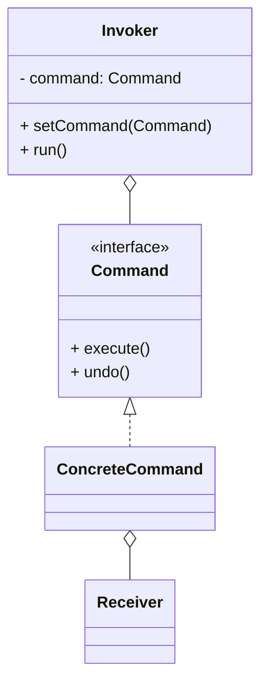

# 命令模式（Command）

> 所属分类：**行为型** 　|　 返回：[设计模式分类](../设计模式分类.md)

> **一句话定义**：把「请求」封装成**对象**，从而支持参数化、队列化、日志化与撤销/重做——发送者与执行者彻底解耦。

## 意图

将一个请求封装为一个对象，从而使你可用不同的请求、队列或日志来参数化其他对象，并支持可撤销操作。

## 结构（类图）



## 示例代码

```java
interface Command { void execute(); void undo(); }
class LightOnCommand implements Command {
    private Light light;
    public LightOnCommand(Light l){ this.light = l; }
    public void execute(){ light.on(); }
    public void undo(){ light.off(); }
}
class RemoteControl {                       // 调用者
    private Command slot;
    void setCommand(Command c){ slot = c; }
    void press(){ slot.execute(); }
    void pressUndo(){ slot.undo(); }
}
```

### 深挖：Runnable/Callable 就是命令——任务队列与撤销

```java
// JDK 把「要执行的动作」封装成对象（命令）交给线程池
ExecutorService pool = Executors.newFixedThreadPool(4);
pool.submit(() -> System.out.println("task"));      // 匿名 Runnable = 命令对象
Future<String> f = pool.submit(() -> "result");     // Callable = 带返回值的命令

// 撤销栈：每次执行入栈 undo 命令（组合命令）
Deque<Runnable> undoStack = new ArrayDeque<>();
void runAndRecord(Command c) {
    c.execute();
    undoStack.push(c::undo);                         // 记住怎么撤销
}
void undo() { if (!undoStack.isEmpty()) undoStack.pop().run(); }
```

- **命令模式的四角色**：Command（封装动作+接收者）、Receiver（真正干活）、Invoker（触发）、Client（组装）。
- **工程收益**：延迟执行（任务队列）、记录重放（事务日志/审计）、撤销重做（历史栈）、宏命令（组合）。

## 适用场景

- 撤销/重做、事务、任务队列、宏命令、GUI 按钮动作绑定、MQ 消费处理。

## 与相似模式区别

- 与**策略**：命令把"动作+参数"封装成对象，强调**发送者与执行者解耦**与可记录；策略强调算法替换。
- 与**观察者**：命令主动触发；观察者被动通知。

## 不适用场景（反例）

- 操作**极简单、无撤销、无队列、无日志**——直接调用方法更直接。
- 为"命令"而命令，却只有一种执行路径——增加无谓抽象。
- 命令对象**持有大量可变状态**且并发执行——需保证线程安全。

## 在 JDK / Spring / 开源中的真实应用

- **JDK**：`Runnable`/`Callable` 就是命令（把『要执行的动作』封装成对象，交给线程池执行）。
- **Spring**：`@Async` 方法、`AsyncTaskExecutor` 执行命令对象；事务模板。
- **实战**：GUI 按钮绑定 `Command`、Undo/Redo 栈、任务调度队列、MQ 消费处理。
- **Netty/消息**：事件与回调封装为任务对象进入 EventLoop 队列执行。

## 实现要点与常见坑

- **命令需支持撤销**：保存 `undo()` 前的状态（或用备忘录），注意状态可能很大。
- **与策略区别**：命令封装『动作+参数』常带接收者，可延迟/排队/撤销；策略封装『算法选择』。
- **组合命令**：用宏命令（Composite Command）批量执行一组命令，注意部分失败的处理。

## 生产实践与重构信号

1. **重构信号**：按钮/入口处 `if (action == "save") ... else if (action == "delete")` → 命令表（Map<动作, 命令>）。
2. **事务性任务**：一组操作要么全成功要么全回滚 → 宏命令 + 逆操作回滚栈（补偿）。
3. **MQ 消费即命令**：消息体描述「做什么」，消费者执行——命令模式天然契合（见 基础知识/中间件/MQ）。
4. **审计与回放**：命令序列化存日志，出问题可回放——事件溯源的雏形。

## 面试高频追问（20+ 条）

1. Q：命令模式解决什么？ A：把请求封装成对象，支持参数化、队列、日志、撤销重做。
2. Q：Runnable 算命令模式吗？ A：算，Runnable 封装了『要运行的任务』，交给线程池执行。
3. Q：命令 vs 策略？ A：命令封装动作+接收者，可延迟/撤销；策略封装可替换算法。
4. Q：如何实现撤销？ A：命令保存执行前状态（或反向操作），提供 undo()。
5. Q：命令模式典型应用？ A：GUI 按钮、事务脚本、任务队列、MQ 消费、调度器。
6. Q：宏命令是什么？ A：组合多个命令按顺序执行/一起撤销的复合命令。
7. Q：命令模式四角色？ A：Command / ConcreteCommand / Receiver / Invoker（+Client）。
8. Q：命令能跨进程吗？ A：能，序列化命令即『远程命令/消息』，MQ 与 RPC 是其工程形态。
9. Q：撤销栈怎么管理内存？ A：限长（如 100 步）或命令轻量（只存差异 delta）。
10. Q：命令与事务的关系？ A：命令 + undo 即『可回滚操作』；事务是数据库层面的命令补偿。
11. Q：命令模式有什么缺点？ A：每操作一个命令类，类数量膨胀；简单调用不必用。
12. Q：与「回调函数」区别？ A：回调是单个函数引用；命令是封装好的『对象+状态+接收者』。
13. Q：日志/审计怎么用命令？ A：命令执行前后打点（动作、参数、结果、耗时），可重放。
14. Q：命令在调度器里？ A：定时任务把『延迟执行』封装为命令（DelayedCommand），到期执行。
15. Q：与状态机组合？ A：命令触发事件 → 状态机转移，二者分层：命令管『做什么』，状态管『允许什么』。
16. Q：命令模式符合哪些原则？ A：单一职责（动作自包含）、开闭（新命令加类不改调用方）。
17. Q：命令对象应该无状态吗？ A：最好无状态或只含不可变参数，有状态需并发保护。
18. Q：MQ 消息算命令还是事件？ A：带明确『执行意图』的消息是命令；带『已发生事实』的是事件。
19. Q：命令模式在编辑器？ A：每个编辑操作是一个 Command，入栈支持 Undo/Redo。
20. Q：命令 vs 中介者？ A：命令封装单个动作；中介者协调多个对象的交互。

## 速记口诀

> **「请求封成对象跑，队列日志撤销好；Runnable 本就是令，MQ 消费同此道。」**
> 命令（动作对象化）≠ 策略（算法替换）≠ 观察者（被动通知）。
