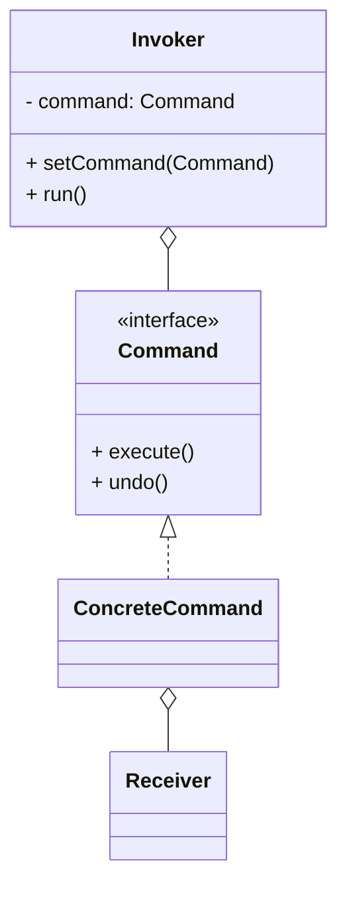

# 命令模式（Command）

> 所属分类：**行为型** 　|　 返回：[设计模式分类](../设计模式分类.md)


## 意图
将一个请求封装为一个对象，从而使你可用不同的请求、队列或日志来参数化其他对象，并支持可撤销操作。

## 结构（类图）


## 示例代码
```java
interface Command { void execute(); void undo(); }
class LightOnCommand implements Command {
    private Light light;
    public void execute(){ light.on(); }
    public void undo(){ light.off(); }
}
class RemoteControl {                       // 调用者
    private Command slot;
    void setCommand(Command c){ slot = c; }
    void press(){ slot.execute(); }
}
```

## 适用场景
- 撤销/重做、事务、任务队列、宏命令、GUI 按钮动作绑定。

## 与相似模式区别
- 与**策略**：命令把"动作+参数"封装成对象，强调**发送者与执行者解耦**与可记录；策略强调算法替换。
- 与**观察者**：命令主动触发；观察者被动通知。

## 不适用场景（反例）

- 操作**极简单、无撤销、无队列、无日志**——直接调用方法更直接。
- 为"命令"而命令，却只有一种执行路径——增加无谓抽象。
- 命令对象**持有大量可变状态**且并发执行——需保证线程安全。

## 在 JDK / Spring / 开源中的真实应用

- **JDK**：`Runnable`/`Callable` 就是命令（把『要执行的动作』封装成对象，交给线程池执行）。
- **Spring**：`@Async` 方法、`AsyncTaskExecutor` 执行命令对象；事务模板。
- **实战**：GUI 按钮绑定 `Command`、Undo/Redo 栈、任务调度队列、MQ 消费处理。

## 实现要点与常见坑

- **命令需支持撤销**：保存 `undo()` 前的状态（或用备忘录），注意状态可能很大。
- **与策略区别**：命令封装『动作+参数』常带接收者，可延迟/排队/撤销；策略封装『算法选择』。
- **组合命令**：用宏命令（Composite Command）批量执行一组命令，注意部分失败的处理。

## 面试高频追问

1. Q：命令模式解决什么？ A：把请求封装成对象，支持参数化、队列、日志、撤销重做。
2. Q：Runnable 算命令模式吗？ A：算，Runnable 封装了『要运行的任务』，交给线程池执行。
3. Q：命令 vs 策略？ A：命令封装动作+接收者，可延迟/撤销；策略封装可替换算法。
4. Q：如何实现撤销？ A：命令保存执行前状态（或反向操作），提供 undo()。
5. Q：命令模式典型应用？ A：GUI 按钮、事务脚本、任务队列、MQ 消费、调度器。
6. Q：宏命令是什么？ A：组合多个命令按顺序执行/一起撤销的复合命令。
