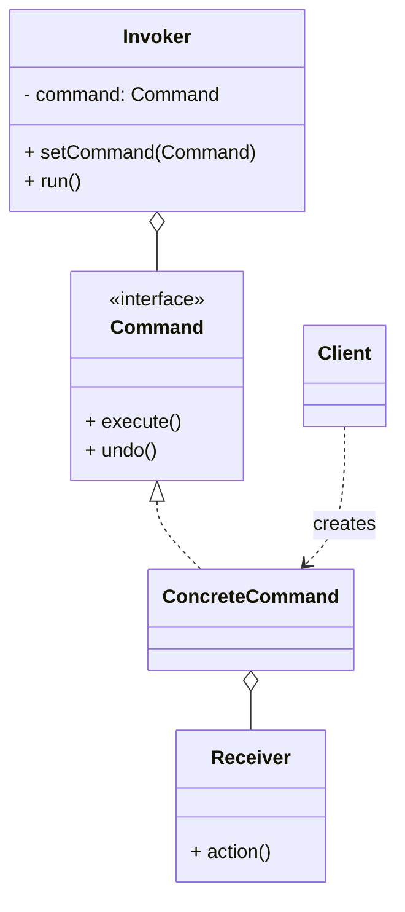

# 命令模式（Command）

> 所属分类：**行为型** 　|　 返回：[设计模式分类](../设计模式分类.md)

> **一句话定义**：把「请求」封装成**对象**，从而支持参数化、队列化、日志化与撤销/重做——发送者（Invoker）与执行者（Receiver）彻底解耦。
> **英文**：Command Pattern 　|　 **意图（GoF）**：Encapsulate a request as an object, thereby letting you parameterize clients with different requests, queue or log requests, and support undoable operations.

---

## 一、意图与解决的问题

「请求」在代码里常被写成「直接调用一个方法」：

```java
// 坏味道：调用方直接依赖具体动作，无法延迟/撤销/记录
public void onButtonClick() {
    light.on();
    fan.off();
    door.lock();
}
```

问题：
1. **无法延迟/异步执行**：动作写死在调用点，不能放进线程池稍后跑。
2. **无法记录与回放**：出了故障无法知道"当时执行了什么"，更无法重放。
3. **无法撤销**：没有"反向动作"的载体。
4. **无法参数化**：不能把"动作"当数据一样传来传去、存进队列。

命令模式把"要做的动作 + 需要的参数"打包成一个**命令对象**，调用方只认识 `Command` 接口：

> 💡 核心思想：**把"行为"当成"数据对象"来传递、存储、调度**。

---

## 二、结构（类图）



- **Command（抽象命令）**：声明 `execute()` / `undo()` 等。
- **ConcreteCommand（具体命令）**：绑定一个 Receiver，把请求转成对 Receiver 的调用。
- **Receiver（接收者）**：真正干活的对象（如 `Light`、`FileSystem`）。
- **Invoker（调用者）**：触发命令，不知道命令内部细节（遥控器、按钮、线程池）。
- **Client**：组装 Command 与 Receiver，交给 Invoker。

---

## 三、经典 Java 实现

```java
interface Command { void execute(); void undo(); }

class Light {                          // Receiver
    void on()  { System.out.println("灯亮"); }
    void off() { System.out.println("灯灭"); }
}

class LightOnCommand implements Command {
    private final Light light;
    public LightOnCommand(Light l) { this.light = l; }
    public void execute() { light.on(); }
    public void undo()    { light.off(); }
}

class RemoteControl {                 // Invoker
    private Command slot;
    void setCommand(Command c) { slot = c; }
    void press()  { slot.execute(); }
    void undo()   { slot.undo(); }
}
```

---

## 四、深挖：Runnable/Callable 就是命令——任务队列与撤销

```java
// JDK 把「要执行的动作」封装成对象（命令）交给线程池
ExecutorService pool = Executors.newFixedThreadPool(4);
pool.submit(() -> System.out.println("task"));      // 匿名 Runnable = 命令对象
Future<String> f = pool.submit(() -> "result");    // Callable = 带返回值的命令

// 撤销栈：每次执行入栈 undo 命令（组合命令）
Deque<Runnable> undoStack = new ArrayDeque<>();
void runAndRecord(Command c) {
    c.execute();
    undoStack.push(c::undo);                        // 记住怎么撤销
}
void undo() { if (!undoStack.isEmpty()) undoStack.pop().run(); }
```

- **命令模式的四角色**：Command（封装动作+接收者）、Receiver（真正干活）、Invoker（触发）、Client（组装）。
- **工程收益**：延迟执行（任务队列）、记录重放（事务日志/审计）、撤销重做（历史栈）、宏命令（组合）。

---

## 五、深挖：宏命令（组合命令）

把多个命令"捆绑"成一个复合命令，一次性执行/撤销：

```java
class MacroCommand implements Command {
    private final List<Command> cmds = new ArrayList<>();
    void add(Command c) { cmds.add(c); }
    public void execute() { cmds.forEach(Command::execute); }
    public void undo() {
        for (int i = cmds.size() - 1; i >= 0; i--) cmds.get(i).undo();  // 逆序撤销
    }
}
// 使用：一键"下班" = 关灯 + 锁门 + 关空调
MacroCommand leaving = new MacroCommand();
leaving.add(new LightOffCommand(light));
leaving.add(new DoorLockCommand(door));
leaving.add(new AcOffCommand(ac));
remote.setCommand(leaving);
```

---

## 六、深挖：命令 vs 事件（消息语义）

| 维度 | 命令（Command） | 事件（Event） |
|------|----------------|---------------|
| 语义 | "请做某事"（有执行意图） | "已发生某事"（事实陈述） |
| 接收方 | 明确的执行者 | 任意订阅者 |
| 典型 | MQ 里带 `action` 的消息、RPC | MQ 里 `OrderCreated` 通知 |

> 带明确『执行意图』的消息是命令；带『已发生事实』的是事件。二者都是"行为对象化"，但语义方向相反。

---

## 七、适用场景

- 撤销/重做、事务、任务队列、宏命令、GUI 按钮动作绑定、MQ 消费处理。
- 调度系统（定时任务把"延迟执行"封装为命令）、审计日志（命令可序列化重放）。

---

## 八、与相似模式区别

| 对比 | 命令 | 策略 | 观察者 | 备忘录 |
|------|------|------|--------|--------|
| 关注 | 动作对象化、可延迟/撤销 | 算法替换 | 被动通知 | 状态快照 |
| 典型 | 任务队列、Undo | 促销折扣 | 事件总线 | 存档 |

- 与**策略**：命令把"动作+参数"封装成对象，强调**发送者与执行者解耦**与可记录；策略强调算法替换。
- 与**观察者**：命令主动触发；观察者被动通知。

---

## 九、不适用场景（反例）

- 操作**极简单、无撤销、无队列、无日志**——直接调用方法更直接。
- 为"命令"而命令，却只有一种执行路径——增加无谓抽象。
- 命令对象**持有大量可变状态**且并发执行——需保证线程安全。

---

## 十、在 JDK / Spring / 开源中的真实应用

- **JDK**：`Runnable`/`Callable` 就是命令（把『要执行的任务』封装成对象，交给线程池执行）。
- **Spring**：`@Async` 方法、`AsyncTaskExecutor` 执行命令对象；事务模板 `TransactionTemplate.execute(TransactionCallback)`。
- **实战**：GUI 按钮绑定 `Command`、Undo/Redo 栈、任务调度队列、MQ 消费处理。
- **Netty/消息**：事件与回调封装为任务对象进入 EventLoop 队列执行。

---

## 十一、实现要点与常见坑

1. **命令需支持撤销**：保存 `undo()` 前的状态（或用备忘录），注意状态可能很大。
2. **与策略区别**：命令封装『动作+参数』常带接收者，可延迟/排队/撤销；策略封装『算法选择』。
3. **组合命令**：用宏命令（Composite Command）批量执行一组命令，注意部分失败的处理。
4. **可序列化**：需要跨进程/落库重放时，命令对象必须可序列化，且避免持有闭包/资源句柄。

---

## 十二、生产实践与重构信号

1. **重构信号**：按钮/入口处 `if (action == "save") ... else if (action == "delete")` → 命令表（Map<动作, 命令>）。
2. **事务性任务**：一组操作要么全成功要么全回滚 → 宏命令 + 逆操作回滚栈（补偿）。
3. **MQ 消费即命令**：消息体描述「做什么」，消费者执行——命令模式天然契合。
4. **审计与回放**：命令序列化存日志，出问题可回放——事件溯源的雏形。
5. **幂等**：命令入队后可能因重试被多次执行，需业务侧幂等（唯一 ID / 状态机拒绝重复）。

---

## 十三、反模式案例

### 案例：命令里藏了业务规则且无法撤销

```java
class PlaceOrderCommand implements Command {
    public void execute() {
        orderRepo.save(order);
        paymentService.charge(order);     // 直接在命令里做跨服务调用
        inventoryService.lock(order);     // 无法对应 undo
    }
    public void undo() { /* 只回滚了 order，payment/inventory 没补偿 */ } // 反模式
}
```

**修正**：命令只做"本地状态变更 + 发布领域事件"，跨服务副作用由 Saga/补偿事务处理，undo 对应明确的逆向补偿命令。

---

## 十四、面试高频追问（30 条）

1. Q：命令模式解决什么？ A：把请求封装成对象，支持参数化、队列、日志、撤销重做。
2. Q：Runnable 算命令模式吗？ A：算，Runnable 封装了『要运行的任务』，交给线程池执行。
3. Q：命令 vs 策略？ A：命令封装动作+接收者，可延迟/撤销；策略封装可替换算法。
4. Q：如何实现撤销？ A：命令保存执行前状态（或反向操作），提供 undo()。
5. Q：命令模式典型应用？ A：GUI 按钮、事务脚本、任务队列、MQ 消费、调度器。
6. Q：宏命令是什么？ A：组合多个命令按顺序执行/一起撤销的复合命令。
7. Q：命令模式四角色？ A：Command / ConcreteCommand / Receiver / Invoker（+Client）。
8. Q：命令能跨进程吗？ A：能，序列化命令即『远程命令/消息』，MQ 与 RPC 是其工程形态。
9. Q：撤销栈怎么管理内存？ A：限长（如 100 步）或命令轻量（只存差异 delta）。
10. Q：命令与事务的关系？ A：命令 + undo 即『可回滚操作』；事务是数据库层面的命令补偿。
11. Q：命令模式有什么缺点？ A：每操作一个命令类，类数量膨胀；简单调用不必用。
12. Q：与「回调函数」区别？ A：回调是单个函数引用；命令是封装好的『对象+状态+接收者』。
13. Q：日志/审计怎么用命令？ A：命令执行前后打点（动作、参数、结果、耗时），可重放。
14. Q：命令在调度器里？ A：定时任务把『延迟执行』封装为命令（DelayedCommand），到期执行。
15. Q：与状态机组合？ A：命令触发事件 → 状态机转移，二者分层：命令管『做什么』，状态管『允许什么』。
16. Q：命令对象应该无状态吗？ A：最好无状态或只含不可变参数，有状态需并发保护。
17. Q：MQ 消息算命令还是事件？ A：带明确『执行意图』的消息是命令；带『已发生事实』的是事件。
18. Q：命令模式在编辑器？ A：每个编辑操作是一个 Command，入栈支持 Undo/Redo。
19. Q：命令 vs 中介者？ A：命令封装单个动作；中介者协调多个对象的交互。
20. Q：命令模式符合哪些原则？ A：单一职责（动作自包含）、开闭（新命令加类不改调用方）。
21. Q：命令能带返回值吗？ A：经典 GoF 只定义 execute() 无返回；工程上可加 `execute(): Result` 或返回 Future（Callable）。
22. Q：命令模式与 CQRS 关系？ A：CQRS 的 Command 端用命令对象承载写意图，与命令模式一脉相承。
23. Q：命令的 undo 需要备忘录吗？ A：可结合备忘录模式——命令持有执行前快照，撤销时 restore。
24. Q：如何避免命令类爆炸？ A：用函数式命令（lambda + Recorder）、通用 `GenericCommand(action, undo)` 或命令注册表。
25. Q：命令与 Actor 模型？ A：Actor 接收的消息即命令对象，线程安全的邮箱天然是命令队列。
26. Q：命令能嵌套执行吗？ A：能，宏命令就是嵌套；注意递归深度与部分失败补偿。
27. Q：命令模式在游戏里？ A：玩家输入封装为命令（MoveCommand/AttackCommand），支持回放与 AI 重放。
28. Q：命令与 REST 的 POST？ A：POST 请求体即"创建/执行命令"的 HTTP 形态，服务端翻译为内部 Command。
29. Q：如何实现命令的持久化？ A：命令对象实现 Serializable / 转 JSON 落库，重启后重放。
30. Q：命令模式会引入性能问题吗？ A：一次对象创建与分发开销极小；瓶颈在 Receiver 的执行，不在命令本身。

---

## 十五、速记口诀（Summary）

> **「请求封成对象跑，队列日志撤销好；Runnable 本就是令，MQ 消费同此道。」**
> 命令（动作对象化）≠ 策略（算法替换）≠ 观察者（被动通知）。

---

## 十六、关联阅读

- 行为型：[备忘录模式](备忘录模式.md)（undo 常配合备忘录） · [观察者模式](观察者模式.md) · [状态模式](状态模式.md)
- 结构型：[外观模式](../结构型/外观模式.md)（命令可作为门面的一个动作）
- 架构实践：CQRS 命令端、Saga 补偿事务、任务调度队列
