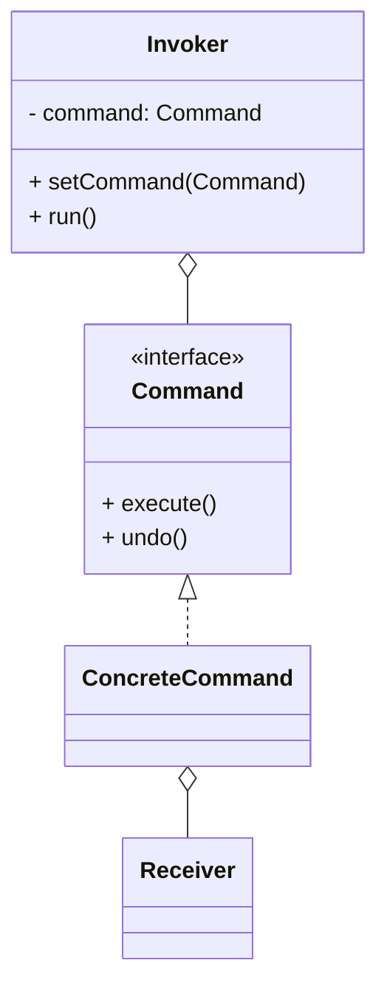

# 命令模式（Command）

> 所属分类：**行为型** 　|　 返回：[设计模式分类](../设计模式分类.md)


## 意图
将一个请求封装为一个对象，从而使你可用不同的请求、队列或日志来参数化其他对象，并支持可撤销操作。

## 结构（类图）


## 示例代码
```java
interface Command { void execute(); void undo(); }
class LightOnCommand implements Command {
    private Light light;
    public void execute(){ light.on(); }
    public void undo(){ light.off(); }
}
class RemoteControl {                       // 调用者
    private Command slot;
    void setCommand(Command c){ slot = c; }
    void press(){ slot.execute(); }
}
```

## 适用场景
- 撤销/重做、事务、任务队列、宏命令、GUI 按钮动作绑定。

## 与相似模式区别
- 与**策略**：命令把"动作+参数"封装成对象，强调**发送者与执行者解耦**与可记录；策略强调算法替换。
- 与**观察者**：命令主动触发；观察者被动通知。
