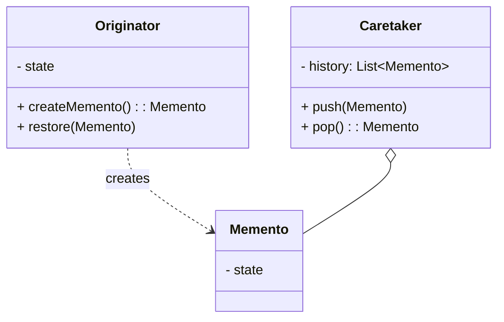

# 备忘录模式（Memento）

> 所属分类：**行为型** 　|　 返回：[设计模式分类](../设计模式分类.md)

> **一句话定义**：在不破坏封装的前提下，**捕获并保存**对象的内部状态，以便将来**恢复**——经典的 Undo/Redo 与快照机制。
> **英文**：Memento Pattern 　|　 **意图（GoF）**：Without violating encapsulation, capture and externalize an object's internal state so that the object can be restored to this state later.

---

## 一、意图与解决的问题

很多场景需要"回到过去的状态"：编辑器撤销、游戏存档、事务回滚、表单分步暂存。朴素做法是在对象外手动存字段：

```java
// 坏味道：外部直接读私有字段，破坏封装；且字段一变快照就过期
String backup = editor.text;     // 外部窥探内部状态
editor.text = "改了";
editor.text = backup;            // 手动恢复，脆弱且不完整
```

痛点：
1. **破坏封装**：外部必须知道对象有哪些字段才能备份。
2. **易漏字段**：对象加了新字段，外部备份忘了同步 → 恢复后状态残缺。
3. **无法管理历史**：只有一份，没有"多步撤销"。

备忘录模式引入三个角色，让**对象自己负责"怎么存、怎么恢复"**：

> 💡 核心思想：**状态的所有权归原发人，外部只负责"保管"，绝不窥探内容。**

---

## 二、结构（类图）



- **Originator（原发人）**：自己保存/恢复状态，创建并返回 `Memento`。
- **Memento（备忘录/快照）**：存储状态，对外暴露窄接口，Caretaker 只保管不读。
- **Caretaker（管理者）**：只负责存放/取出，绝不读取备忘录内容（防封装泄漏）。

---

## 三、经典 Java 实现

```java
class Editor {
    private String text;
    Memento save() { return new Memento(text); }      // 自己决定存什么
    void restore(Memento m) { this.text = m.getState(); }

    static class Memento {                            // 私有内部类，保护封装
        private final String state;
        Memento(String s) { state = s; }
        String getState() { return state; }            // 仅原发人能调用（包级/私有）
    }
}
```

---

## 四、深挖：撤销栈 + 命令模式的组合（工程级 Undo）

```java
// Caretaker：撤销历史栈（限长防内存爆炸）
Deque<Memento> history = new ArrayDeque<>();
void backup(Editor e) {
    history.push(e.save());
    if (history.size() > 100) history.removeLast();   // 限长
}
void undo(Editor e) {
    if (!history.isEmpty()) e.restore(history.pop());
}

// 增量快照：只存 diff 而非全量（大文档编辑器的关键优化）
class DeltaMemento {
    List<Edit> edits;
    long baseVersion;
}
```

- **三角色**：**Originator**（原发人：自己保存/恢复状态）、**Memento**（快照：私有内部类保护封装）、**Caretaker**（管理者：只保管不窥探）。
- **与命令模式组合**：命令执行前 `backup()`，`undo()` 恢复——编辑器/表单的标准撤销实现。
- **内存纪律**：全量快照限长 + 增量快照（只存变化）+ 必要时外存（数据库版本表）。

---

## 五、深挖：窄接口与封装保护

```java
// 宽接口（危险）：Memento 对外暴露 setState，Caretaker 能篡改内容
// 窄接口（推荐）：对外只暴露 getState 给原发人，Caretaker 连读都不能
interface Memento { /* 空标记，或仅给原发人用的窄方法 */ }

class Editor {
    String text;
    Memento save() { return new Snap(text); }
    void restore(Memento m) { this.text = ((Snap) m).state(); }
    private static class Snap implements Memento {     // 私有：外部拿不到具体类型
        final String state;
        Snap(String s) { state = s; }
        String state() { return state; }
    }
}
```

> 通过"私有内部类 + 窄接口"，Caretaker 只能 `push/pop` 一个它读不懂的 `Memento`，封装被完整保护。

---

## 六、深挖：快照策略（全量 vs 增量 vs 外存）

| 策略 | 做法 | 优点 | 缺点 | 适用 |
|------|------|------|------|------|
| 全量快照 | 每次存整份状态 | 简单、恢复快 | 内存/存储大 | 状态小、步数少 |
| 增量快照 | 只存 diff（操作序列） | 省空间 | 恢复需重放 | 大文档/大状态 |
| 外存版本 | 落库版本表/事件表 | 可跨重启、可审计 | 有 IO 成本 | 长生命周期 |

---

## 七、适用场景

- 撤销/重做、事务回滚、游戏存档、编辑器快照、表单分步暂存。
- 分布式系统的状态快照（Raft snapshot、数据库 Savepoint）。

---

## 八、与相似模式区别

| 对比 | 备忘录 | 命令 | 原型 |
|------|--------|------|------|
| 存什么 | 对象状态 | 动作+参数 | 克隆实例 |
| 撤销方式 | 直接恢复状态 | 执行反向操作 | 不适用 |
| 封装 | 强（Caretaker 不读） | 中 | 弱（克隆暴露字段） |

- 与**命令**：备忘录只存状态；命令存"动作"并可反向执行（undo）。
- 与**原型**：备忘录有意隐藏状态；原型暴露克隆。

---

## 九、不适用场景（反例）

- 需要保存的状态**极简单**（一个值）——直接存变量即可，无需备忘录对象。
- 状态对象**巨大且频繁快照**——内存开销爆炸，需增量快照或外部存储。
- 用备忘录绕过**封装**直接读写私有状态——应通过发起人自身接口操作。

---

## 十、在 JDK / Spring / 开源中的真实应用

- **JDK**：`Serializable` 序列化做对象快照；`ObjectOutputStream` 保存/恢复。
- **数据库**：事务 `Savepoint`（回滚到某点，类似备忘录）。
- **实战**：编辑器 Undo/Redo、游戏存档、表单分步填写的暂存。
- **分布式**：状态快照（Raft 的 snapshot 即备忘录思想，见 基础知识/分布式系统.md）。

---

## 十一、实现要点与常见坑

1. **原发人(Caretaker) 不应窥探状态**：备忘录应由原发人自己创建与恢复，Caretaker 只负责保管不读内容（可用窄接口/内部类实现）。
2. **内存**：每次保存全量状态很重，可对大对象用增量或外存。
3. **与命令配合**：撤销常用『命令持有备忘录』或『备忘录记录反向操作』。
4. **并发**：快照不可变即安全；可变状态需深拷贝后保存。

---

## 十二、生产实践与重构信号

1. **重构信号**：手写 Undo/Redo 时状态散落、越权读写 → 收拢成「原发人 save/restore + 管理者历史栈」。
2. **快照策略**：限长（N 步）+ 合并（连续相同类型编辑合并为一步）+ 增量（只存 diff）。
3. **持久化撤销**：跨重启撤销 → 快照落库（版本表/事件表），回放或回滚。
4. **与命令组合的边界**：备忘录管『状态恢复』，命令管『动作语义』——撤销时二者分工。

---

## 十三、反模式案例

### 案例：Caretaker 越权读状态

```java
// 反模式：管理者直接读备忘录内部字段，破坏封装
class Caretaker {
    void log(Memento m) { System.out.println(m.getState()); }  // 越权
}
```

**修正**：Memento 对外只暴露窄接口（甚至空接口），状态读取仅限原发人内部类。

---

## 十四、面试高频追问（30 条）

1. Q：备忘录解决什么？ A：在不破坏封装的前提下捕获并恢复对象内部状态（如 Undo）。
2. Q：备忘录三个角色？ A：Originator(原发人)、Memento(备忘录)、Caretaker(管理者，只保管不读)。
3. Q：备忘录 vs 命令的撤销？ A：命令用反向操作撤销；备忘录直接恢复之前保存的状态。
4. Q：备忘录内存风险？ A：频繁全量快照开销大，需增量或外存。
5. Q：JDK 哪里体现备忘录思想？ A：事务 Savepoint、Serializable 快照。
6. Q：为什么 Caretaker 不能读备忘录内容？ A：否则破坏封装，应通过原发人接口恢复。
7. Q：撤销栈限长多少合适？ A：按对象大小与内存预算（如 50~200 步），大对象用增量。
8. Q：增量快照怎么做？ A：只记录变化（diff/操作序列），恢复时 base + diffs 重放。
9. Q：备忘录与版本控制类比？ A：Git 提交就是文件系统快照的备忘录思想（tree+blob）。
10. Q：Raft snapshot 是备忘录吗？ A：是，把状态机压缩为快照传输给落后节点，替代全量日志重放。
11. Q：备忘录与原型模式区别？ A：原型复制并暴露克隆；备忘录保存状态但藏起细节。
12. Q：表单暂存怎么实现？ A：每步保存备忘录，刷新/回退恢复；落库存草稿版本。
13. Q：备忘录能用于跨线程吗？ A：快照不可变即安全；可变状态需深拷贝后保存。
14. Q：什么时候不该用备忘录？ A：状态简单（一个变量）、或快照太大太频繁。
15. Q：快照一致性怎么保证？ A：保存瞬间保证状态完整（同一事务/锁内生成快照）。
16. Q：备忘录模式与「窄接口」？ A：Memento 对外暴露窄接口（仅 getState 给原发人），Caretaker 只能存不能读。
17. Q：备忘录 + 命令 谁负责 undo？ A：命令负责触发，备忘录负责提供可恢复的状态。
18. Q：游戏存档怎么设计？ A：角色状态序列化存 Memento，落盘即存档，读档即 restore。
19. Q：备忘录在事务里？ A：数据库 Savepoint=temporary memento，rollback to savepoint 即恢复。
20. Q：备忘录模式缺点？ A：快照占用内存、频繁保存开销大、需管理生命周期防止泄漏。
21. Q：备忘录和克隆（clone）区别？ A：克隆会暴露对象结构且是对象副本；备忘录只存"需要的状态"，封装更严。
22. Q：如何支持"重做（Redo）"？ A：再维护一个 redo 栈：undo 时把弹出的快照压入 redo 栈，redo 时弹回。
23. Q：备忘录序列化注意什么？ A：transient 字段不序列化，恢复后需补默认；大对象快照序列化成本高。
24. Q：备忘录和事件溯源（Event Sourcing）？ A：事件溯源是"存变更事件"而非"存状态快照"，恢复=重放事件，可看作增量备忘录的极致。
25. Q：Caretaker 用什么数据结构？ A：撤销用栈（Stack/Deque），需要跳转任意历史用 List + 指针。
26. Q：快照版本冲突怎么处理？ A：用版本号/乐观锁，恢复时校验 base 版本未被并发修改。
27. Q：备忘录模式符合哪些原则？ A：封装（状态不外泄）、单一职责（原发人管状态）、开闭（新状态类型不改 Caretaker）。
28. Q：备忘录能存计算结果缓存吗？ A：可以，memoization（记忆化）本质是"存计算结果快照"，与备忘录同源。
29. Q：分布式下备忘录怎么存？ A：状态机 snapshot 落共享存储（如对象存储/DB），多节点可加载。
30. Q：备忘录与序列化框架（Kryo/Protostuff）？ A：这些框架用于高效生成/恢复快照，是备忘录的工程实现手段。

---

## 十五、速记口诀（Summary）

> **「原发人存状，保管者存票；不破坏封装，Undo 就靠它。」**
> 备忘录（存状态）≠ 命令（存动作），二者常联手做 Undo。

---

## 十六、关联阅读

- 行为型：[命令模式](命令模式.md)（undo 常配合） · [状态模式](状态模式.md)（状态快照辅助状态机）
- 架构实践：事件溯源、Raft 快照、数据库 Savepoint、Git 版本模型
