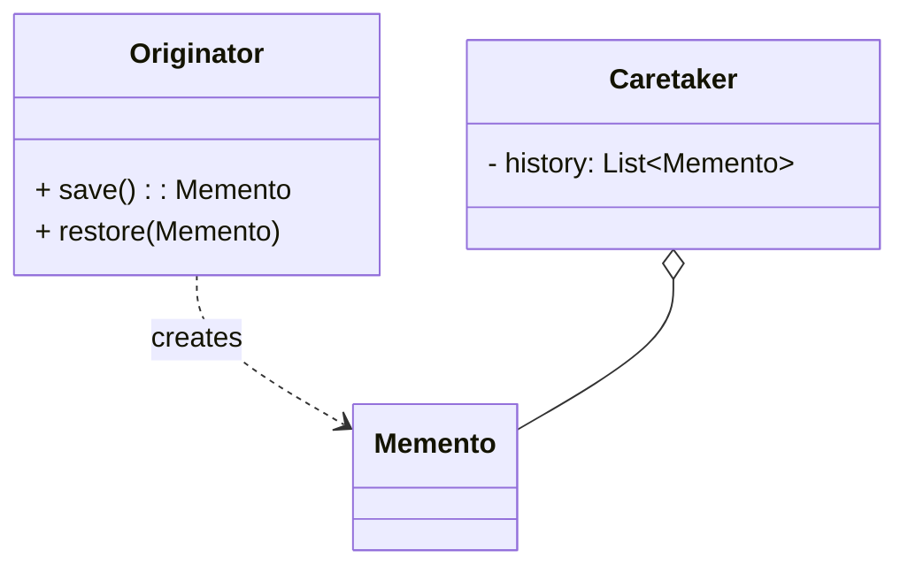

# 备忘录模式（Memento）

> 所属分类：**行为型** 　|　 返回：[设计模式分类](../设计模式分类.md)


## 意图
在不破坏封装性的前提下，捕获一个对象的内部状态，并在该对象之外保存这个状态，以便以后恢复。

## 结构（类图）


## 示例代码
```java
class Editor {
    private String text;
    Memento save(){ return new Memento(text); }
    void restore(Memento m){ this.text = m.getState(); }
    static class Memento {                  // 私有内部类，保护封装
        private String state;
        Memento(String s){ state = s; }
        String getState(){ return state; }
    }
}
```

## 适用场景
- 撤销/重做、事务回滚、游戏存档、编辑器快照。

## 与相似模式区别
- 与**命令**：备忘录只存状态；命令存"动作"并可反向执行（undo）。
- 与**原型**：备忘录有意隐藏状态；原型暴露克隆。

## 不适用场景（反例）

- 需要保存的状态**极简单**（一个值）——直接存变量即可，无需备忘录对象。
- 状态对象**巨大且频繁快照**——内存开销爆炸，需增量快照或外部存储。
- 用备忘录绕过**封装**直接读写私有状态——应通过发起人自身接口操作。

## 在 JDK / Spring / 开源中的真实应用

- **JDK**：`Serializable` 序列化做对象快照；`ObjectOutputStream` 保存/恢复。
- **数据库**：事务 `Savepoint`（回滚到某点，类似备忘录）。
- **实战**：编辑器 Undo/Redo、游戏存档、表单分步填写的暂存。

## 实现要点与常见坑

- **原发人(Caretaker) 不应窥探状态**：备忘录应由原发人自己创建与恢复，Caretaker 只负责保管不读内容（可用窄接口/内部类实现）。
- **内存**：每次保存全量状态很重，可对大对象用增量或外存。
- **与命令配合**：撤销常用『命令持有备忘录』或『备忘录记录反向操作』。

## 面试高频追问

1. Q：备忘录解决什么？ A：在不破坏封装的前提下捕获并恢复对象内部状态（如 Undo）。
2. Q：备忘录三个角色？ A：Originator(原发人)、Memento(备忘录)、Caretaker(管理者，只保管不读)。
3. Q：备忘录 vs 命令的撤销？ A：命令用反向操作撤销；备忘录直接恢复之前保存的状态。
4. Q：备忘录内存风险？ A：频繁全量快照开销大，需增量或外存。
5. Q：JDK 哪里体现备忘录思想？ A：事务 Savepoint、Serializable 快照。
6. Q：为什么 Caretaker 不能读备忘录内容？ A：否则破坏封装，应通过原发人接口恢复。
