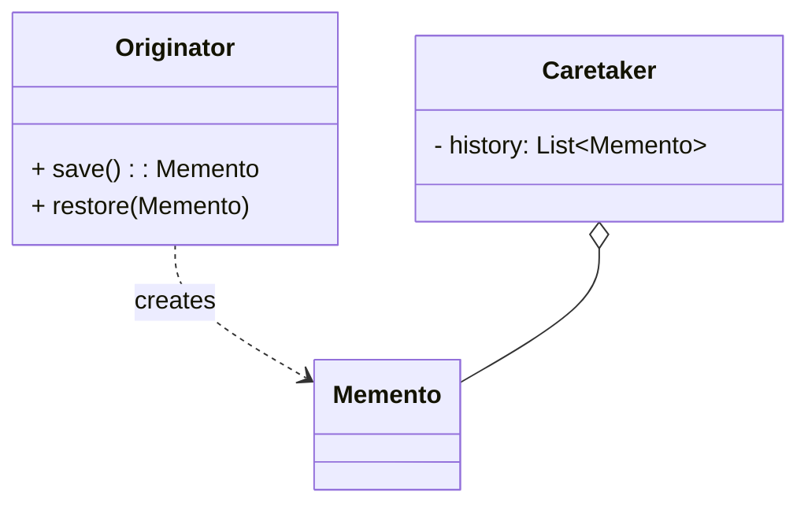

# 备忘录模式（Memento）

> 所属分类：**行为型** 　|　 返回：[设计模式分类](../设计模式分类.md)


## 意图
在不破坏封装性的前提下，捕获一个对象的内部状态，并在该对象之外保存这个状态，以便以后恢复。

## 结构（类图）


## 示例代码
```java
class Editor {
    private String text;
    Memento save(){ return new Memento(text); }
    void restore(Memento m){ this.text = m.getState(); }
    static class Memento {                  // 私有内部类，保护封装
        private String state;
        Memento(String s){ state = s; }
        String getState(){ return state; }
    }
}
```

### 深挖：撤销栈 + 命令模式的组合（工程级 Undo）

```java
// Caretaker：撤销历史栈（限长防内存爆炸）
Deque<Memento> history = new ArrayDeque<>();
void backup(Editor e) {
    history.push(e.save());
    if (history.size() > 100) history.removeLast();   // 限长
}
void undo(Editor e) {
    if (!history.isEmpty()) e.restore(history.pop());
}

// 增量快照：只存 diff 而非全量（大文档编辑器的关键优化）
class DeltaMemento { List<Edit> edits; long baseVersion; }
```

- **三角色**：**Originator**（原发人：自己保存/恢复状态）、**Memento**（快照：私有内部类保护封装）、**Caretaker**（管理者：只保管不窥探）。
- **与命令模式组合**：命令执行前 `backup()`，`undo()` 恢复——编辑器/表单的标准撤销实现。
- **内存纪律**：全量快照限长 + 增量快照（只存变化）+ 必要时外存（数据库版本表）。

## 适用场景
- 撤销/重做、事务回滚、游戏存档、编辑器快照。

## 与相似模式区别
- 与**命令**：备忘录只存状态；命令存"动作"并可反向执行（undo）。
- 与**原型**：备忘录有意隐藏状态；原型暴露克隆。

## 不适用场景（反例）

- 需要保存的状态**极简单**（一个值）——直接存变量即可，无需备忘录对象。
- 状态对象**巨大且频繁快照**——内存开销爆炸，需增量快照或外部存储。
- 用备忘录绕过**封装**直接读写私有状态——应通过发起人自身接口操作。

## 在 JDK / Spring / 开源中的真实应用

- **JDK**：`Serializable` 序列化做对象快照；`ObjectOutputStream` 保存/恢复。
- **数据库**：事务 `Savepoint`（回滚到某点，类似备忘录）。
- **实战**：编辑器 Undo/Redo、游戏存档、表单分步填写的暂存。
- **分布式**：状态快照（Raft 的 snapshot 即备忘录思想，见 基础知识/分布式系统.md）。

## 实现要点与常见坑

- **原发人(Caretaker) 不应窥探状态**：备忘录应由原发人自己创建与恢复，Caretaker 只负责保管不读内容（可用窄接口/内部类实现）。
- **内存**：每次保存全量状态很重，可对大对象用增量或外存。
- **与命令配合**：撤销常用『命令持有备忘录』或『备忘录记录反向操作』。

## 生产实践与重构信号

1. **重构信号**：手写 Undo/Redo 时状态散落、越权读写 → 收拢成「原发人 save/restore + 管理者历史栈」。
2. **快照策略**：限长（N 步）+ 合并（连续相同类型编辑合并为一步）+ 增量（只存 diff）。
3. **持久化撤销**：跨重启撤销 → 快照落库（版本表/事件表），回放或回滚。
4. **与命令组合的边界**：备忘录管『状态恢复』，命令管『动作语义』——撤销时二者分工。

## 面试高频追问（15+ 条）

1. Q：备忘录解决什么？ A：在不破坏封装的前提下捕获并恢复对象内部状态（如 Undo）。
2. Q：备忘录三个角色？ A：Originator(原发人)、Memento(备忘录)、Caretaker(管理者，只保管不读)。
3. Q：备忘录 vs 命令的撤销？ A：命令用反向操作撤销；备忘录直接恢复之前保存的状态。
4. Q：备忘录内存风险？ A：频繁全量快照开销大，需增量或外存。
5. Q：JDK 哪里体现备忘录思想？ A：事务 Savepoint、Serializable 快照。
6. Q：为什么 Caretaker 不能读备忘录内容？ A：否则破坏封装，应通过原发人接口恢复。
7. Q：撤销栈限长多少合适？ A：按对象大小与内存预算（如 50~200 步），大对象用增量。
8. Q：增量快照怎么做？ A：只记录变化（diff/操作序列），恢复时 base + diffs 重放。
9. Q：备忘录与版本控制类比？ A：Git 提交就是文件系统快照的备忘录思想（tree+blob）。
10. Q：Raft snapshot 是备忘录吗？ A：是，把状态机压缩为快照传输给落后节点，替代全量日志重放。
11. Q：备忘录与原型模式区别？ A：原型复制并暴露克隆；备忘录保存状态但藏起细节。
12. Q：表单暂存怎么实现？ A：每步保存备忘录，刷新/回退恢复；落库存草稿版本。
13. Q：备忘录能用于跨线程吗？ A：快照不可变即安全；可变状态需深拷贝后保存。
14. Q：什么时候不该用备忘录？ A：状态简单（一个变量）、或快照太大太频繁。
15. Q：快照一致性怎么保证？ A：保存瞬间保证状态完整（同一事务/锁内生成快照）。
