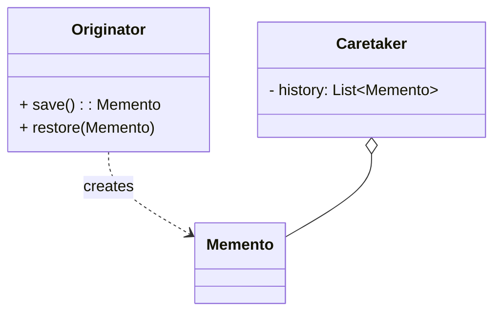

# 备忘录模式（Memento）

> 所属分类：**行为型** 　|　 返回：[设计模式分类](../设计模式分类.md)


## 意图
在不破坏封装性的前提下，捕获一个对象的内部状态，并在该对象之外保存这个状态，以便以后恢复。

## 结构（类图）


## 示例代码
```java
class Editor {
    private String text;
    Memento save(){ return new Memento(text); }
    void restore(Memento m){ this.text = m.getState(); }
    static class Memento {                  // 私有内部类，保护封装
        private String state;
        Memento(String s){ state = s; }
        String getState(){ return state; }
    }
}
```

## 适用场景
- 撤销/重做、事务回滚、游戏存档、编辑器快照。

## 与相似模式区别
- 与**命令**：备忘录只存状态；命令存"动作"并可反向执行（undo）。
- 与**原型**：备忘录有意隐藏状态；原型暴露克隆。
