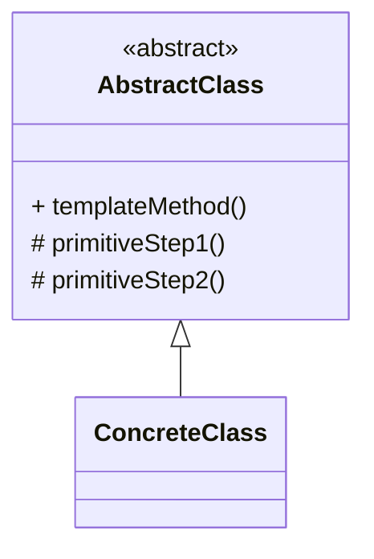

# 模板方法模式（Template Method）

> 所属分类：**行为型** 　|　 返回：[设计模式分类](../设计模式分类.md)


## 意图
定义一个操作中的算法骨架，而将一些步骤延迟到子类中，使得子类可以不改变算法结构即可重定义该算法的某些特定步骤。

## 结构（类图）


## 示例代码
```java
abstract class Beverage {
    final void prepare() {                  // 模板方法（final 防子类破坏流程）
        boil();
        brew();
        if (wantsCondiment()) add();        // 钩子方法
    }
    abstract void brew();
    void boil() { System.out.println("烧水"); }
    boolean wantsCondiment() { return true; }  // 钩子：子类可覆盖
    abstract void add();
}
```

### 深挖：JdbcTemplate 的「模板方法 + 回调」工程形态

```java
// 骨架固定：取连接 → 执行 SQL → 转结果 → 释放资源
// 可变步骤由回调（Callback）注入，替代继承——组合版模板方法
public <T> T query(String sql, RowMapper<T> mapper) {
    Connection conn = getConnection();      // 骨架：固定
    PreparedStatement ps = null;
    try {
        ps = conn.prepareStatement(sql);
        try (ResultSet rs = ps.executeQuery()) {
            List<T> list = new ArrayList<>();
            while (rs.next()) list.add(mapper.mapRow(rs));   // 可变：回调
            return list.get(0);
        }
    } finally {
        close(ps); close(conn);             // 骨架：固定
    }
}
```

| 形态 | 可变步骤实现 | 典型 |
|------|--------------|------|
| 继承版（GoF） | 子类覆写抽象方法 | `BaseExecutor.doQuery` |
| **回调版（组合）** | 传入 lambda/回调 | `JdbcTemplate`、`RedisTemplate`、`RestTemplate` |

> 面试加分：现代框架多用**回调版**模板方法（继承脆弱、组合灵活）——`JdbcTemplate.execute(ConnectionCallback)`、`TransactionTemplate.execute()` 都是。

## 适用场景
- 多个子类有相同算法流程、仅个别步骤不同（数据导入、报告生成、单元测试 setUp/tearDown）。

## 与相似模式区别
- 与**策略**：模板方法用**继承**复用流程；策略用**组合**替换算法。
- 与**建造者**：模板方法流程图固定；建造者步骤可灵活组合。

## 不适用场景（反例）

- 算法**几乎不会变、且很短**——直接写死更简单。
- 子类**大量需要重写**几乎全部步骤——模板形同虚设，应换策略/组合。
- 父类调用子类方法（『好莱坞原则』）导致**父类依赖子类细节**，超类与子类耦合需克制。

## 在 JDK / Spring / 开源中的真实应用

- **JDK**：`AbstractList`/`AbstractSet` 的钩子方法；`InputStream.read()` 由子类实现，父类 `read(byte[])` 提供骨架。
- **Spring**：`JdbcTemplate.execute()`、`RedisTemplate.execute()`、`AbstractController.handleRequest()`。
- **MyBatis**：`BaseExecutor` 固定 `query/update` 流程，子类实现 `doQuery/doUpdate`。
- **Netty**：`ByteToMessageDecoder` 固定解码流程，子类实现 `decode`。

## 实现要点与常见坑

- **final 防止破坏骨架**：把模板主方法设为 `final`，避免子类重写打乱算法流程。
- **钩子方法 vs 抽象方法**：必做步骤用抽象方法强制子类实现；可选步骤用 `hook()`（默认空实现）让子类可选覆盖。
- **与策略区别**：模板方法在『父类固定流程、子类填步骤』（编译期组合）；策略在『运行期替换整个算法』。

## 生产实践与重构信号

1. **重构信号**：多个 Service 方法「校验 → 执行 → 记录 → 通知」结构重复 → 抽抽象基类 + 模板方法。
2. **固定资源的获取与释放**：事务、锁、连接——模板方法把 try/finally 收进骨架，防遗漏（见 源码系列/MyBatis源码.md 的 Executor）。
3. **避免继承滥用**：子类只需改 1 个方法但被迫继承整棵类树 → 考虑回调/策略重构。
4. **测试**：模板骨架逻辑单测一次，各步骤单测子类实现。

## 面试高频追问（15+ 条）

1. Q：模板方法解决什么？ A：定义算法骨架，把可变步骤延迟到子类，复用流程、反向控制（好莱坞原则）。
2. Q：钩子方法 vs 抽象方法？ A：抽象方法子类必须实现（必做步骤）；钩子方法默认空实现，子类可选覆盖。
3. Q：模板方法 vs 策略？ A：模板固定流程、子类填步骤（编译期）；策略运行期整体替换算法。
4. Q：为什么要 final 模板方法？ A：防止子类重写破坏已定好的算法骨架。
5. Q：Spring 哪用了模板方法？ A：JdbcTemplate/RedisTemplate 的 execute 骨架，子类/回调填具体步骤。
6. Q：好莱坞原则是什么？ A：『别调用我们，我们调用你』——父类调用子类实现，子类不主动调父类流程。
7. Q：模板方法的缺点？ A：继承强耦合、父类改动影响所有子类、子类多步骤需重写时反而不灵活。
8. Q：回调版模板方法是什么？ A：骨架用参数接收 lambda（RowMapper/ConnectionCallback），组合代替继承。
9. Q：BaseExecutor 怎么体现模板方法？ A：query 骨架固定（缓存→语句→查询→记录），doQuery 由子类实现。
10. Q：模板方法在测试里？ A：JUnit 的 setUp/tearDown 生命周期就是模板方法（父类编排、子类填充）。
11. Q：钩子方法的设计意图？ A：让子类『可选地』影响流程（如加不加调料），不强制覆写。
12. Q：什么时候该换回调？ A：步骤实现方与骨架方没有 is-a 关系、或子类化会污染类层次时。
13. Q：模板方法与「开闭」？ A：骨架固定、步骤扩展，对扩展开放、对修改关闭。
14. Q：模板方法能嵌套吗？ A：能，大流程套小流程（如导入：读文件 → 校验 → 落库，校验又是模板）。
15. Q：与工厂方法关系？ A：模板方法里常用工厂方法创建步骤所需对象，两者常组合。
