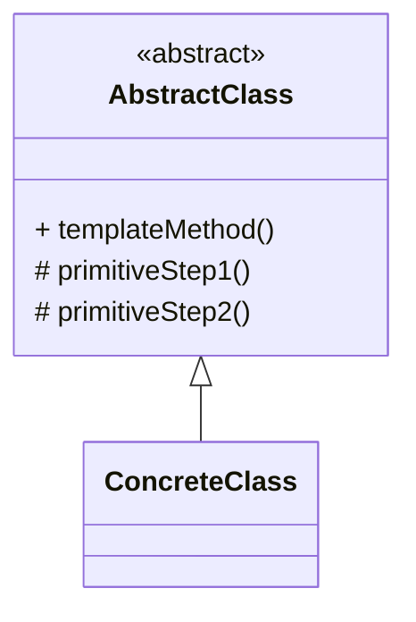

# 模板方法模式（Template Method）

> 所属分类：**行为型** 　|　 返回：[设计模式分类](../设计模式分类.md)


## 意图
定义一个操作中的算法骨架，而将一些步骤延迟到子类中，使得子类可以不改变算法结构即可重定义该算法的某些特定步骤。

## 结构（类图）


## 示例代码
```java
abstract class Beverage {
    final void prepare() {                  // 模板方法（final 防子类破坏流程）
        boil();
        brew();
        if (wantsCondiment()) add();        // 钩子方法
    }
    abstract void brew();
    void boil() { System.out.println("烧水"); }
    boolean wantsCondiment() { return true; }  // 钩子：子类可覆盖
    abstract void add();
}
```

## 适用场景
- 多个子类有相同算法流程、仅个别步骤不同（数据导入、报告生成、单元测试 setUp/tearDown）。

## 与相似模式区别
- 与**策略**：模板方法用**继承**复用流程；策略用**组合**替换算法。
- 与**建造者**：模板方法流程图固定；建造者步骤可灵活组合。
