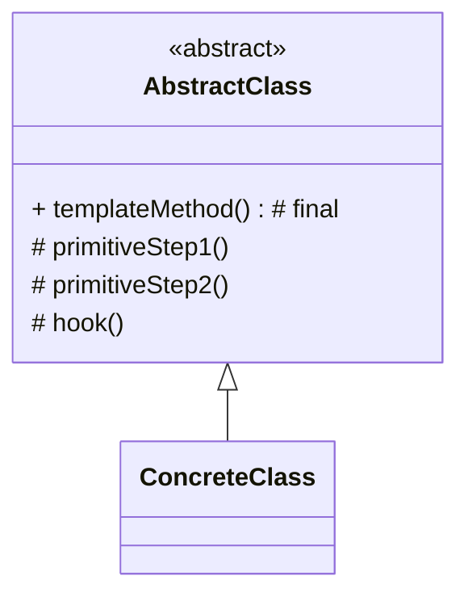

# 模板方法模式（Template Method）

> 所属分类：**行为型** 　|　 返回：[设计模式分类](../设计模式分类.md)

> **一句话定义**：在父类定义算法的**骨架（固定步骤）**，把可变步骤**延迟到子类**实现——「反向控制」（好莱坞原则：Don't call us, we'll call you）。
> **英文**：Template Method Pattern 　|　 **意图（GoF）**：Define the skeleton of an algorithm in an operation, deferring some steps to subclasses. Template Method lets subclasses redefine certain steps of an algorithm without changing its structure.

---

## 一、意图与解决的问题

多个子类有相同算法流程、仅个别步骤不同，朴素写法是把流程在每个子类复制一遍：

```java
// 坏味道：流程逻辑重复散落，改一处要改 N 处
class Tea {
    void prepare() { boil(); brewTea(); addLemon(); }
}
class Coffee {
    void prepare() { boil(); brewCoffee(); addSugar(); }
}
```

痛点：
1. **流程重复**：`boil()` 等公共步骤在每个子类都写一遍，违反 DRY。
2. **流程不一致风险**：某子类改了步骤顺序，行为悄悄分歧。
3. **无法统一控制**：想给所有流程加"计时/日志/事务"，没有统一切入点。

模板方法把"不变的部分"放父类并**final 锁死**，"会变的部分"留抽象方法/钩子给子类填：

> 💡 核心思想：**父类定流程（骨架），子类填步骤（可变），好莱坞原则反向控制。**

---

## 二、结构（类图）



- **AbstractClass（抽象类）**：`templateMethod()`（**final**，编排固定步骤） + 抽象方法（必做步骤） + 钩子方法（可选步骤）。
- **ConcreteClass（具体类）**：实现抽象方法，可选覆盖钩子。

---

## 三、经典 Java 实现

```java
abstract class Beverage {
    final void prepare() {                  // 模板方法（final 防子类破坏流程）
        boil();
        brew();
        if (wantsCondiment()) add();        // 钩子方法
    }
    abstract void brew();
    void boil() { System.out.println("烧水"); }
    boolean wantsCondiment() { return true; }  // 钩子：子类可覆盖
    abstract void add();
}
class Tea extends Beverage {
    void brew() { System.out.println("泡茶"); }
    void add() { System.out.println("加柠檬"); }
}
```

---

## 四、深挖：JdbcTemplate 的「模板方法 + 回调」工程形态

```java
// 骨架固定：取连接 → 执行 SQL → 转结果 → 释放资源
// 可变步骤由回调（Callback）注入，替代继承——组合版模板方法
public <T> T query(String sql, RowMapper<T> mapper) {
    Connection conn = getConnection();      // 骨架：固定
    PreparedStatement ps = null;
    try {
        ps = conn.prepareStatement(sql);
        try (ResultSet rs = ps.executeQuery()) {
            List<T> list = new ArrayList<>();
            while (rs.next()) list.add(mapper.mapRow(rs));   // 可变：回调
            return list.get(0);
        }
    } finally {
        close(ps); close(conn);             // 骨架：固定
    }
}
```

| 形态 | 可变步骤实现 | 典型 |
|------|--------------|------|
| 继承版（GoF） | 子类覆写抽象方法 | `BaseExecutor.doQuery` |
| **回调版（组合）** | 传入 lambda/回调 | `JdbcTemplate`、`RedisTemplate`、`RestTemplate` |

> 面试加分：现代框架多用**回调版**模板方法（继承脆弱、组合灵活）——`JdbcTemplate.execute(ConnectionCallback)`、`TransactionTemplate.execute()` 都是。

---

## 五、深挖：抽象方法 vs 钩子方法（Hook）

| 类型 | 子类必须实现？ | 用途 |
|------|---------------|------|
| 抽象方法（abstract） | 必须 | 必做步骤，缺失编译不过 |
| 钩子方法（hook） | 可选（默认空/true） | 让子类「可选地」影响流程 |

```java
void prepare() {
    boil();                 // 具体方法（不变）
    brew();                 // 抽象方法（必做）
    if (customerWantsCondiment()) add();   // 钩子（可选）
}
```

---

## 六、适用场景

- 多个子类有相同算法流程、仅个别步骤不同（数据导入、报告生成、单元测试 setUp/tearDown、事务模板）。
- 想把「不变的流程」收口到一处，避免散落重复。

---

## 七、与相似模式区别

| 对比 | 模板方法 | 策略 | 建造者 | 工厂方法 |
|------|----------|------|--------|----------|
| 关注 | 固定流程、子类填步骤 | 运行期换算法 | 分步装配对象 | 延迟实例化 |
| 机制 | 继承（编译期） | 组合（运行期） | 组合 | 继承/注册表 |

- 与**策略**：模板方法用**继承**复用流程；策略用**组合**替换算法。
- 与**建造者**：模板方法流程图固定；建造者步骤可灵活组合。

---

## 八、不适用场景（反例）

- 算法**几乎不会变、且很短**——直接写死更简单。
- 子类**大量需要重写**几乎全部步骤——模板形同虚设，应换策略/组合。
- 父类调用子类方法（『好莱坞原则』）导致**父类依赖子类细节**，超类与子类耦合需克制。

---

## 九、在 JDK / Spring / 开源中的真实应用

- **JDK**：`AbstractList`/`AbstractSet` 的钩子方法；`InputStream.read()` 由子类实现，父类 `read(byte[])` 提供骨架。
- **Spring**：`JdbcTemplate.execute()`、`RedisTemplate.execute()`、`AbstractController.handleRequest()`。
- **MyBatis**：`BaseExecutor` 固定 `query/update` 流程，子类实现 `doQuery/doUpdate`。
- **Netty**：`ByteToMessageDecoder` 固定解码流程，子类实现 `decode`。

---

## 十、实现要点与常见坑

1. **final 防止破坏骨架**：把模板主方法设为 `final`，避免子类重写打乱算法流程。
2. **钩子 vs 抽象**：必做步骤用抽象方法强制；可选步骤用 `hook()`（默认空实现）让子类可选覆盖。
3. **与策略区别**：模板方法在『父类固定流程、子类填步骤』（编译期组合）；策略在『运行期替换整个算法』。
4. **不要滥用继承**：步骤实现方与骨架方没有 is-a 关系时应改用回调/策略。

---

## 十一、生产实践与重构信号

1. **重构信号**：多个 Service 方法「校验 → 执行 → 记录 → 通知」结构重复 → 抽抽象基类 + 模板方法。
2. **固定资源的获取与释放**：事务、锁、连接——模板方法把 try/finally 收进骨架，防遗漏。
3. **避免继承滥用**：子类只需改 1 个方法但被迫继承整棵类树 → 考虑回调/策略重构。
4. **测试**：模板骨架逻辑单测一次，各步骤单测子类实现。

---

## 十二、反模式案例

### 案例：模板方法没用 final，子类破坏了流程

```java
abstract class Report {
    void generate() { header(); body(); footer(); }  // 没有 final
}
class BadReport extends Report {
    @Override void generate() { body(); }             // 子类重写后丢了 header/footer
}
```

**修正**：`generate()` 加 `final`，子类只能覆写 `body()` 等步骤方法。

---

## 十三、面试高频追问（30 条）

1. Q：模板方法解决什么？ A：定义算法骨架，把可变步骤延迟到子类，复用流程、反向控制（好莱坞原则）。
2. Q：钩子方法 vs 抽象方法？ A：抽象方法子类必须实现（必做步骤）；钩子方法默认空实现，子类可选覆盖。
3. Q：模板方法 vs 策略？ A：模板固定流程、子类填步骤（编译期）；策略运行期整体替换算法。
4. Q：为什么要 final 模板方法？ A：防止子类重写破坏已定好的算法骨架。
5. Q：Spring 哪用了模板方法？ A：JdbcTemplate/RedisTemplate 的 execute 骨架，子类/回调填具体步骤。
6. Q：好莱坞原则是什么？ A：『别调用我们，我们调用你』——父类调用子类实现，子类不主动调父类流程。
7. Q：模板方法的缺点？ A：继承强耦合、父类改动影响所有子类、子类多步骤需重写时反而不灵活。
8. Q：回调版模板方法是什么？ A：骨架用参数接收 lambda（RowMapper/ConnectionCallback），组合代替继承。
9. Q：BaseExecutor 怎么体现模板方法？ A：query 骨架固定（缓存→语句→查询→记录），doQuery 由子类实现。
10. Q：模板方法在测试里？ A：JUnit 的 setUp/tearDown 生命周期就是模板方法（父类编排、子类填充）。
11. Q：钩子方法的设计意图？ A：让子类『可选地』影响流程（如加不加调料），不强制覆写。
12. Q：什么时候该换回调？ A：步骤实现方与骨架方没有 is-a 关系、或子类化会污染类层次时。
13. Q：模板方法与「开闭」？ A：骨架固定、步骤扩展，对扩展开放、对修改关闭。
14. Q：模板方法能嵌套吗？ A：能，大流程套小流程（如导入：读文件 → 校验 → 落库，校验又是模板）。
15. Q：与工厂方法关系？ A：模板方法里常用工厂方法创建步骤所需对象，两者常组合。
16. Q：模板方法违反里氏替换吗？ A：若子类覆盖钩子改变核心语义，可能违反；应保持骨架语义稳定。
17. Q：模板方法 vs 建造者？ A：模板流程固定逐步执行；建造者逐步装配出复杂对象，步骤顺序可配。
18. Q：抽象基类太厚怎么办？ A：把可选步骤拆成策略/回调注入，基类只留必做骨架。
19. Q：模板方法能用于异步流程吗？ A：可以，骨架里编排异步步骤（如 CompletableFuture 串起模板步骤）。
20. Q：JDK InputStream 的 read 怎么体现？ A：read(byte[]) 是模板，内部调子类 abstract read()，子类只管单字节读取。
21. Q：模板方法适合所有"有公共步骤"的场景吗？ A：不适合步骤高度不同、或没有稳定骨架的场景，那会逼出臃肿基类。
22. Q：模板方法和模板引擎（Thymeleaf）有关吗？ A：名字相似但无关；模板引擎是文本渲染，模板方法是算法骨架复用。
23. Q：如何防止"基类膨胀"？ A：基类只留真正的公共骨架 + 少量钩子，具体变体通过组合注入而非层层继承。
24. Q：模板方法在事务管理？ A：TransactionTemplate.execute 固定"开启事务→执行回调→提交/回滚"，回调是变化点。
25. Q：模板方法能被 Spring AOP 增强吗？ A：能，模板方法在父类，子类实例的调用可被切面拦截（注意 this 调用不走代理）。
26. Q：与"函数式接口"叠加？ A：现代 Java 可用 `Supplier`/`Consumer` 作步骤参数，模板方法 + lambda 兼具灵活与清晰。
27. Q：模板方法在大数据框架？ A：Flink/Spark 算子的 `open()/map()/close()` 生命周期即模板方法。
28. Q：模板方法 vs 责任链（流程编排）？ A：模板方法是单链固定流程；责任链是多个独立处理器接力，节点可动态组合。
29. Q：抽象步骤太多说明什么？ A：可能骨架不稳定，应重新审视"什么真的不变"，把易变部分转回调/策略。
30. Q：模板方法模式过时了吗？ A：没有，它仍是框架级流程收口的标准手段，只是现代多用回调版降低继承成本。

---

## 十四、速记口诀（Summary）

> **「骨架父类定，可变子类填；final 护流程，钩子可插选。」**
> 模板方法（继承填步骤）≠ 策略（组合换算法）；现代多用回调版。

---

## 十五、关联阅读

- 行为型：[工厂方法模式](工厂方法模式.md)（模板里常用工厂创建步骤对象） · [策略模式](策略模式.md)（变化大的步骤改策略）
- 结构型：[装饰器模式](../结构型/装饰器模式.md)
- 框架实践：Spring `JdbcTemplate`、`TransactionTemplate`、`BaseExecutor`
