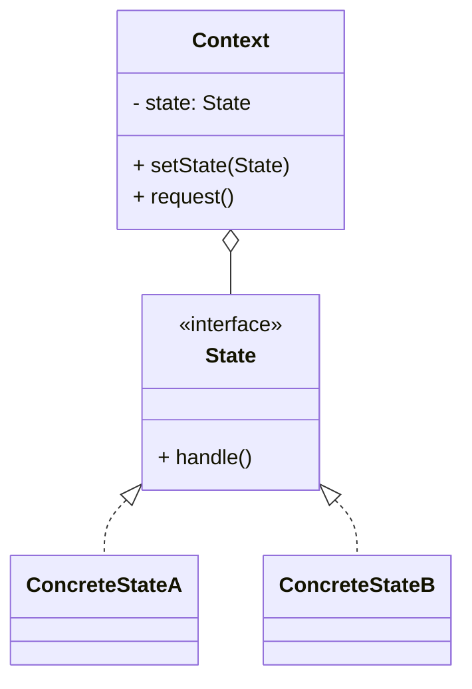

# 状态模式（State）

> 所属分类：**行为型** 　|　 返回：[设计模式分类](../设计模式分类.md)


## 意图
允许一个对象在其内部状态改变时改变它的行为，对象看起来似乎修改了它所属的类。

## 结构（类图）


## 示例代码
```java
interface State { void handle(Context c); }
class IdleState implements State {
    public void handle(Context c){ System.out.println("开始运行"); c.setState(new RunningState()); }
}
class RunningState implements State {
    public void handle(Context c){ System.out.println("暂停"); c.setState(new PausedState()); }
}
class Context {
    private State state = new IdleState();
    void setState(State s){ state = s; }
    void request(){ state.handle(this); }    // 行为随状态自动切换
}
```

## 适用场景
- 对象行为依赖状态且状态多、转换复杂（订单状态机、电梯、游戏角色状态、TCP 连接）。

## 与相似模式区别
- 与**策略**：状态**内部自动切换**；策略**由客户端指定**且不自动变换。
- 与**责任链**：状态通常只有一个当前状态对象；责任链有多个处理者串联。
