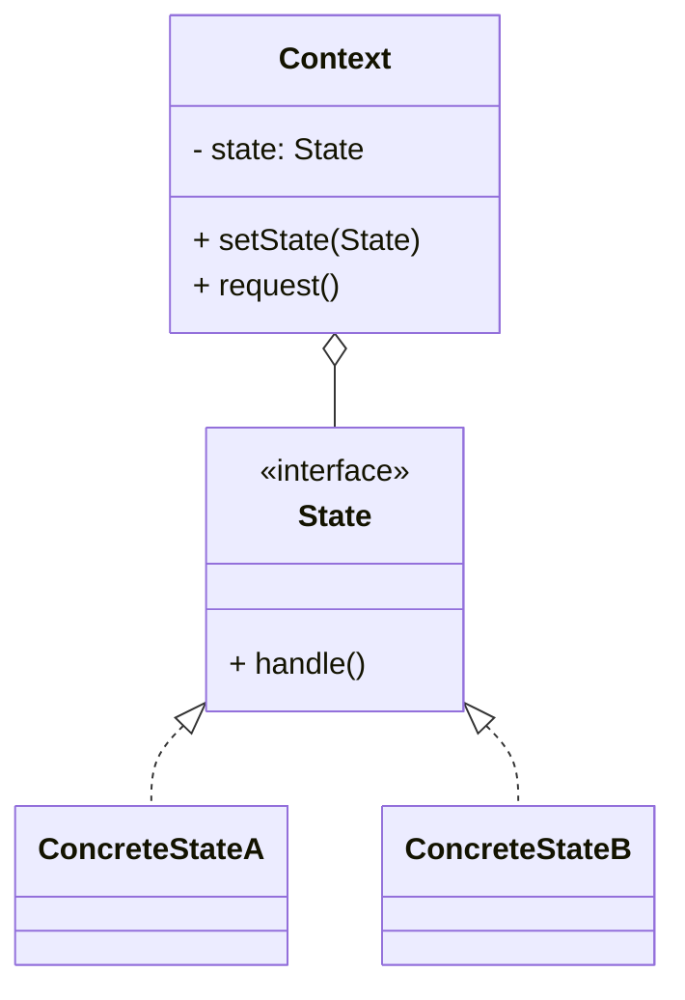
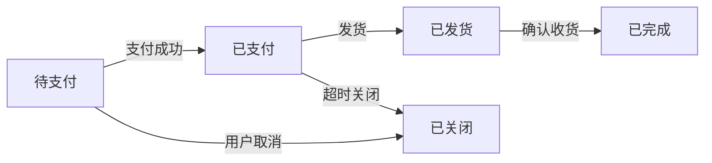

# 状态模式（State）

> 所属分类：**行为型** 　|　 返回：[设计模式分类](../设计模式分类.md)

> **一句话定义**：允许一个对象在其**内部状态改变时改变它的行为**——把「庞大的 switch(state)」拆成一组状态对象，对象看起来像换了类。
> **英文**：State Pattern 　|　 **意图（GoF）**：Allow an object to alter its behavior when its internal state changes. The object will appear to change its class.

---

## 一、意图与解决的问题

对象行为依赖状态且有多种状态、复杂转换时，朴素写法是堆 `switch(status)`：

```java
// 坏味道：行为方法里堆满 switch，每个新状态要改所有方法（违反开闭）
void handle(Order o) {
    switch (o.status) {
        case PENDING_PAY:  pay(o); break;
        case PAID:         ship(o); break;
        case SHIPPED:      confirm(o); break;
        // 加一个状态 → 这里、那里、哪里都要改
    }
}
```

痛点：
1. **违反开闭**：新增状态要改所有 `switch` 分支。
2. **易漏分支**：某方法忘了处理新状态 → 运行时 NPE/逻辑错误。
3. **可读性差**：状态转换规则散落各处，无法一眼看全。

状态模式把每个状态封装成对象，对象行为委托给"当前状态对象"：

> 💡 核心思想：**把"状态"变成"对象"，行为随状态自动切换，消灭 switch。**

---

## 二、结构（类图）



- **State（抽象状态）**：定义在该状态下对象能响应的方法。
- **ConcreteState（具体状态）**：实现该状态下的行为，并可触发向其他状态的转换。
- **Context（上下文）**：持有当前状态引用，把请求委托给当前状态。

---

## 三、经典 Java 实现（类版）

```java
interface State { void handle(Context c); }
class IdleState implements State {
    public void handle(Context c){ System.out.println("开始运行"); c.setState(new RunningState()); }
}
class RunningState implements State {
    public void handle(Context c){ System.out.println("暂停"); c.setState(new PausedState()); }
}
class Context {
    private State state = new IdleState();
    void setState(State s){ state = s; }
    void request(){ state.handle(this); }    // 行为随状态自动切换
}
```

---

## 四、深挖：订单状态机的工程形态（状态驱动行为）



```java
// 状态 + 事件（动作）的状态机：事件决定转移，状态决定行为
public enum OrderStatus {
    PENDING_PAY {
        @Override public OrderStatus onEvent(OrderEvent e) {
            return switch (e) {
                case PAY_SUCCESS -> PAID;
                case CANCEL, TIMEOUT -> CLOSED;
                default -> throw new IllegalStateException("非法转移: " + e);
            };
        }
    },
    PAID {
        @Override public OrderStatus onEvent(OrderEvent e) {
            return switch (e) {
                case SHIP -> SHIPPED;
                case REFUND -> REFUNDED;
                default -> throw new IllegalStateException("非法转移: " + e);
            };
        }
    },
    // ... SHIPPED / COMPLETED / CLOSED / REFUNDED
    ;
    public abstract OrderStatus onEvent(OrderEvent e);
}
```

- **两种实现**：**类版**（每个状态一个类，适合行为复杂）；**枚举版**（状态 + 转移表，适合状态/事件有限、行为简单的订单流——工程最常用）。
- **状态机框架**：状态多、转移复杂时用 Spring Statemachine / 状态机 DSL。
- **持久化**：订单状态落库，事件幂等（支付回调重复）→ 状态机提供「非法转移即拒绝」，天然防重。

---

## 五、深挖：类版 vs 枚举版选型

| 形态 | 适合 | 优点 | 缺点 |
|------|------|------|------|
| 类版（GoF） | 状态行为复杂、差异大 | 符合开闭、每状态独立 | 类数量多 |
| 枚举 + 转移表 | 状态/事件有限、行为简单 | 集中可读、易加日志 | 行为都塞在枚举里 |

---

## 六、适用场景

- 对象行为依赖状态且状态多、转换复杂（订单状态机、电梯、游戏角色状态、TCP 连接）。

---

## 七、与相似模式区别

| 对比 | 状态 | 策略 | 责任链 |
|------|------|------|--------|
| 谁决定行为 | 内部状态自动切换 | 客户端指定（不自动变） | 请求沿链传递 |
| 关系 | 状态间常互转 | 算法间平级 | 多处理者串联 |

- 与**策略**：状态**内部自动切换**；策略**由客户端指定**且不自动变换。
- 与**责任链**：状态通常只有一个当前状态对象；责任链有多个处理者串联。

---

## 八、不适用场景（反例）

- 状态**极少且转换简单**——用 `if/else` + 枚举字段更直接，状态模式过度设计。
- 状态间**转换逻辑极其复杂、变化频繁**——可能更适合状态机框架（如 Spring Statemachine）而非手写。
- 状态对象**有副作用且被多线程共享可变**——需保证状态切换的原子性。

---

## 九、在 JDK / Spring / 开源中的真实应用

- **JDK**：`Thread.State`（NEW/RUNNABLE/BLOCKED/... 状态及合法转换）；`javax.fsm`（部分容器提供）。
- **实战**：订单状态机（待支付→已支付→已发货→已完成）、TCP 连接状态、工作流引擎、电梯控制。
- **Spring Statemachine**：企业级有限状态机实现。
- **Netty**：`Channel` 状态（未连接/已连接/已注册）驱动读写行为。

---

## 十、实现要点与常见坑

1. **状态转换集中管理**：转换规则要么在 Context、要么在各 State 内部，避免散落 `if`。
2. **与策略区别**：策略客户端主动换算法；状态『内部状态自动切换行为』，且状态间常互相知晓转移。
3. **避免巨型 if**：不用状态模式时，行为方法里会堆满 `switch(state)`，违反开闭。
4. **并发安全**：状态切换需同步或 CAS（如订单并发支付/取消），状态机 + 乐观锁更稳。

---

## 十一、生产实践与重构信号

1. **重构信号**：业务类里 `switch (status) { case PENDING: ... }` 出现第二处 → 抽状态机。
2. **非法转移防护**：状态机天然拒绝「已关闭的订单再支付」——业务规则集中一处。
3. **事件驱动 + 幂等**：回调/异步事件触发状态机，非法事件抛异常 + 记录，配合唯一事件 ID 幂等。
4. **可观测**：状态变更打点（谁、何时、从哪到哪），配合审计。

---

## 十二、反模式案例

### 案例：状态转换散落导致漏处理

```java
// 反模式：状态转移写在多处，新增 REFUNDED 状态后某处忘了处理
void onPay(Order o) {
    if (o.status == PENDING_PAY) o.status = PAID;   // 转移 A 处
}
void onCancel(Order o) {
    if (o.status == PENDING_PAY) o.status = CLOSED;  // 转移 B 处
}
// 新增状态后，C 处忘了加分支 → 状态卡死
```

**修正**：转移规则集中在 `OrderStatus.onEvent()`，一处定义所有合法转移，非法转移统一抛异常。

---

## 十三、面试高频追问（30 条）

1. Q：状态模式解决什么？ A：允许对象在内部状态改变时改变行为，消除大量条件分支。
2. Q：状态 vs 策略？ A：策略由客户端主动选择算法；状态由对象内部状态自动切换行为，且状态间有转移关系。
3. Q：Order 状态机怎么设计？ A：每个状态是一个类，定义合法转移与在该状态下的行为；Context 委托当前状态处理。
4. Q：状态模式 vs 状态字段+if？ A：状态模式把分支变成对象，符合开闭，新增状态只加类；if 写法改一处牵全身。
5. Q：JDK 例子？ A：Thread.State 及其状态合法转换。
6. Q：状态切换放在哪？ A：放在状态类内部（自驱转移）或 Context（集中管理），二者权衡可读性。
7. Q：订单状态机用什么实现好？ A：状态/事件不多用枚举+转移表；行为复杂用状态模式类；更复杂用 Spring Statemachine。
8. Q：非法状态转移怎么办？ A：抛异常 + 审计日志；或返回错误码由调用方处理。
9. Q：状态机与工作流引擎区别？ A：状态机管对象状态；工作流管『流程任务与人的协作』，粒度更大。
10. Q：状态模式与「有限状态机（FSM）」？ A：状态模式是 FSM 的面向对象实现之一。
11. Q：并发下状态切换安全吗？ A：需同步或 CAS（如订单并发支付/取消），状态机 + 乐观锁更稳。
12. Q：状态怎么持久化？ A：状态字段落库；事件表可追溯；回放事件重建状态（事件溯源）。
13. Q：状态模式会不会类爆炸？ A：状态数多时类多；可枚举化或收敛行为到转移表。
14. Q：状态模式在协议栈？ A：TCP 连接状态机（SYN/ESTABLISHED/FIN_WAIT）就是 FSM 经典。
15. Q：状态模式 vs 策略模式的代码相似？ A：结构相似但意图不同：策略是『选算法』，状态是『状态驱动』。
16. Q：状态模式能处理历史/回溯吗？ A：可以维护状态栈（撤销），或用事件溯源重放。
17. Q：转移条件放状态里还是 Context？ A：放状态内则自驱、易测；放 Context 则集中、便于统一校验。
18. Q：状态模式在游戏开发？ A：角色 空闲/移动/攻击/死亡 状态切换，行为完全由状态决定。
19. Q：状态模式与事件驱动如何结合？ A：事件触发状态转移，状态决定响应行为，二者天然契合。
20. Q：如何防止状态机死循环？ A：转移表加校验、单元测试覆盖所有事件 × 状态组合。
21. Q：状态模式适合配置驱动吗？ A：适合，转移表可外置成 JSON/YAML，配合状态机引擎动态加载。
22. Q：状态模式与备忘录配合？ A：状态切换前用备忘录存快照，可支持"退回上一步状态"。
23. Q：状态机如何做超时触发？ A：进入状态启动定时器（如待支付 30 分钟超时），事件触发自动转移。
24. Q：状态模式在审批流？ A：审批中/通过/驳回 各状态，审批动作触发状态转移，符合业务规则。
25. Q：状态对象应该是单例吗？ A：无状态的状态对象可作单例（如枚举）；含可变字段则每上下文独立实例。
26. Q：状态模式违反单一职责吗？ A：每个状态类只管一种状态下的行为，反而更契合单一职责。
27. Q：如何测试状态机？ A：对每个 (状态, 事件) 组合做单元测试，验证转移结果与拒绝非法转移。
28. Q：状态模式和领域驱动（DDD）？ A：聚合根的状态转换是领域核心规则，状态机是聚合行为的天然建模方式。
29. Q：状态模式在 UI 组件？ A：按钮 disabled/enabled/hover/pressed 状态决定渲染与点击行为。
30. Q：状态机和规则引擎区别？ A：状态机管"状态转移"；规则引擎管"条件→动作"的复杂判断，二者可结合。

---

## 十四、速记口诀（Summary）

> **「状态一变行为变，switch 散落该收编；订单电梯 TCP，状态机里转圈圈。」**
> 状态（内部自切换）≠ 策略（客户端选算法）。

---

## 十五、关联阅读

- 行为型：[策略模式](策略模式.md)（状态 vs 策略） · [备忘录模式](备忘录模式.md)（状态回溯） · [命令模式](命令模式.md)
- 架构实践：订单状态机、Spring Statemachine、Saga 编排、事件溯源
