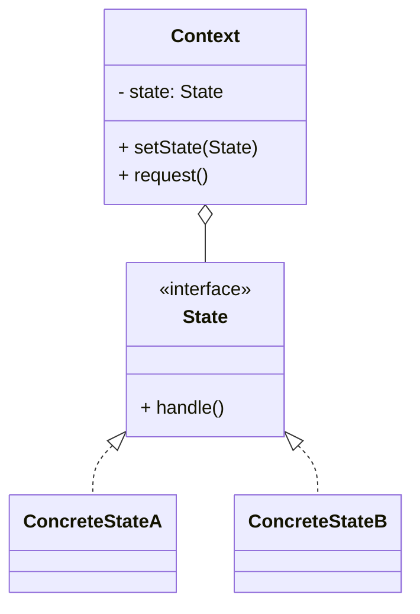
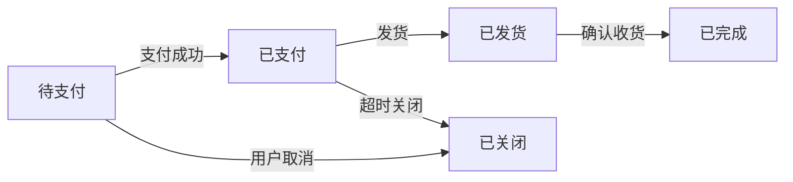

# 状态模式（State）

> 所属分类：**行为型** 　|　 返回：[设计模式分类](../设计模式分类.md)


## 意图
允许一个对象在其内部状态改变时改变它的行为，对象看起来似乎修改了它所属的类。

## 结构（类图）


## 示例代码
```java
interface State { void handle(Context c); }
class IdleState implements State {
    public void handle(Context c){ System.out.println("开始运行"); c.setState(new RunningState()); }
}
class RunningState implements State {
    public void handle(Context c){ System.out.println("暂停"); c.setState(new PausedState()); }
}
class Context {
    private State state = new IdleState();
    void setState(State s){ state = s; }
    void request(){ state.handle(this); }    // 行为随状态自动切换
}
```

### 深挖：订单状态机的工程形态（状态驱动行为）



```java
// 状态 + 事件（动作）的状态机：事件决定转移，状态决定行为
public enum OrderStatus {
    PENDING_PAY {
        @Override public OrderStatus onEvent(OrderEvent e) {
            return switch (e) {
                case PAY_SUCCESS -> PAID;
                case CANCEL, TIMEOUT -> CLOSED;
                default -> throw new IllegalStateException("非法转移: " + e);
            };
        }
    },
    PAID {
        @Override public OrderStatus onEvent(OrderEvent e) {
            return switch (e) {
                case SHIP -> SHIPPED;
                case REFUND -> REFUNDED;
                default -> throw new IllegalStateException("非法转移: " + e);
            };
        }
    },
    // ... SHIPPED / COMPLETED / CLOSED / REFUNDED
    ;

    public abstract OrderStatus onEvent(OrderEvent e);
}
```

- **两种实现**：**类版**（每个状态一个类，状态模式原教旨，适合行为复杂）；**枚举版**（状态 + 转移表，适合状态/事件有限、行为简单的订单流——工程最常用）。
- **状态机框架**：状态多、转移复杂时用 Spring Statemachine / 状态机 DSL（如 sormas）。
- **持久化**：订单状态落库，事件幂等（支付回调重复）→ 状态机提供「非法转移即拒绝」，天然防重。

## 适用场景
- 对象行为依赖状态且状态多、转换复杂（订单状态机、电梯、游戏角色状态、TCP 连接）。

## 与相似模式区别
- 与**策略**：状态**内部自动切换**；策略**由客户端指定**且不自动变换。
- 与**责任链**：状态通常只有一个当前状态对象；责任链有多个处理者串联。

## 不适用场景（反例）

- 状态**极少且转换简单**——用 `if/else` + 枚举字段更直接，状态模式过度设计。
- 状态间**转换逻辑极其复杂、变化频繁**——可能更适合状态机框架（如 Spring Statemachine）而非手写。
- 状态对象**有副作用且被多线程共享可变**——需保证状态切换的原子性。

## 在 JDK / Spring / 开源中的真实应用

- **JDK**：`Thread.State`（NEW/RUNNABLE/BLOCKED/... 状态及合法转换）；`javax.fsm`（部分容器提供）。
- **实战**：订单状态机（待支付→已支付→已发货→已完成）、TCP 连接状态、工作流引擎、电梯控制。
- **Spring Statemachine**：企业级有限状态机实现。
- **Netty**：`Channel` 状态（未连接/已连接/已注册）驱动读写行为。

## 实现要点与常见坑

- **状态转换集中管理**：转换规则要么在 Context、要么在各 State 内部，避免散落 `if`。
- **与策略区别**：策略客户端主动换算法；状态『内部状态自动切换行为』，且状态间常互相知晓转移。
- **避免巨型 if**：不用状态模式时，行为方法里会堆满 `switch(state)`，违反开闭。

## 生产实践与重构信号

1. **重构信号**：业务类里 `switch (status) { case PENDING: ... }` 出现第二处 → 抽状态机。
2. **非法转移防护**：状态机天然拒绝「已关闭的订单再支付」——业务规则集中一处。
3. **事件驱动 + 幂等**：回调/异步事件触发状态机，非法事件抛异常 + 记录，配合唯一事件 ID 幂等。
4. **可观测**：状态变更打点（谁、何时、从哪到哪），配合审计。

## 面试高频追问（15+ 条）

1. Q：状态模式解决什么？ A：允许对象在内部状态改变时改变行为，消除大量条件分支。
2. Q：状态 vs 策略？ A：策略由客户端主动选择算法；状态由对象内部状态自动切换行为，且状态间有转移关系。
3. Q：Order 状态机怎么设计？ A：每个状态是一个类，定义合法转移与在该状态下的行为；Context 委托当前状态处理。
4. Q：状态模式 vs 状态字段+if？ A：状态模式把分支变成对象，符合开闭，新增状态只加类；if 写法改一处牵全身。
5. Q：JDK 例子？ A：Thread.State 及其状态合法转换。
6. Q：状态切换放在哪？ A：放在状态类内部（自驱转移）或 Context（集中管理），二者权衡可读性。
7. Q：订单状态机用什么实现好？ A：状态/事件不多用枚举+转移表；行为复杂用状态模式类；更复杂用 Spring Statemachine。
8. Q：非法状态转移怎么办？ A：抛异常 + 审计日志；或返回错误码由调用方处理。
9. Q：状态机与工作流引擎区别？ A：状态机管对象状态；工作流管『流程任务与人的协作』，粒度更大。
10. Q：状态模式与「有限状态机（FSM）」？ A：状态模式是 FSM 的面向对象实现之一。
11. Q：并发下状态切换安全吗？ A：需同步或 CAS（如订单并发支付/取消），状态机 + 乐观锁更稳。
12. Q：状态怎么持久化？ A：状态字段落库；事件表可追溯；回放事件重建状态（事件溯源）。
13. Q：状态模式会不会类爆炸？ A：状态数多时类多；可枚举化或收敛行为到转移表。
14. Q：状态模式在协议栈？ A：TCP 连接状态机（SYN/ESTABLISHED/FIN_WAIT）就是 FSM 经典。
15. Q：状态模式 vs 策略模式的代码相似？ A：结构相似但意图不同：策略是『选算法』，状态是『状态驱动』。
