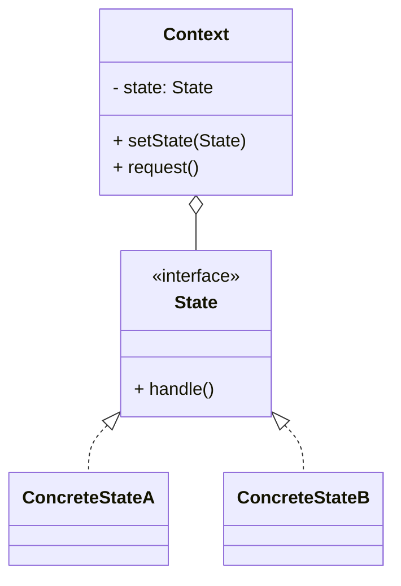

# 状态模式（State）

> 所属分类：**行为型** 　|　 返回：[设计模式分类](../设计模式分类.md)


## 意图
允许一个对象在其内部状态改变时改变它的行为，对象看起来似乎修改了它所属的类。

## 结构（类图）


## 示例代码
```java
interface State { void handle(Context c); }
class IdleState implements State {
    public void handle(Context c){ System.out.println("开始运行"); c.setState(new RunningState()); }
}
class RunningState implements State {
    public void handle(Context c){ System.out.println("暂停"); c.setState(new PausedState()); }
}
class Context {
    private State state = new IdleState();
    void setState(State s){ state = s; }
    void request(){ state.handle(this); }    // 行为随状态自动切换
}
```

## 适用场景
- 对象行为依赖状态且状态多、转换复杂（订单状态机、电梯、游戏角色状态、TCP 连接）。

## 与相似模式区别
- 与**策略**：状态**内部自动切换**；策略**由客户端指定**且不自动变换。
- 与**责任链**：状态通常只有一个当前状态对象；责任链有多个处理者串联。

## 不适用场景（反例）

- 状态**极少且转换简单**——用 `if/else` + 枚举字段更直接，状态模式过度设计。
- 状态间**转换逻辑极其复杂、变化频繁**——可能更适合状态机框架（如 Spring Statemachine）而非手写。
- 状态对象**有副作用且被多线程共享可变**——需保证状态切换的原子性。

## 在 JDK / Spring / 开源中的真实应用

- **JDK**：`Thread.State`（NEW/RUNNABLE/BLOCKED/... 状态及合法转换）；`javax.fsm`（部分容器提供）。
- **实战**：订单状态机（待支付→已支付→已发货→已完成）、TCP 连接状态、工作流引擎、电梯控制。
- **Spring Statemachine**：企业级有限状态机实现。

## 实现要点与常见坑

- **状态转换集中管理**：转换规则要么在 Context、要么在各 State 内部，避免散落 `if`。
- **与策略区别**：策略客户端主动换算法；状态『内部状态自动切换行为』，且状态间常互相知晓转移。
- **避免巨型 if**：不用状态模式时，行为方法里会堆满 `switch(state)`，违反开闭。

## 面试高频追问

1. Q：状态模式解决什么？ A：允许对象在内部状态改变时改变行为，消除大量条件分支。
2. Q：状态 vs 策略？ A：策略由客户端主动选择算法；状态由对象内部状态自动切换行为，且状态间有转移关系。
3. Q：Order 状态机怎么设计？ A：每个状态是一个类，定义合法转移与在该状态下的行为；Context 委托当前状态处理。
4. Q：状态模式 vs 状态字段+if？ A：状态模式把分支变成对象，符合开闭，新增状态只加类；if 写法改一处牵全身。
5. Q：JDK 例子？ A：Thread.State 及其状态合法转换。
6. Q：状态切换放在哪？ A：放在状态类内部（自驱转移）或 Context（集中管理），二者权衡可读性。
