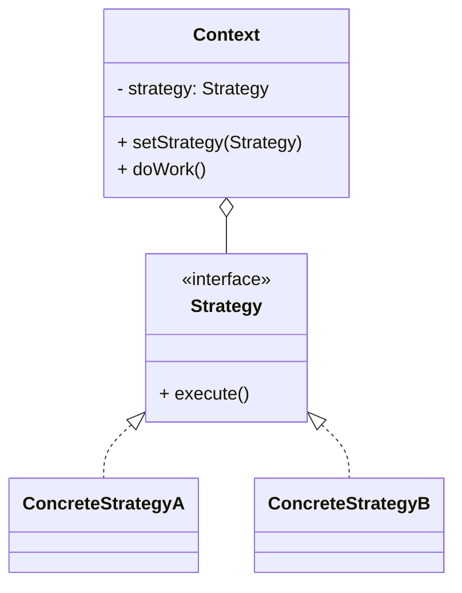

# 策略模式（Strategy）

> 所属分类：**行为型** 　|　 返回：[设计模式分类](../设计模式分类.md)


## 意图
定义一系列算法，把它们一个个封装起来，并且使它们可互相替换，使得算法可独立于使用它的客户而变化。

## 结构（类图）


## 示例代码
```java
interface DiscountStrategy { double calc(double price); }
class NoDiscount implements DiscountStrategy { public double calc(double p){ return p; } }
class HalfDiscount implements DiscountStrategy { public double calc(double p){ return p * 0.5; } }
class Cart {
    private DiscountStrategy strategy;
    public void setStrategy(DiscountStrategy s){ this.strategy = s; }
    public double checkout(double p){ return strategy.calc(p); }
}
```

### 深挖：策略注册表 + 函数式写法（消灭 if/else 的工程标准答案）

```java
// 注册表版：Map<枚举, 策略>，加新策略不改调用代码
public enum DiscountType { NONE, HALF, FULL_REDUCTION }

@Component
public class DiscountStrategyRegistry {
    private final Map<DiscountType, DiscountStrategy> strategies;

    public DiscountStrategyRegistry(List<DiscountStrategy> all) {  // Spring 注入全部实现
        strategies = all.stream().collect(Collectors.toMap(DiscountStrategy::type, s -> s));
    }
    public DiscountStrategy get(DiscountType t) {
        return strategies.getOrDefault(t, new NoDiscount());
    }
}
// 用法：cart.setStrategy(registry.get(type));   —— 业务代码零分支

// 函数式版：简单策略直接用 lambda
Map<String, Function<Double, Double>> rules = Map.of(
    "half", p -> p * 0.5,
    "none", p -> p);
```

> 面试加分：**「策略 + 工厂/注册表 + 依赖注入」三件套**是「消灭 switch 重构」的完整答案——新增策略只需加实现类（开闭），业务侧无感。

## 适用场景
- 一个行为有多种可互换算法（排序、压缩、校验、促销）。
- 避免大量 if/else 或 switch 分支。

## 与相似模式区别
- 与**状态**：策略由**客户端主动选择**算法；状态由**对象内部状态自动切换**行为。
- 与**桥接**：桥接偏结构维度，策略偏算法替换。

## 不适用场景（反例）

- 只有**一种算法**且不会变——直接写死，策略是过度设计。
- 算法**差异极小、只是参数不同**——用参数配置而非新建策略类。
- 客户端**每次都手动 if 选策略**且散落各处——应集中成策略工厂/注册表 + 上下文自动选择。

## 在 JDK / Spring / 开源中的真实应用

- **JDK**：`Comparator` 即排序策略；`LayoutManager`（布局策略）；`ZipOutputStream` 的压缩策略。
- **Spring**：`Resource`（classpath/file/url 资源策略）、`HandlerMapping`/`HandlerAdapter`、`RejectedExecutionHandler`（线程池拒绝策略）。
- **实战**：促销折扣、支付方式、序列化格式、路由规则。
- **Netty**：`EventLoopGroup` 的 IO 多路复用策略（NIO/Epoll）。

## 实现要点与常见坑

- **客户端需认识策略**：策略模式把『选哪个策略』的责任交回客户端或工厂；配合工厂/Map 注册更优雅。
- **与状态区别**：策略是『被主动选择的算法』；状态是『随内部状态自动切换的行为』（且状态间常互转）。
- **大量策略类**：可结合 lambda/函数式（Java 8+ 用 `Function`/`Predicate` 替代小策略类）。

## 生产实践与重构信号

1. **重构信号**：`if (type == A) ... else if (type == B) ...` 出现第二处 → 抽策略接口；第三处 → 注册表。
2. **配合 Spring**：策略实现全部 `@Component`，构造器注入 List 自动收集，`Map` 按类型取——零配置开闭。
3. **拒绝策略（线程池）**：AbortPolicy/CallerRunsPolicy/DiscardPolicy 就是 JDK 的策略模式示例。
4. **策略与模板方法组合**：固定流程 + 可换算法（见 设计模式分类.md 的组合案例）。

## 面试高频追问（15+ 条）

1. Q：策略模式解决什么？ A：封装一系列可互换算法，使算法独立于使用它的客户变化。
2. Q：策略 vs 状态？ A：策略客户端主动选算法；状态对象内部状态自动切换行为。
3. Q：策略 vs 工厂？ A：工厂负责『造对象』；策略负责『算法替换』，二者常配合（工厂产出策略）。
4. Q：JDK 策略例子？ A：Comparator、LayoutManager、RejectedExecutionHandler。
5. Q：策略类太多怎么办？ A：Java 8+ 用 lambda/函数式接口替代简单策略；或用注册表管理。
6. Q：策略如何被客户端选择？ A：由客户端或工厂按条件选，配合 Map 注册避免 if/else。
7. Q：策略模式和开闭原则？ A：新增算法加实现类即可，不改调用方与上下文，对扩展开放。
8. Q：策略模式有什么缺点？ A：策略类增多、客户端要知道有哪些策略（需工厂/注册表收敛）。
9. Q：如何用 Spring 管理策略？ A：@Component + List 注入自动收集 + Map<type,策略> 查找。
10. Q：策略 vs 模板方法？ A：策略运行期换整个算法（组合）；模板方法固定流程填步骤（继承）。
11. Q：策略能配合枚举吗？ A：能，枚举 + 函数式字段（Java 8）或 Map 注册，语义更清晰。
12. Q：支付系统怎么用策略？ A：PaymentStrategy 接口 + 微信/支付宝/银行卡策略 + 渠道注册表。
13. Q：策略模式影响性能吗？ A：一次接口调用，可忽略；避免在热路径上做策略查找的反射。
14. Q：什么时候不该用策略？ A：只有一种算法、或差异只是参数不同时。
15. Q：与「策略模式 + 观察者」对比？ A：策略是选择行为；观察者是通知行为，可组合使用。
