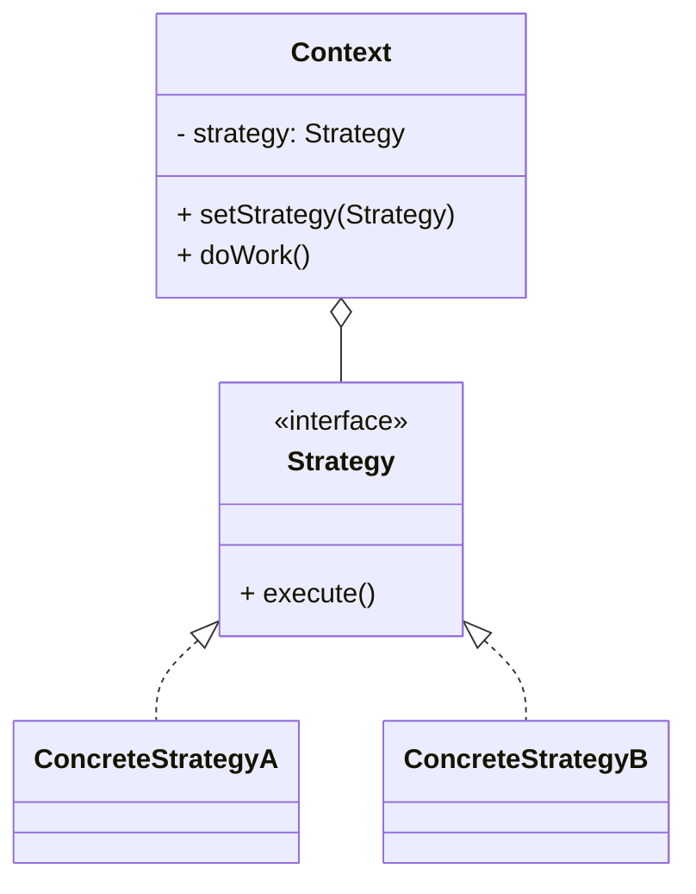

# 策略模式（Strategy）

> 所属分类：**行为型** 　|　 返回：[设计模式分类](../设计模式分类.md)


## 意图
定义一系列算法，把它们一个个封装起来，并且使它们可互相替换，使得算法可独立于使用它的客户而变化。

## 结构（类图）


## 示例代码
```java
interface DiscountStrategy { double calc(double price); }
class NoDiscount implements DiscountStrategy { public double calc(double p){ return p; } }
class HalfDiscount implements DiscountStrategy { public double calc(double p){ return p * 0.5; } }
class Cart {
    private DiscountStrategy strategy;
    public void setStrategy(DiscountStrategy s){ this.strategy = s; }
    public double checkout(double p){ return strategy.calc(p); }
}
```

## 适用场景
- 一个行为有多种可互换算法（排序、压缩、校验、促销）。
- 避免大量 if/else 或 switch 分支。

## 与相似模式区别
- 与**状态**：策略由**客户端主动选择**算法；状态由**对象内部状态自动切换**行为。
- 与**桥接**：桥接偏结构维度，策略偏算法替换。
