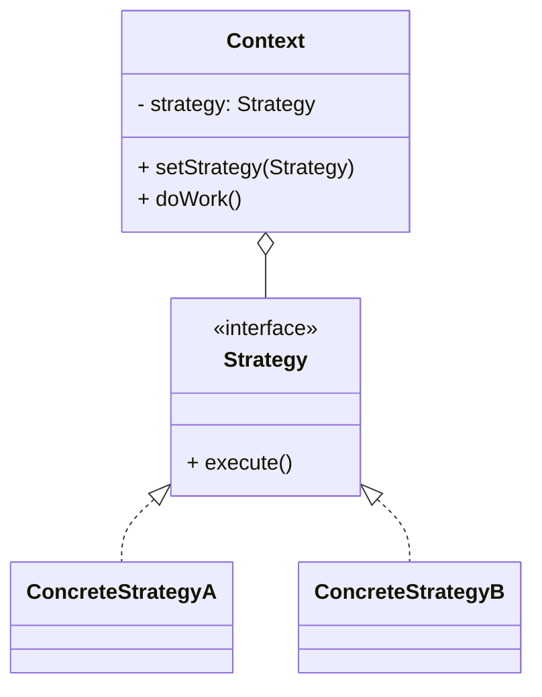

# 策略模式（Strategy）

> 所属分类：**行为型** 　|　 返回：[设计模式分类](../设计模式分类.md)


## 意图
定义一系列算法，把它们一个个封装起来，并且使它们可互相替换，使得算法可独立于使用它的客户而变化。

## 结构（类图）


## 示例代码
```java
interface DiscountStrategy { double calc(double price); }
class NoDiscount implements DiscountStrategy { public double calc(double p){ return p; } }
class HalfDiscount implements DiscountStrategy { public double calc(double p){ return p * 0.5; } }
class Cart {
    private DiscountStrategy strategy;
    public void setStrategy(DiscountStrategy s){ this.strategy = s; }
    public double checkout(double p){ return strategy.calc(p); }
}
```

## 适用场景
- 一个行为有多种可互换算法（排序、压缩、校验、促销）。
- 避免大量 if/else 或 switch 分支。

## 与相似模式区别
- 与**状态**：策略由**客户端主动选择**算法；状态由**对象内部状态自动切换**行为。
- 与**桥接**：桥接偏结构维度，策略偏算法替换。

## 不适用场景（反例）

- 只有**一种算法**且不会变——直接写死，策略是过度设计。
- 算法**差异极小、只是参数不同**——用参数配置而非新建策略类。
- 客户端**每次都手动 if 选策略**且散落各处——应集中成策略工厂/注册表 + 上下文自动选择。

## 在 JDK / Spring / 开源中的真实应用

- **JDK**：`Comparator` 即排序策略；`LayoutManager`（布局策略）；`ZipOutputStream` 的压缩策略。
- **Spring**：`Resource`（classpath/file/url 资源策略）、`HandlerMapping`/`HandlerAdapter`、`RejectedExecutionHandler`（线程池拒绝策略）。
- **实战**：促销折扣、支付方式、序列化格式、路由规则。

## 实现要点与常见坑

- **客户端需认识策略**：策略模式把『选哪个策略』的责任交回客户端或工厂；配合工厂/Map 注册更优雅。
- **与状态区别**：策略是『被主动选择的算法』；状态是『随内部状态自动切换的行为』（且状态间常互转）。
- **大量策略类**：可结合 lambda/函数式（Java 8+ 用 `Function`/`Predicate` 替代小策略类）。

## 面试高频追问

1. Q：策略模式解决什么？ A：封装一系列可互换算法，使算法独立于使用它的客户变化。
2. Q：策略 vs 状态？ A：策略客户端主动选算法；状态对象内部状态自动切换行为。
3. Q：策略 vs 工厂？ A：工厂负责『造对象』；策略负责『算法替换』，二者常配合（工厂产出策略）。
4. Q：JDK 策略例子？ A：Comparator、LayoutManager、RejectedExecutionHandler。
5. Q：策略类太多怎么办？ A：Java 8+ 用 lambda/函数式接口替代简单策略；或用注册表管理。
6. Q：策略如何被客户端选择？ A：由客户端或工厂按条件选，配合 Map 注册避免 if/else。
