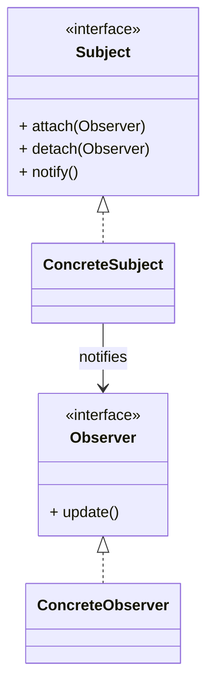

# 观察者模式（Observer）

> 所属分类：**行为型** 　|　 返回：[设计模式分类](../设计模式分类.md)


## 意图
定义对象间的一种一对多依赖关系，当一个对象状态发生改变时，所有依赖它的对象都得到通知并自动更新。

## 结构（类图）


## 示例代码
```java
interface Observer { void update(String msg); }
class NewsAgency {                         // 主题
    private List<Observer> obs = new ArrayList<>();
    void add(Observer o){ obs.add(o); }
    void publish(String m){ obs.forEach(o -> o.update(m)); }
}
```

## 适用场景
- 事件总线、发布订阅、Model-View 数据绑定、消息通知。

## 与相似模式区别
- 与**中介者**：观察者对象间**松耦合**靠主题通知；中介者让对象**不直接引用**彼此，经中介协调。
- 与**责任链**：观察者**多接收者并行**通知；责任链**单请求串行**传递。
