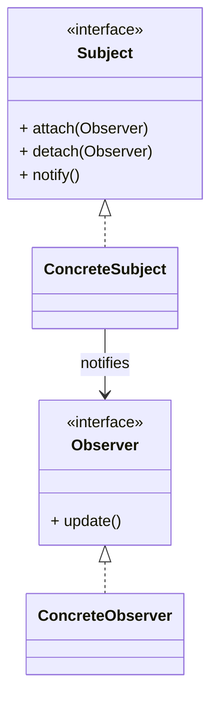
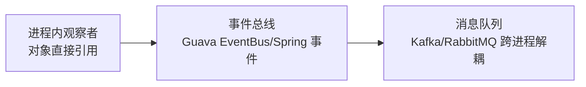

# 观察者模式（Observer）

> 所属分类：**行为型** 　|　 返回：[设计模式分类](../设计模式分类.md)

> **一句话定义**：定义**一对多**的依赖关系，当一个对象（主题）状态变化时，所有依赖它的对象（观察者）都收到通知并自动更新——「发布-订阅」的面向对象实现。
> **英文**：Observer Pattern 　|　 **意图（GoF）**：Define a one-to-many dependency between objects so that when one object changes state, all its dependents are notified and updated automatically.

---

## 一、意图与解决的问题

核心流程里"主业务 + 一堆副作用"写在一起是最常见的耦合坏味道：

```java
// 坏味道：下单后直接调发短信/邮件/记日志，耦合且难扩展
public void placeOrder(Order o) {
    orderRepo.save(o);
    smsService.send(o);     // 加一种通知就要改这里
    emailService.send(o);
    logService.log(o);
}
```

痛点：
1. **强耦合**：核心流程依赖所有副作用实现，新增通知要改核心代码（违反开闭）。
2. **同步阻塞**：某个通知慢，拖垮下单主链路。
3. **难测试**：测下单要同时备齐所有通知服务的 mock。

观察者模式把"副作用"建模成"观察者"，核心流程只负责**发布事件**：

> 💡 核心思想：**主体变化 → 自动通知所有关注者**，主体不认识观察者，观察者也不阻塞主体（理想情况下）。

---

## 二、结构（类图）



- **Subject（主题/被观察者）**：维护观察者列表，提供注册/注销/通知。
- **ConcreteSubject**：状态变化时调用 `notify()`。
- **Observer（观察者）**：定义更新接口 `update()`。
- **ConcreteObserver**：实现 `update()`，响应主题变化。

---

## 三、经典 Java 实现

```java
interface Observer { void update(String msg); }
class NewsAgency {                         // 主题
    private List<Observer> obs = new ArrayList<>();
    void add(Observer o){ obs.add(o); }
    void remove(Observer o){ obs.remove(o); }
    void publish(String m){ obs.forEach(o -> o.update(m)); }
}
class Reader implements Observer {
    private String name;
    public void update(String m){ System.out.println(name + " 收到:" + m); }
}
```

---

## 四、深挖：从进程内观察者到跨进程 MQ 的演进



| 层级 | 解耦程度 | 可靠性 | 典型 |
|------|----------|--------|------|
| 直接对象引用 | 弱 | 同步 | 经典 GoF 观察者 |
| 进程内事件 | 中 | 同步/异步（@Async） | Spring `ApplicationEvent` |
| 消息队列 | 强（跨进程） | 可持久化/重试 | Kafka/RabbitMQ（见 基础知识/中间件） |

- **Spring 事件写法**：发布 `new OrderCreatedEvent(order)` + `@EventListener` 监听——业务代码零耦合。
- **生产注意**：同步监听抛异常会中断主流程；异步监听需幂等与顺序保障；跨服务用 MQ 并消费幂等。

---

## 五、深挖：推模型 vs 拉模型

| 模型 | 做法 | 优缺点 |
|------|------|--------|
| 推（push） | 主题把数据作为参数传给 `update` | 观察者直接拿到数据；但若数据多则浪费带宽 |
| 拉（pull） | 只通知「变了」，观察者主动去主题取 | 观察者按需取，但需持有主题引用 |

```java
// 推：update(Order o) 直接带数据
// 拉：update() 后 observer 调 subject.getOrder() 自取
```

---

## 六、深挖：领域事件（DDD 形态）

```java
// 聚合根发布领域事件，监听器跨限界上下文联动
class Order {
    private final List<DomainEvent> events = new ArrayList<>();
    void pay() { this.status = PAID; events.add(new OrderPaidEvent(id)); }
    List<DomainEvent> pullEvents() { /* 清空并返回 */ }
}
// 监听器：发短信、更新积分、同步搜索索引——各自独立，互不阻塞
@EventListener void on(OrderPaidEvent e) { smsService.notify(e.orderId); }
```

---

## 七、适用场景

- 事件总线、发布订阅、Model-View 数据绑定、消息通知、领域事件。

---

## 八、与相似模式区别

| 对比 | 观察者 | 中介者 | 责任链 | 回调 |
|------|--------|--------|--------|------|
| 关系 | 一对多广播 | 双向协调 | 单请求串行 | 点对点 |
| 耦合 | 松（主题不知观察者） | 星型集中 | 链传递 | 单函数 |

- 与**中介者**：观察者对象间**松耦合**靠主题通知；中介者让对象**不直接引用**彼此，经中介协调。
- 与**责任链**：观察者**多接收者并行**通知；责任链**单请求串行**传递。

---

## 九、不适用场景（反例）

- 通知**只是简单的函数调用**、无一对多需求——直接调用即可，观察者徒增间接。
- 观察者与主题**生命周期错配**（主题长期存活、观察者短命）——易造成内存泄漏（观察者未注销）。
- 通知链**过长或同步阻塞**——一个观察者慢会拖垮主题，应考虑异步/线程池。

---

## 十、在 JDK / Spring / 开源中的真实应用

- **JDK**：早期 `Observable`/`Observer`（已弃用），现代用 `Flow`(响应式)；`java.beans.PropertyChangeSupport`。
- **Spring**：`ApplicationEvent` + `ApplicationListener`（或 `@EventListener`）事件驱动解耦。
- **Guava**：`EventBus`；**MQ**（Kafka/RabbitMQ）是典型的跨进程观察者模式。

---

## 十一、实现要点与常见坑

1. **避免内存泄漏**：观察者用完必须 `remove`/`unregister`，否则被主题强引用无法回收（尤其在短命观察者场景）。
2. **同步 vs 异步**：默认同步通知，某观察者异常会中断后续；生产建议异步 + 容错（如 Spring `@Async` 事件）。
3. **事件顺序**：观察者间若有顺序要求，需显式排序（Spring 可用 `@Order`）。
4. **与中介者区别**：观察者一对多被动通知；中介者双向协调调用。

---

## 十二、生产实践与重构信号

1. **重构信号**：下单/注册等核心流程里「业务 + 发短信 + 发邮件 + 记日志」写在一起 → 发布领域事件，观察者解耦。
2. **领域事件（DDD）**：聚合根发布 `DomainEvent`，事件处理器跨上下文联动——观察者的 DDD 形态。
3. **Spring 事件注意**：`@TransactionalEventListener` 可保证事务提交后再通知（避免半成品状态）。
4. **异步化纪律**：非核心观察者（通知、统计）异步化；核心一致性逻辑不要靠观察者隐式执行。

---

## 十三、反模式案例

### 案例：同步观察者拖垮主链路

```java
// 反模式：下单同步调所有通知，短信服务抖动 → 下单超时
void placeOrder(Order o) {
    orderRepo.save(o);
    smsService.send(o);      // 同步，慢！
    emailService.send(o);    // 同步，慢！
}
```

**修正**：核心流程只 `publish(new OrderCreatedEvent(o))`，通知类监听者异步处理；失败不影响下单。

---

## 十四、面试高频追问（30 条）

1. Q：观察者解决什么？ A：定义一对多依赖，主题状态变更自动通知所有观察者，实现解耦。
2. Q：观察者 vs 发布-订阅（MQ）？ A：经典观察者在同进程、直接引用；MQ 是跨进程、经 broker 解耦，更彻底。
3. Q：观察者内存泄漏怎么产生？ A：主题强引用观察者且观察者未注销，导致无法被 GC。
4. Q：同步通知的问题？ A：一个观察者慢/抛异常会阻塞或中断其他观察者，宜异步+容错。
5. Q：Spring 事件机制？ A：ApplicationEvent 发布，ApplicationListener/@EventListener 监听，可 @Async 异步。
6. Q：JDK 观察者缺陷？ A：Observable/Observer 设计不佳已弃用，现代用 Flow/响应式。
7. Q：观察者 vs 责任链？ A：观察者一对多广播；责任链单请求串行传递。
8. Q：观察者 vs 中介者？ A：观察者主题被动通知；中介者主动协调多个同事。
9. Q：@TransactionalEventListener 是什么？ A：事务提交后（或回滚后）才触发的事件监听，避免读到半成品。
10. Q：观察者怎么防重入？ A：通知过程中锁住集合副本（快照遍历），避免并发增删观察者。
11. Q：事件风暴会有什么问题？ A：事件链过长、循环依赖、难排查；用事件总线做收敛与追踪 ID。
12. Q：观察者模式与响应式编程？ A：Reactive Streams（Flow/Publisher-Subscriber）是观察者的标准化异步版。
13. Q：如何保证观察者执行顺序？ A：@Order / 注册列表排序，但别过度依赖顺序（顺序敏感说明耦合）。
14. Q：观察者失败怎么兜底？ A：异步 + 重试 + 死信；核心链路与通知链路隔离。
15. Q：什么时候用 MQ 而不是进程内事件？ A：跨服务、需要持久化/重放/削峰时；同进程解耦用事件即可。
16. Q：推模型与拉模型区别？ A：推模型直接带数据；拉模型只通知、观察者自行取，各有权衡。
17. Q：观察者模式符合什么原则？ A：开闭（新增观察者不改主题）、观察者间松耦合。
18. Q：观察者模式在 MVC 里？ A：Model 是主题，View 是观察者，Model 变化自动刷新 View。
19. Q：观察者能传递异常吗？ A：同步时异常会传播；异步应捕获并记录，避免影响其他观察者。
20. Q：观察者 vs 回调？ A：回调是点对点（一个完成通知一个）；观察者是一对多广播。
21. Q：观察者未注销除了泄漏还有什么风险？ A：主题触发时观察者仍被调用，可能操作已销毁资源 → NPE。
22. Q：观察者如何支持"只通知变更字段"？ A：事件对象携带变更描述（如 PropertyChangeEvent），观察者按需响应。
23. Q：观察者模式适合强一致场景吗？ A：不适合——观察者通知是"尽力而为"，强一致应走事务/Saga。
24. Q：观察者模式与事件溯源？ A：事件溯源把所有变更记录为事件流，观察者（投影/读模型）订阅事件重建视图。
25. Q：如何测试观察者？ A：mock 主题，验证状态变更后观察者的 update 被正确调用（次数/参数）。
26. Q：观察者数量和性能？ A：观察者多时通知遍历开销累加；热点路径用异步或收敛事件。
27. Q：观察者能携带上下文（traceId）吗？ A：能，事件对象放 traceId/tenantId，监听器透传全链路追踪。
28. Q：观察者 vs Pub/Sub 模式？ A：观察者常指进程内对象通知；Pub/Sub 是消息范式（含 broker、主题订阅），观察者思想是 Pub/Sub 的 OO 前身。
29. Q：观察者模式在 Vue/React？ A：响应式数据（data）→ 视图自动重渲染，正是观察者思想的体现。
30. Q：观察者模式缺点？ A：隐式依赖难追踪、通知顺序/异常需管控、内存泄漏风险、调试链路不直观。

---

## 十五、速记口诀（Summary）

> **「一对多，主题变，观察者自动被通知；用完记得要注销，否则内存泄漏掉。」**
> 进程内用事件，跨服务上 MQ；核心链路不要隐式依赖观察者。

---

## 十六、关联阅读

- 行为型：[中介者模式](中介者模式.md) · [命令模式](命令模式.md)（命令可作为事件载荷）
- 架构实践：领域事件（DDD）、Spring `ApplicationEvent`、`@TransactionalEventListener`、Kafka/RabbitMQ
