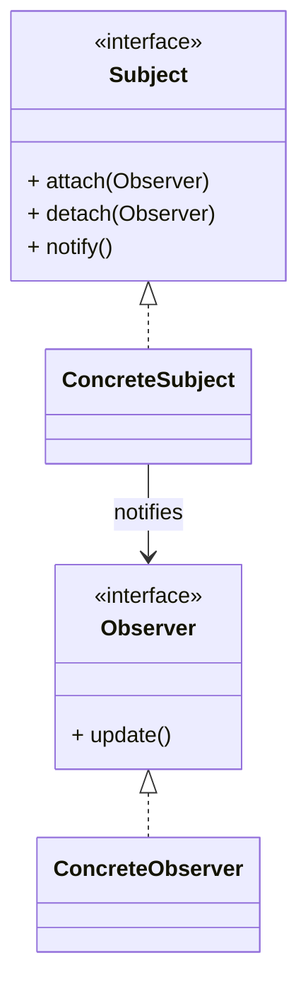
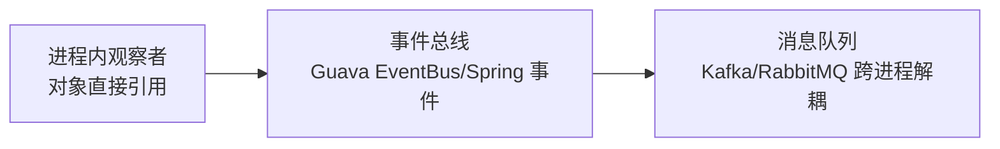

# 观察者模式（Observer）

> 所属分类：**行为型** 　|　 返回：[设计模式分类](../设计模式分类.md)


## 意图
定义对象间的一种一对多依赖关系，当一个对象状态发生改变时，所有依赖它的对象都得到通知并自动更新。

## 结构（类图）


## 示例代码
```java
interface Observer { void update(String msg); }
class NewsAgency {                         // 主题
    private List<Observer> obs = new ArrayList<>();
    void add(Observer o){ obs.add(o); }
    void publish(String m){ obs.forEach(o -> o.update(m)); }
}
```

### 深挖：从进程内观察者到跨进程 MQ 的演进



| 层级 | 解耦程度 | 可靠性 | 典型 |
|------|----------|--------|------|
| 直接对象引用 | 弱 | 同步 | 经典 GoF 观察者 |
| 进程内事件 | 中 | 同步/异步（@Async） | Spring `ApplicationEvent` |
| 消息队列 | 强（跨进程） | 可持久化/重试 | Kafka/RabbitMQ（见 基础知识/中间件） |

- **Spring 事件写法**：发布 `new OrderCreatedEvent(order)` + `@EventListener` 监听——业务代码零耦合。
- **生产注意**：同步监听抛异常会中断主流程；异步监听需幂等与顺序保障；跨服务用 MQ 并消费幂等。

## 适用场景
- 事件总线、发布订阅、Model-View 数据绑定、消息通知。

## 与相似模式区别
- 与**中介者**：观察者对象间**松耦合**靠主题通知；中介者让对象**不直接引用**彼此，经中介协调。
- 与**责任链**：观察者**多接收者并行**通知；责任链**单请求串行**传递。

## 不适用场景（反例）

- 通知**只是简单的函数调用**、无一对多需求——直接调用即可，观察者徒增间接。
- 观察者与主题**生命周期错配**（主题长期存活、观察者短命）——易造成内存泄漏（观察者未注销）。
- 通知链**过长或同步阻塞**——一个观察者慢会拖垮主题，应考虑异步/线程池。

## 在 JDK / Spring / 开源中的真实应用

- **JDK**：早期 `Observable`/`Observer`（已弃用），现代用 `Flow`(响应式)；`java.beans.PropertyChangeSupport`。
- **Spring**：`ApplicationEvent` + `ApplicationListener`（或 `@EventListener`）事件驱动解耦。
- **Guava**：`EventBus`；**MQ**（Kafka/RabbitMQ）是典型的跨进程观察者模式。

## 实现要点与常见坑

- **避免内存泄漏**：观察者用完必须 `remove`/`unregister`，否则被主题强引用无法回收（尤其在短命观察者场景）。
- **同步 vs 异步**：默认同步通知，某观察者异常会中断后续；生产建议异步 + 容错（如 Spring `@Async` 事件）。
- **事件顺序**：观察者间若有顺序要求，需显式排序（Spring 可用 `@Order`）。
- **与中介者区别**：观察者一对多被动通知；中介者双向协调调用。

## 生产实践与重构信号

1. **重构信号**：下单/注册等核心流程里「业务 + 发短信 + 发邮件 + 记日志」写在一起 → 发布领域事件，观察者解耦。
2. **领域事件（DDD）**：聚合根发布 `DomainEvent`，事件处理器跨上下文联动——观察者的 DDD 形态。
3. **Spring 事件注意**：`@TransactionalEventListener` 可保证事务提交后再通知（避免半成品状态）。
4. **异步化纪律**：非核心观察者（通知、统计）异步化；核心一致性逻辑不要靠观察者隐式执行。

## 面试高频追问（15+ 条）

1. Q：观察者解决什么？ A：定义一对多依赖，主题状态变更自动通知所有观察者，实现解耦。
2. Q：观察者 vs 发布-订阅（MQ）？ A：经典观察者在同进程、直接引用；MQ 是跨进程、经 broker 解耦，更彻底。
3. Q：观察者内存泄漏怎么产生？ A：主题强引用观察者且观察者未注销，导致无法被 GC。
4. Q：同步通知的问题？ A：一个观察者慢/抛异常会阻塞或中断其他观察者，宜异步+容错。
5. Q：Spring 事件机制？ A：ApplicationEvent 发布，ApplicationListener/@EventListener 监听，可 @Async 异步。
6. Q：JDK 观察者缺陷？ A：Observable/Observer 设计不佳已弃用，现代用 Flow/响应式。
7. Q：观察者 vs 责任链？ A：观察者一对多广播；责任链单请求串行传递。
8. Q：观察者 vs 中介者？ A：观察者主题被动通知；中介者主动协调多个同事。
9. Q：@TransactionalEventListener 是什么？ A：事务提交后（或回滚后）才触发的事件监听，避免读到半成品。
10. Q：观察者怎么防重入？ A：通知过程中锁住集合副本（快照遍历），避免并发增删观察者。
11. Q：事件风暴会有什么问题？ A：事件链过长、循环依赖、难排查；用事件总线做收敛与追踪 ID。
12. Q：观察者模式与响应式编程？ A：Reactive Streams（Flow/Publisher-Subscriber）是观察者的标准化异步版。
13. Q：如何保证观察者执行顺序？ A：@Order / 注册列表排序，但别过度依赖顺序（顺序敏感说明耦合）。
14. Q：观察者失败怎么兜底？ A：异步 + 重试 + 死信；核心链路与通知链路隔离。
15. Q：什么时候用 MQ 而不是进程内事件？ A：跨服务、需要持久化/重放/削峰时；同进程解耦用事件即可。
