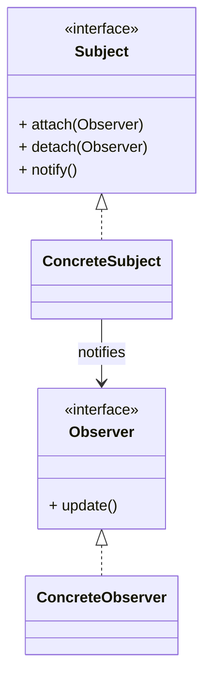

# 观察者模式（Observer）

> 所属分类：**行为型** 　|　 返回：[设计模式分类](../设计模式分类.md)


## 意图
定义对象间的一种一对多依赖关系，当一个对象状态发生改变时，所有依赖它的对象都得到通知并自动更新。

## 结构（类图）


## 示例代码
```java
interface Observer { void update(String msg); }
class NewsAgency {                         // 主题
    private List<Observer> obs = new ArrayList<>();
    void add(Observer o){ obs.add(o); }
    void publish(String m){ obs.forEach(o -> o.update(m)); }
}
```

## 适用场景
- 事件总线、发布订阅、Model-View 数据绑定、消息通知。

## 与相似模式区别
- 与**中介者**：观察者对象间**松耦合**靠主题通知；中介者让对象**不直接引用**彼此，经中介协调。
- 与**责任链**：观察者**多接收者并行**通知；责任链**单请求串行**传递。

## 不适用场景（反例）

- 通知**只是简单的函数调用**、无一对多需求——直接调用即可，观察者徒增间接。
- 观察者与主题**生命周期错配**（主题长期存活、观察者短命）——易造成内存泄漏（观察者未注销）。
- 通知链**过长或同步阻塞**——一个观察者慢会拖垮主题，应考虑异步/线程池。

## 在 JDK / Spring / 开源中的真实应用

- **JDK**：早期 `Observable`/`Observer`（已弃用），现代用 `Flow`(响应式)；`java.beans.PropertyChangeSupport`。
- **Spring**：`ApplicationEvent` + `ApplicationListener`（或 `@EventListener`）事件驱动解耦。
- **Guava**：`EventBus`；**MQ**（Kafka/RabbitMQ）是典型的跨进程观察者模式。

## 实现要点与常见坑

- **避免内存泄漏**：观察者用完必须 `remove`/`unregister`，否则被主题强引用无法回收（尤其在短命观察者场景）。
- **同步 vs 异步**：默认同步通知，某观察者异常会中断后续；生产建议异步 + 容错（如 Spring `@Async` 事件）。
- **事件顺序**：观察者间若有顺序要求，需显式排序（Spring 可用 `@Order`）。
- **与中介者区别**：观察者一对多被动通知；中介者双向协调调用。

## 面试高频追问

1. Q：观察者解决什么？ A：定义一对多依赖，主题状态变更自动通知所有观察者，实现解耦。
2. Q：观察者 vs 发布-订阅（MQ）？ A：经典观察者在同进程、直接引用；MQ 是跨进程、经 broker 解耦，更彻底。
3. Q：观察者内存泄漏怎么产生？ A：主题强引用观察者且观察者未注销，导致无法被 GC。
4. Q：同步通知的问题？ A：一个观察者慢/抛异常会阻塞或中断其他观察者，宜异步+容错。
5. Q：Spring 事件机制？ A：ApplicationEvent 发布，ApplicationListener/@EventListener 监听，可 @Async 异步。
6. Q：JDK 观察者缺陷？ A：Observable/Observer 设计不佳已弃用，现代用 Flow/响应式。
