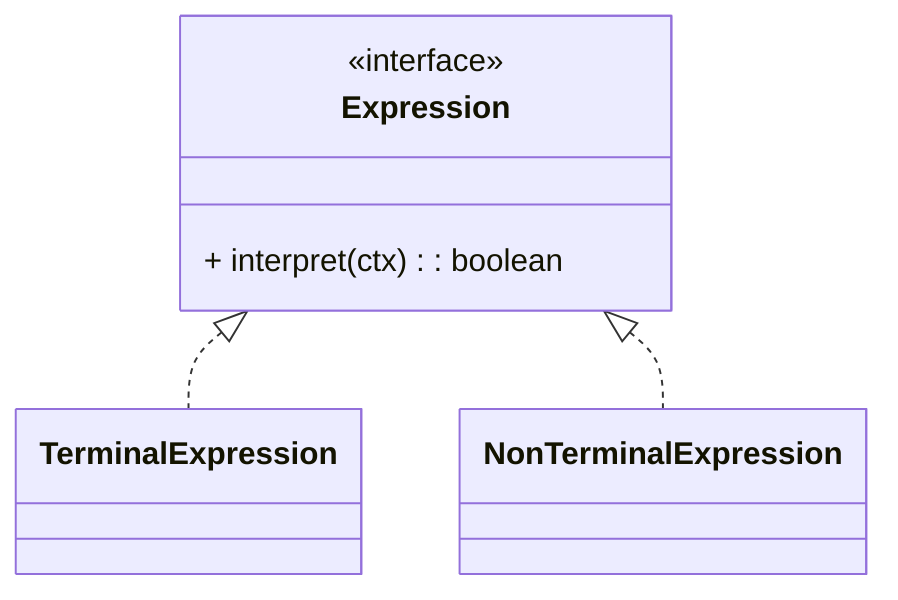

# 解释器模式（Interpreter）

> 所属分类：**行为型** 　|　 返回：[设计模式分类](../设计模式分类.md)


## 意图
给定一个语言，定义它的文法的一种表示，并定义一个解释器，该解释器使用该表示来解释语言中的句子。

## 结构（类图）


## 示例代码
```java
interface Expression { boolean interpret(String ctx); }
class TerminalExpression implements Expression {     // 终结符
    private String data;
    public TerminalExpression(String d){ data = d; }
    public boolean interpret(String ctx){ return ctx.contains(data); }
}
```

## 适用场景
- 规则引擎、正则表达式、SQL 解析、配置表达式、小型 DSL。**工程上复杂文法更推荐 ANTLR 等生成器。**

## 与相似模式区别
- 与**访问者**：解释器定义文法结构并解释执行；访问者对已有结构追加操作。
- 与**组合**：解释器常用组合表示语法树。

---

## 不适用场景（反例）

- 语法**很简单**——用正则表达式或现成解析库即可，解释器过度设计。
- 语法**频繁大改或非常复杂**——手写解释器维护成本高，应换成熟 parser（ANTLR）或用表达式引擎。
- 性能敏感且**递归极深**——解释执行慢且易栈溢出。

## 在 JDK / Spring / 开源中的真实应用

- **JDK**：`java.util.regex.Pattern`（正则文法解释执行）；`Spring EL` 表达式解析。
- **MyBatis**：动态 SQL 的 OGNL 表达式求值；**规则引擎**（Drools）内部也是解释执行。
- **实战**：SQL 解析、公式计算器、权限表达式、配置 DSL。

## 实现要点与常见坑

- **文法用类表达**：每个文法规则一个 `Expression` 类，规则多了类爆炸（这是解释器结构性短板）。
- **性能**：解释执行慢于编译执行，热点路径慎用；可考虑先做 AST 再求值。
- **与组合模式配合**：抽象语法树（AST）本质就是组合结构，叶子是终结符、分支是非终结符。

## 面试高频追问

1. Q：解释器解决什么？ A：给定语言文法，定义解释器来解释该语言的句子（如表达式求值）。
2. Q：解释器缺点？ A：文法规则多时类爆炸；解释执行性能差。
3. Q：JDK 哪里算解释器？ A：正则 Pattern 的解释执行、Spring EL。
4. Q：解释器与组合的关系？ A：AST 就是组合结构，终结符为叶子、非终结符为分支。
5. Q：何时不该用解释器？ A：文法复杂/频繁变化，应换 ANTLR 等成熟工具或表达式引擎。
6. Q：解释器典型应用？ A：SQL/公式/权限表达式/配置 DSL 求值。
