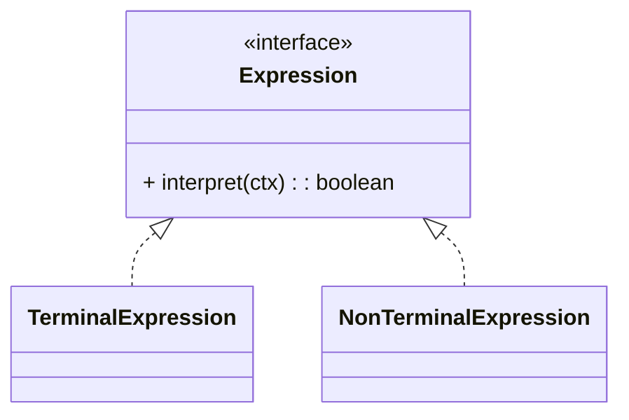

# 解释器模式（Interpreter）

> 所属分类：**行为型** 　|　 返回：[设计模式分类](../设计模式分类.md)


## 意图
给定一个语言，定义它的文法的一种表示，并定义一个解释器，该解释器使用该表示来解释语言中的句子。

## 结构（类图）


## 示例代码
```java
interface Expression { boolean interpret(String ctx); }
class TerminalExpression implements Expression {     // 终结符
    private String data;
    public TerminalExpression(String d){ data = d; }
    public boolean interpret(String ctx){ return ctx.contains(data); }
}
```

## 适用场景
- 规则引擎、正则表达式、SQL 解析、配置表达式、小型 DSL。**工程上复杂文法更推荐 ANTLR 等生成器。**

## 与相似模式区别
- 与**访问者**：解释器定义文法结构并解释执行；访问者对已有结构追加操作。
- 与**组合**：解释器常用组合表示语法树。

---
