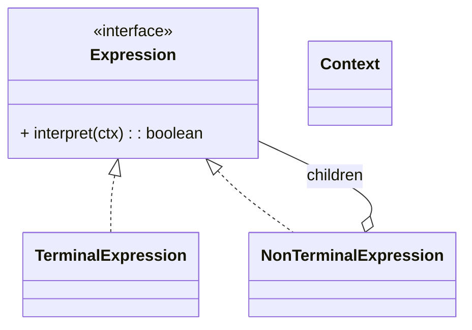

# 解释器模式（Interpreter）

> 所属分类：**行为型** 　|　 返回：[设计模式分类](../设计模式分类.md)

> **一句话定义**：给定一门**语言的文法**，定义对应的解释器来**解释执行**该语言的句子——把「规则/表达式」变成可执行的语法树。

## 意图

给定一个语言，定义它的文法的一种表示，并定义一个解释器，该解释器使用该表示来解释语言中的句子。

## 结构（类图）



## 示例代码

```java
interface Expression { boolean interpret(String ctx); }
class TerminalExpression implements Expression {     // 终结符
    private String data;
    public TerminalExpression(String d){ data = d; }
    public boolean interpret(String ctx){ return ctx.contains(data); }
}
class AndExpression implements Expression {          // 非终结符
    private Expression left, right;
    public AndExpression(Expression l, Expression r){ left=l; right=r; }
    public boolean interpret(String ctx){ return left.interpret(ctx) && right.interpret(ctx); }
}
// 使用：new AndExpression(new Terminal("a"), new Terminal("b")).interpret("a and b") -> true
```

### 深挖：从手写解释器到成熟解析器（工程选型）

```
工程上「解释语言」的层次：
1. 极简规则（contains/starts/数值比较）→ 直接用正则/条件判断
2. 简单布尔/算术表达式 → 手写解释器（本模式）或表达式引擎（Aviator/SpEL/QLExpress）
3. 复杂文法（SQL/DSL）→ ANTLR/JavaCC 生成解析器 + 访问者模式求值
4. 规则引擎 → Drools/规则编排平台（避免手写文法维护）
```

| 方案 | 适用 | 成本 |
|------|------|------|
| 正则/条件 | 单条简单规则 | 低 |
| 表达式引擎（Aviator/SpEL） | 公式/布尔/权限表达式 | 中 |
| 手写解释器（本模式） | 简单 DSL、教学 | 中 |
| ANTLR + Visitor | 复杂文法（SQL/协议） | 高 |
| Drools 规则引擎 | 大量复杂规则、需要运行时改规则 | 高 |

- **AST 就是组合结构**：终结符=叶子，非终结符（AND/OR/加减）=分支，`interpret()` 递归求值。
- **性能**：解释执行比编译慢；热点可「先解析成 AST/字节码，再多次执行」（一次解析、多次求值）。

## 适用场景

- 规则引擎、正则表达式、SQL 解析、配置表达式、小型 DSL。**工程上复杂文法更推荐 ANTLR 等生成器。**

## 与相似模式区别

- 与**访问者**：解释器定义文法结构并解释执行；访问者对已有结构追加操作。
- 与**组合**：解释器常用组合表示语法树。

## 不适用场景（反例）

- 语法**很简单**——用正则表达式或现成解析库即可，解释器过度设计。
- 语法**频繁大改或非常复杂**——手写解释器维护成本高，应换成熟 parser（ANTLR）或用表达式引擎。
- 性能敏感且**递归极深**——解释执行慢且易栈溢出。

## 在 JDK / Spring / 开源中的真实应用

- **JDK**：`java.util.regex.Pattern`（正则文法解释执行）；`Spring EL` 表达式解析。
- **MyBatis**：动态 SQL 的 OGNL 表达式求值；**规则引擎**（Drools）内部也是解释执行。
- **实战**：SQL 解析、公式计算器、权限表达式、配置 DSL。
- **大数据**：Spark SQL/Flink SQL 把 SQL 解析成逻辑计划树（Antlr4 + visitor）再执行。

## 实现要点与常见坑

- **文法用类表达**：每个文法规则一个 `Expression` 类，规则多了类爆炸（这是解释器结构性短板）。
- **性能**：解释执行慢于编译执行，热点路径慎用；可考虑先做 AST 再求值。
- **与组合模式配合**：抽象语法树（AST）本质就是组合结构，叶子是终结符、分支是非终结符。

## 生产实践与重构信号

1. **重构信号**：字符串规则「a && (b || c)」散落各处手写解析 → 收敛成统一表达式解析器。
2. **安全**：解释器执行用户输入要防注入/拒绝服务（正则回溯爆炸、表达式深度限制、白名单函数）。
3. **可观测**：解析失败要给出清晰的错误位置（行/列/上下文），AST 便于静态校验。
4. **一次解析多次求值**：把「解析」与「执行」分离（AST 缓存），规则变更走发布。

## 面试高频追问（20+ 条）

1. Q：解释器解决什么？ A：给定语言文法，定义解释器来解释该语言的句子（如表达式求值）。
2. Q：解释器缺点？ A：文法规则多时类爆炸；解释执行性能差。
3. Q：JDK 哪里算解释器？ A：正则 Pattern 的解释执行、Spring EL。
4. Q：解释器与组合的关系？ A：AST 就是组合结构，终结符为叶子、非终结符为分支。
5. Q：何时不该用解释器？ A：文法复杂/频繁变化，应换 ANTLR 等成熟工具或表达式引擎。
6. Q：解释器典型应用？ A：SQL/公式/权限表达式/配置 DSL 求值。
7. Q：终结符与非终结符？ A：终结符=原子（数字/标识符）；非终结符=组合（AND/加减/函数调用）。
8. Q：解释器与编译器区别？ A：解释器直接求值执行；编译器先翻译成目标代码再执行。
9. Q：表达式引擎（Aviator/SpEL）是什么？ A：现成的解释器框架，支持公式/布尔表达式，防注入需配置白名单。
10. Q：SQL 解析器怎么做？ A：ANTLR 文法 + visitor 建逻辑计划树（Spark SQL 就是）。
11. Q：正则回溯爆炸怎么防？ A：限制输入长度、用 RE2 等线性正则引擎、拒绝嵌套量词。
12. Q：解释器性能优化？ A：一次解析 AST 多次求值；热点编译成字节码（如正则→NFA/DFA）。
13. Q：DSL 什么时候值得自研？ A：规则语义稳定、领域专家可读、引擎/库无法覆盖时。
14. Q：解释器与访问者配合？ A：AST 建好后，用访问者对树做校验/优化/求值，互不侵入。
15. Q：安全注意事项？ A：限制递归深度、函数白名单、执行超时，防恶意表达式攻击。
16. Q：解释器模式符合什么原则？ A：单一职责（每规则一类的解释）、开闭（加规则加类）。
17. Q：解释器 vs 策略？ A：策略换算法；解释器是完整的文法求值体系。
18. Q：手写表达式引擎的最小实现？ A：词法分析（tokenize）→ 语法分析（建 AST）→ 解释执行。
19. Q：解释器的 Context 对象做什么？ A：保存全局变量/符号表/上下文状态，供各 Expression 读取。
20. Q：解释器在权限系统？ A：把权限规则（role==admin && dept==x）表达为表达式，解释求值。

## 速记口诀

> **「文法定规则，句子建语法树；终结是叶子，非终结递归求。」**
> 简单规则用正则/引擎，复杂文法上 ANTLR；别手写大文法。
