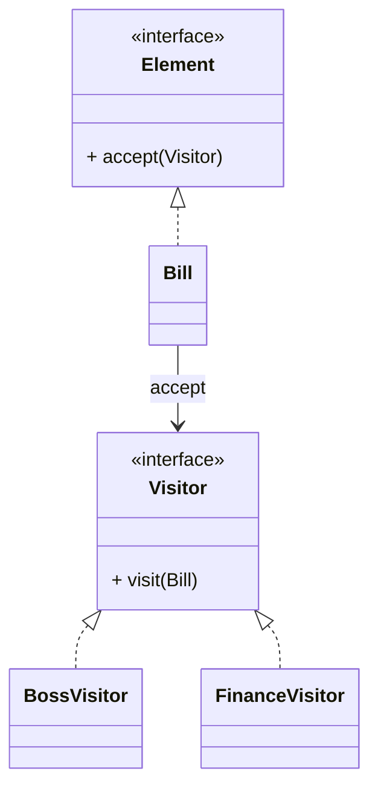

# 访问者模式（Visitor）

> 所属分类：**行为型** 　|　 返回：[设计模式分类](../设计模式分类.md)


## 意图
表示一个作用于某对象结构中的各元素的操作，使得可以在不改变各元素的类的前提下定义作用于这些元素的新操作。

## 结构（类图）


## 示例代码
```java
interface Visitor { void visit(Bill b); }
class Bill {                              // 元素（原始数据稳定不变）
    double amount;
    public void accept(Visitor v){ v.visit(this); }
}
class BossVisitor implements Visitor {    // 老板视角
    public void visit(Bill b){ System.out.println("总收入:" + b.amount); }
}
class FinanceVisitor implements Visitor { // 财务视角
    public void visit(Bill b){ System.out.println("税前:" + b.amount); }
}
```

## 适用场景
- 对象结构稳定、但**操作频繁变化**（编译器 AST、报表统计、账单多视角查看）。

## 与相似模式区别
- 与**策略**：访问者针对**多种元素类型**集中定义操作；策略只针对单一行为的算法替换。
- 与**迭代器**：访问者边遍历边操作；迭代器只负责遍历。
