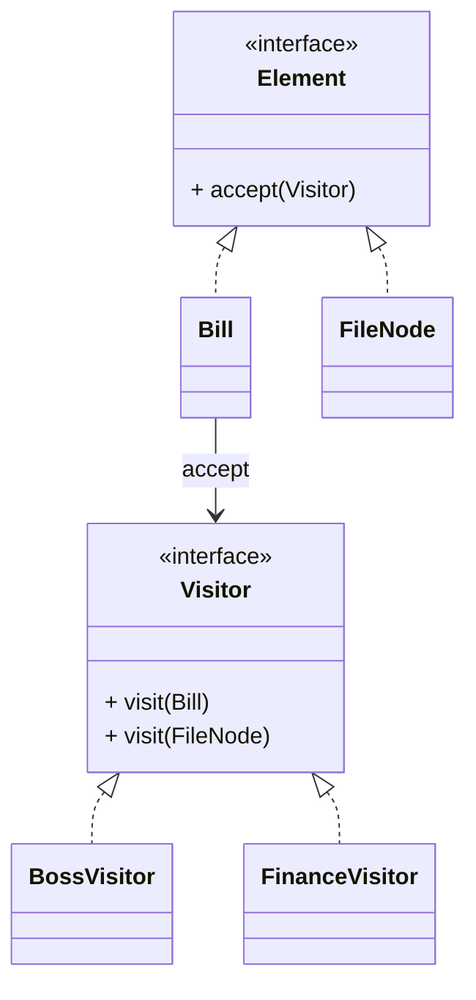

# 访问者模式（Visitor）

> 所属分类：**行为型** 　|　 返回：[设计模式分类](../设计模式分类.md)

> **一句话定义**：把「作用于一组**稳定元素**的多种操作」抽出来，新增操作只需加一个访问者类，**元素类一行不改**——经典「双分派」。

## 意图

表示一个作用于某对象结构中的各元素的操作，使得可以在不改变各元素的类的前提下定义作用于这些元素的新操作。

## 结构（类图）



## 示例代码

```java
interface Visitor { void visit(Bill b); void visit(FileNode f); }
class Bill {                              // 元素（原始数据稳定不变）
    double amount;
    public void accept(Visitor v){ v.visit(this); }
}
class FileNode {
    String name; int size;
    public void accept(Visitor v){ v.visit(this); }
}
class BossVisitor implements Visitor {    // 老板视角
    public void visit(Bill b){ System.out.println("总收入:" + b.amount); }
    public void visit(FileNode f){ System.out.println("文件:" + f.name); }
}
class FinanceVisitor implements Visitor { // 财务视角
    public void visit(Bill b){ System.out.println("税前:" + b.amount); }
    public void visit(FileNode f){ System.out.println("大小:" + f.size); }
}
```

### 深挖：双分派（Double Dispatch）——访问者的灵魂

```java
// Java 单分派：方法选择只取决于「接收者类型」
// 访问者用 accept → visit 两步，实现「接收者 + 参数」双维度的动态分派：

element.accept(visitor);
// ↑ 第一步分派：动态选 element 的 accept（元素类型）
// ↓ 第二步分派：accept 里调用 visitor.visit(this)，this 是具体元素类型 → 动态选 visit 重载
visitor.visit(bill)   // 具体类型 Bill → 选中 visit(Bill)
```

- **为什么需要**：`visitor.visit(element)` 直接写，Java 编译期就按「静态类型」选重载，无法动态分派到元素子类型——`accept` 把「动态类型」传回给 `visit`。
- **访问者模式适用判据**：**元素类型稳定（很少新增），操作频繁新增**——加操作只加一个 Visitor 类，元素类一行不改。

## 适用场景

- 对象结构稳定、但**操作频繁变化**（编译器 AST、报表统计、账单多视角查看、代码静态分析）。

## 与相似模式区别

- 与**策略**：访问者针对**多种元素类型**集中定义操作；策略只针对单一行为的算法替换。
- 与**迭代器**：访问者边遍历边操作；迭代器只负责遍历。

## 不适用场景（反例）

- 对象结构**稳定、很少新增元素类型**——否则每加一种元素要改所有访问者，违背开闭。
- 元素与访问者**双向耦合**——访问者需知道元素内部结构，破坏封装。
- 仅为了『遍历』——用迭代器即可，访问者是为『对多种元素做多种操作』而生。

## 在 JDK / Spring / 开源中的真实应用

- **ASM**：`ClassVisitor`/`MethodVisitor` 访问字节码（经典访问者，元素固定为类/方法/字段）。
- **JDK 编译器**：`javac` 的 AST 访问（`TreeVisitor`）；`javax.lang.model` 注解处理。
- **Spring**：`BeanDefinitionVisitor` 遍历并修改 Bean 定义。
- **实战**：账单多视角（老板/财务/审计）、报表引擎、AST 静态分析（扫描坏味道/安全漏洞）。

## 实现要点与常见坑

- **双分派本质**：方法选择取决于『元素类型 + 访问者类型』两者，Java 单分派需靠 `accept(visitor)` 调 `visitor.visit(this)` 实现。
- **新增元素困难**：元素类固定（如 AST 节点类型稳定）才适合；业务对象常变则不合适。
- **破坏封装**：访问者常需读取元素内部状态，元素要暴露 getter 或让访问者友元。

## 生产实践与重构信号

1. **重构信号**：同一组对象上反复出现「按类型 switch 的统计/导出/校验」→ 抽 Visitor。
2. **AST 工具**：代码扫描（linter、安全检查）、重构工具（IDE 插件）都是访问者模式的高价值应用。
3. **与组合配合**：树结构遍历（组合） + 多种操作（访问者）——报表/规则引擎的经典组合。
4. **现代替代**：Java 17 的 `switch pattern matching` 能简化部分访问者写法，但对象层次仍常用。

## 面试高频追问（20+ 条）

1. Q：访问者解决什么？ A：把『对一组稳定元素的多种操作』分离出来，新增操作不必改元素类。
2. Q：访问者 vs 迭代器？ A：迭代器只遍历；访问者遍历时对不同元素做不同操作（双分派）。
3. Q：为什么访问者难加新元素？ A：每加一种元素类型，所有 Visitor 都要加对应 visit 方法，违反开闭。
4. Q：什么是双分派？ A：方法调用既取决于调用者类型、也取决于参数类型；Java 用 accept+visit 模拟。
5. Q：访问者例子？ A：ASM 字节码 visitor、javac 的 AST 访问。
6. Q：访问者优点？ A：易增新操作、把相关操作集中到一个类，适合稳定结构+多变操作。
7. Q：访问者模式适用判据？ A：元素类型稳定、操作频繁变化——「结构稳定，行为开放」。
8. Q：访问者与组合模式关系？ A：组合建树，访问者遍历树并对不同节点做操作。
9. Q：访问者破坏封装吗？ A：可能，访问者需读元素状态；用 getter 收敛暴露面。
10. Q：switch pattern matching 能替代访问者吗？ A：部分场景可以（模式匹配 + 类型守卫），但跨类层级的分派仍是访问者主场。
11. Q：报表系统怎么用访问者？ A：数据元素稳定，老板/财务/审计各一个 Visitor 生成不同视角报表。
12. Q：访问者性能？ A：多次虚方法调用，开销小；瓶颈是元素遍历本身。
13. Q：与策略模式区别？ A：策略是『一种行为多算法』；访问者是『多类元素 × 多操作』的矩阵。
14. Q：什么时候访问者反而不值？ A：元素类型常增、操作数少——新增元素要改全部 Visitor，维护爆炸。
15. Q：ASM 的 MethodVisitor 怎么工作？ A：字节码元素（类/方法/字段/指令）逐个 visitXxx 回调，扫描/改写都在回调里。
16. Q：访问者能修改元素吗？ A：能，visit 里调用元素的 setter 即可（如 BeanDefinitionVisitor 改名）。
17. Q：访问者模式符合开闭原则吗？ A：对「新增操作」开放（加 Visitor）；对「新增元素」关闭（要改所有 Visitor）。
18. Q：访问者 vs 解释器？ A：解释器定义文法并求值；访问者对已有结构追加操作。
19. Q：访问者模式在编译器？ A：语义分析、优化、代码生成都是对 AST 的不同 Visitor 遍（pass）。
20. Q：访问者的缺点总结？ A：新增元素困难、元素与访问者双向耦合、破坏封装风险。

## 速记口诀

> **「稳定结构多变操作，访问者来收；元素改一行不用，新增操作只加类。」**
> 双分派是灵魂：accept 把动态类型交还 visit。
