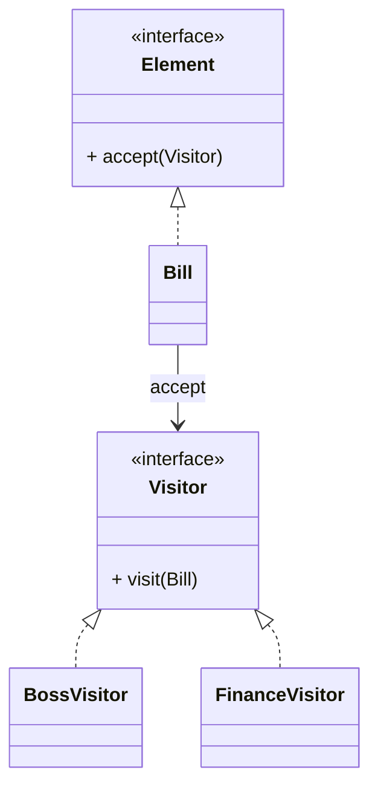

# 访问者模式（Visitor）

> 所属分类：**行为型** 　|　 返回：[设计模式分类](../设计模式分类.md)


## 意图
表示一个作用于某对象结构中的各元素的操作，使得可以在不改变各元素的类的前提下定义作用于这些元素的新操作。

## 结构（类图）


## 示例代码
```java
interface Visitor { void visit(Bill b); }
class Bill {                              // 元素（原始数据稳定不变）
    double amount;
    public void accept(Visitor v){ v.visit(this); }
}
class BossVisitor implements Visitor {    // 老板视角
    public void visit(Bill b){ System.out.println("总收入:" + b.amount); }
}
class FinanceVisitor implements Visitor { // 财务视角
    public void visit(Bill b){ System.out.println("税前:" + b.amount); }
}
```

## 适用场景
- 对象结构稳定、但**操作频繁变化**（编译器 AST、报表统计、账单多视角查看）。

## 与相似模式区别
- 与**策略**：访问者针对**多种元素类型**集中定义操作；策略只针对单一行为的算法替换。
- 与**迭代器**：访问者边遍历边操作；迭代器只负责遍历。

## 不适用场景（反例）

- 对象结构**稳定、很少新增元素类型**——否则每加一种元素要改所有访问者，违背开闭。
- 元素与访问者**双向耦合**——访问者需知道元素内部结构，破坏封装。
- 仅为了『遍历』——用迭代器即可，访问者是为『对多种元素做多种操作』而生。

## 在 JDK / Spring / 开源中的真实应用

- **ASM**：`ClassVisitor`/`MethodVisitor` 访问字节码（经典访问者，元素固定为类/方法/字段）。
- **JDK 编译器**：`javac` 的 AST 访问（`TreeVisitor`）；`javax.lang.model` 注解处理。
- **Spring**：`BeanDefinitionVisitor` 遍历并修改 Bean 定义。

## 实现要点与常见坑

- **双分派本质**：方法选择取决于『元素类型 + 访问者类型』两者，Java 单分派需靠 `accept(visitor)` 调 `visitor.visit(this)` 实现。
- **新增元素困难**：元素类固定（如 AST 节点类型稳定）才适合；业务对象常变则不合适。
- **破坏封装**：访问者常需读取元素内部状态，元素要暴露 getter 或让访问者友元。

## 面试高频追问

1. Q：访问者解决什么？ A：把『对一组稳定元素的多种操作』分离出来，新增操作不必改元素类。
2. Q：访问者 vs 迭代器？ A：迭代器只遍历；访问者遍历时对不同元素做不同操作（双分派）。
3. Q：为什么访问者难加新元素？ A：每加一种元素类型，所有 Visitor 都要加对应 visit 方法，违反开闭。
4. Q：什么是双分派？ A：方法调用既取决于调用者类型、也取决于参数类型；Java 用 accept+visit 模拟。
5. Q：访问者例子？ A：ASM 字节码 visitor、javac 的 AST 访问。
6. Q：访问者优点？ A：易增新操作、把相关操作集中到一个类，适合稳定结构+多变操作。
