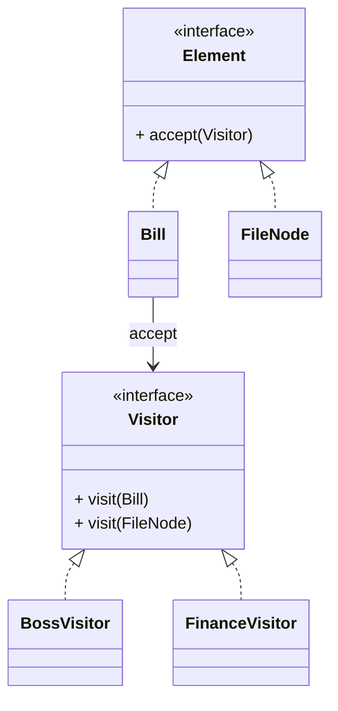

# 访问者模式（Visitor）

> 所属分类：**行为型** 　|　 返回：[设计模式分类](../设计模式分类.md)

> **一句话定义**：把「作用于一组**稳定元素**的多种操作」抽出来，新增操作只需加一个访问者类，**元素类一行不改**——经典「双分派」。
> **英文**：Visitor Pattern 　|　 **意图（GoF）**：Represent an operation to be performed on the elements of an object structure. Visitor lets you define a new operation without changing the classes of the elements on which it operates.

---

## 一、意图与解决的问题

对同一组对象（如账单、AST、文件树）要做多种操作（统计/导出/校验/审计），朴素写法是用 `instanceof` 或 `switch` 散落在各操作里：

```java
// 坏味道：每加一种操作都要碰元素类，且 instanceof 散落
if (e instanceof Bill) { ... } else if (e instanceof FileNode) { ... }
```

痛点：
1. **操作分散**：统计逻辑、导出逻辑、校验逻辑混在调用处，难维护。
2. **元素类被污染**：加一种操作就要改元素类（违反开闭）。
3. **类型判断脆弱**：`instanceof`/`switch` 改动时易漏分支。

访问者把"操作"提取成独立的 Visitor 类，元素只提供一个 `accept(visitor)` 钩子：

> 💡 核心思想：**结构稳定、操作常变**时，把"操作"集中成类，元素只认 accept，新增操作只加 Visitor。

---

## 二、结构（类图）



- **Element（元素）**：`accept(Visitor)`，把自身交给访问者。
- **ConcreteElement**：实现 `accept`，内部调用 `visitor.visit(this)`。
- **Visitor（抽象访问者）**：为每种元素类型声明一个 `visit()` 重载。
- **ConcreteVisitor（具体访问者）**：实现每种元素的具体操作（老板视角/财务视角）。

---

## 三、经典 Java 实现

```java
interface Visitor { void visit(Bill b); void visit(FileNode f); }
class Bill {                              // 元素（原始数据稳定不变）
    double amount;
    public void accept(Visitor v){ v.visit(this); }
}
class FileNode {
    String name; int size;
    public void accept(Visitor v){ v.visit(this); }
}
class BossVisitor implements Visitor {    // 老板视角
    public void visit(Bill b){ System.out.println("总收入:" + b.amount); }
    public void visit(FileNode f){ System.out.println("文件:" + f.name); }
}
class FinanceVisitor implements Visitor { // 财务视角
    public void visit(Bill b){ System.out.println("税前:" + b.amount); }
    public void visit(FileNode f){ System.out.println("大小:" + f.size); }
}
```

---

## 四、深挖：双分派（Double Dispatch）——访问者的灵魂

```java
// Java 单分派：方法选择只取决于「接收者类型」
// 访问者用 accept → visit 两步，实现「接收者 + 参数」双维度的动态分派：

element.accept(visitor);
// ↑ 第一步分派：动态选 element 的 accept（元素类型）
// ↓ 第二步分派：accept 里调用 visitor.visit(this)，this 是具体元素类型 → 动态选 visit 重载
visitor.visit(bill)   // 具体类型 Bill → 选中 visit(Bill)
```

- **为什么需要**：`visitor.visit(element)` 直接写，Java 编译期就按「静态类型」选重载，无法动态分派到元素子类型——`accept` 把「动态类型」传回给 `visit`。
- **访问者模式适用判据**：**元素类型稳定（很少新增），操作频繁新增**——加操作只加一个 Visitor 类，元素类一行不改。

---

## 五、深挖：与组合模式配合（报表/规则引擎经典组合）

```java
// 组合树 + 访问者：遍历树并对不同节点做操作
class FileSystemNode { List<FileSystemNode> children; int size;
    void accept(Visitor v){ v.visit(this); children.forEach(c -> c.accept(v)); }
}
class SizeVisitor implements Visitor {
    int total;
    void visit(FileSystemNode n){ total += n.size; }   // 累加，无需关心父子结构
}
```

---

## 六、适用场景

- 对象结构稳定、但**操作频繁变化**（编译器 AST、报表统计、账单多视角查看、代码静态分析）。

---

## 七、与相似模式区别

| 对比 | 访问者 | 策略 | 迭代器 |
|------|--------|------|--------|
| 关注 | 多元素×多操作矩阵 | 单一行为算法替换 | 仅遍历 |
| 扩展方向 | 加操作容易、加元素难 | 加算法容易 | 仅遍历 |

- 与**策略**：访问者针对**多种元素类型**集中定义操作；策略只针对单一行为的算法替换。
- 与**迭代器**：访问者边遍历边操作；迭代器只负责遍历。

---

## 八、不适用场景（反例）

- 对象结构**稳定、很少新增元素类型**——否则每加一种元素要改所有访问者，违背开闭。
- 元素与访问者**双向耦合**——访问者需知道元素内部结构，破坏封装。
- 仅为了『遍历』——用迭代器即可，访问者是为『对多种元素做多种操作』而生。

---

## 九、在 JDK / Spring / 开源中的真实应用

- **ASM**：`ClassVisitor`/`MethodVisitor` 访问字节码（经典访问者，元素固定为类/方法/字段）。
- **JDK 编译器**：`javac` 的 AST 访问（`TreeVisitor`）；`javax.lang.model` 注解处理。
- **Spring**：`BeanDefinitionVisitor` 遍历并修改 Bean 定义。
- **实战**：账单多视角（老板/财务/审计）、报表引擎、AST 静态分析（扫描坏味道/安全漏洞）。

---

## 十、实现要点与常见坑

1. **双分派本质**：方法选择取决于『元素类型 + 访问者类型』两者，Java 单分派需靠 `accept(visitor)` 调 `visitor.visit(this)` 实现。
2. **新增元素困难**：元素类固定（如 AST 节点类型稳定）才适合；业务对象常变则不合适。
3. **破坏封装**：访问者常需读取元素内部状态，元素要暴露 getter 或让访问者友元。

---

## 十一、生产实践与重构信号

1. **重构信号**：同一组对象上反复出现「按类型 switch 的统计/导出/校验」→ 抽 Visitor。
2. **AST 工具**：代码扫描（linter、安全检查）、重构工具（IDE 插件）都是访问者模式的高价值应用。
3. **与组合配合**：树结构遍历（组合） + 多种操作（访问者）——报表/规则引擎的经典组合。
4. **现代替代**：Java 17 的 `switch pattern matching` 能简化部分访问者写法，但对象层次仍常用。

---

## 十二、反模式案例

### 案例：元素频繁新增导致所有 Visitor 爆炸

```java
// 反模式：业务对象 ImageNode 是常变类型，每加一种节点都要改所有 Visitor
interface Visitor { void visit(Bill b); void visit(FileNode f); void visit(ImageNode i); /* ... */ }
```

**修正**：只有"稳定结构（如 AST、字节码）"才用访问者；业务多变的模型改用策略/回调注入操作。

---

## 十三、面试高频追问（30 条）

1. Q：访问者解决什么？ A：把『对一组稳定元素的多种操作』分离出来，新增操作不必改元素类。
2. Q：访问者 vs 迭代器？ A：迭代器只遍历；访问者遍历时对不同元素做不同操作（双分派）。
3. Q：为什么访问者难加新元素？ A：每加一种元素类型，所有 Visitor 都要加对应 visit 方法，违反开闭。
4. Q：什么是双分派？ A：方法调用既取决于调用者类型、也取决于参数类型；Java 用 accept+visit 模拟。
5. Q：访问者例子？ A：ASM 字节码 visitor、javac 的 AST 访问。
6. Q：访问者优点？ A：易增新操作、把相关操作集中到一个类，适合稳定结构+多变操作。
7. Q：访问者模式适用判据？ A：元素类型稳定、操作频繁变化——「结构稳定，行为开放」。
8. Q：访问者与组合模式关系？ A：组合建树，访问者遍历树并对不同节点做操作。
9. Q：访问者破坏封装吗？ A：可能，访问者需读元素状态；用 getter 收敛暴露面。
10. Q：switch pattern matching 能替代访问者吗？ A：部分场景可以（模式匹配 + 类型守卫），但跨类层级的分派仍是访问者主场。
11. Q：报表系统怎么用访问者？ A：数据元素稳定，老板/财务/审计各一个 Visitor 生成不同视角报表。
12. Q：访问者性能？ A：多次虚方法调用，开销小；瓶颈是元素遍历本身。
13. Q：与策略模式区别？ A：策略是『一种行为多算法』；访问者是『多类元素 × 多操作』的矩阵。
14. Q：什么时候访问者反而不值？ A：元素类型常增、操作数少——新增元素要改全部 Visitor，维护爆炸。
15. Q：ASM 的 MethodVisitor 怎么工作？ A：字节码元素（类/方法/字段/指令）逐个 visitXxx 回调，扫描/改写都在回调里。
16. Q：访问者能修改元素吗？ A：能，visit 里调用元素的 setter 即可（如 BeanDefinitionVisitor 改名）。
17. Q：访问者模式符合开闭原则吗？ A：对「新增操作」开放（加 Visitor）；对「新增元素」关闭（要改所有 Visitor）。
18. Q：访问者 vs 解释器？ A：解释器定义文法并求值；访问者对已有结构追加操作。
19. Q：访问者模式在编译器？ A：语义分析、优化、代码生成都是对 AST 的不同 Visitor 遍（pass）。
20. Q：访问者的缺点总结？ A：新增元素困难、元素与访问者双向耦合、破坏封装风险。
21. Q：访问者如何保证元素顺序？ A：由组合/迭代器的遍历顺序决定，Visitor 不关心顺序只关心操作。
22. Q：访问者能累积状态吗？ A：能，Visitor 持有累加字段（如 totalSize），遍历完即得结果。
23. Q：访问者和函数式编程？ A：函数式用 `fold/map` + 模式匹配也能做类似操作，但访问者更 OO、可持有状态。
24. Q：访问者模式需要所有元素都 implement 同一接口吗？ A：需要，否则 `accept` 无统一入口；元素类型通过 visit 重载区分。
25. Q：访问者和反射遍历？ A：反射可遍历字段但无类型安全；访问者用编译期 visit 重载，类型安全且性能更好。
26. Q：访问者模式在 ORM/序列化？ A：序列化器常是 Visitor（对象→JSON/XML/二进制各一个 Visitor）。
27. Q：如何避免 Visitor 变胖？ A：把不相关的操作拆成多个 Visitor（统计 Visitor、校验 Visitor），而非一个上帝 Visitor。
28. Q：访问者支持部分元素不处理吗？ A：支持，对应的 visit 留空或抛 UnsupportedOperationException。
29. Q：访问者与"访问者层"架构？ A：HTTP 处理中 Handler 按资源类型分发，也有访问者思想（但更偏责任链/路由）。
30. Q：访问者模式过时了吗？ A：没有，AST 工具、字节码改写、报表多视角仍是它的高价值主场。

---

## 十四、速记口诀（Summary）

> **「稳定结构多变操作，访问者来收；元素改一行不用，新增操作只加类。」**
> 双分派是灵魂：accept 把动态类型交还 visit。

---

## 十五、关联阅读

- 行为型：[组合模式](../结构型/组合模式.md)（建树） · [迭代器模式](迭代器模式.md)（遍历） · [解释器模式](解释器模式.md)（建 AST）
- 架构实践：ASM 字节码改写、javac AST 分析、报表多视角、代码静态扫描
