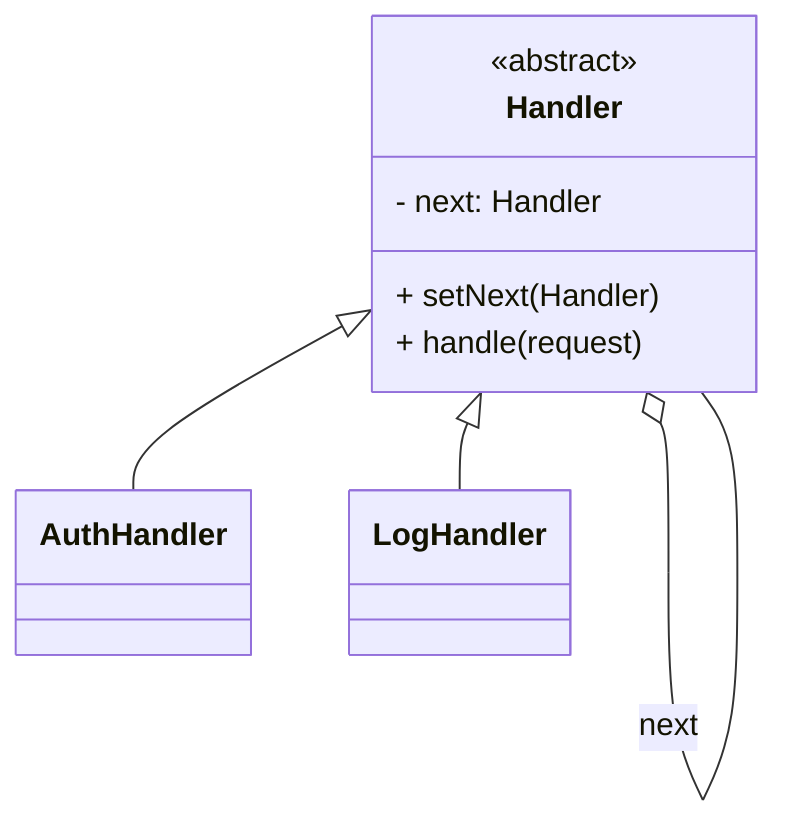

# 责任链模式（Chain of Responsibility）

> 所属分类：**行为型** 　|　 返回：[设计模式分类](../设计模式分类.md)


## 意图
使多个对象都有机会处理请求，从而避免请求的发送者与接收者之间的耦合，将这些对象连成一条链，并沿着链传递请求直到被处理。

## 结构（类图）


## 示例代码
```java
abstract class Handler {
    protected Handler next;
    void setNext(Handler n){ this.next = n; }
    abstract void handle(String req);
}
class AuthHandler extends Handler {
    void handle(String req){
        if (req.equals("auth")) System.out.println("鉴权通过");
        else if (next != null) next.handle(req);   // 传递给下一节点
    }
}
```

## 适用场景
- 审批流、过滤器链（Servlet Filter、Netty Pipeline）、日志分级、中间件（责任树为变体）。

## 与相似模式区别
- 与**装饰器**：责任链**传递请求**直到处理；装饰器**逐层增强**返回同一对象。
- 与**观察者**：责任链是**单请求串行**；观察者**一对多广播**。
