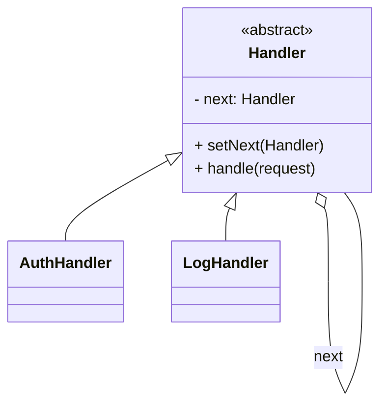
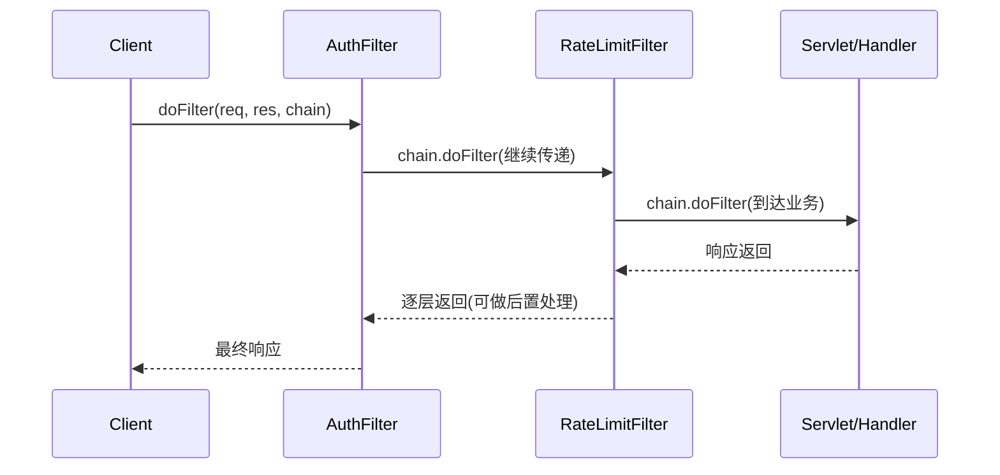

# 责任链模式（Chain of Responsibility）

> 所属分类：**行为型** 　|　 返回：[设计模式分类](../设计模式分类.md)


## 意图
使多个对象都有机会处理请求，从而避免请求的发送者与接收者之间的耦合，将这些对象连成一条链，并沿着链传递请求直到被处理。

## 结构（类图）


## 示例代码
```java
abstract class Handler {
    protected Handler next;
    void setNext(Handler n){ this.next = n; }
    abstract void handle(String req);
}
class AuthHandler extends Handler {
    void handle(String req){
        if (req.equals("auth")) System.out.println("鉴权通过");
        else if (next != null) next.handle(req);   // 传递给下一节点
    }
}
```

### 深挖：Servlet FilterChain 与 Netty Pipeline 的执行模型



- **两种执行语义**：① **命中即止**（审批流、日志分级）；② **全链必经 + 后置**（Filter/Pipeline，每个节点前后各做一半）。
- **Netty**：`ChannelPipeline` 入站（head→tail）与出站（tail→head）双向链，`ChannelHandler` 可同时读写。
- **Servlet Filter**：`chain.doFilter()` 显式放行，放行前是前置逻辑，放行后是后置逻辑。

## 适用场景
- 审批流、过滤器链（Servlet Filter、Netty Pipeline）、日志分级、中间件（责任树为变体）。

## 与相似模式区别
- 与**装饰器**：责任链**传递请求**直到处理；装饰器**逐层增强**返回同一对象。
- 与**观察者**：责任链是**单请求串行**；观察者**一对多广播**。

## 不适用场景（反例）

- 处理**只有一个确定节点**、或条件很简单——直接 if 即可。
- 链**过长且每个节点都做重 IO**——延迟高、排查难，宜控制链长或并行。
- 节点**顺序强依赖业务**却未在文档/命名中体现——易出错。

## 在 JDK / Spring / 开源中的真实应用

- **JDK**：类加载器 `loadClass` 的双亲委派链（向上委派，命中即返回）；`java.util.logging` 的 Filter 链。
- **Servlet**：`FilterChain` 过滤器链（鉴权/日志/压缩依次执行）。
- **MyBatis**：`Interceptor` 插件链（多插件拦截同一执行点）；**Spring Security** `FilterChain`；**Netty** `Pipeline` 的 `ChannelHandler` 链。

## 实现要点与常见坑

- **是否终止**：节点处理完是『终止并响应』还是『继续往下传』需明确，避免请求被吞或重复处理。
- **与装饰器区别**：责任链是『逐个节点尝试处理直到有人处理』；装饰器是『层层增强同一调用』。
- **链路顺序**：顺序敏感（如鉴权必须在业务前），注册/排序要可控。
- **性能与可观测**：长链建议加 trace 日志，定位『哪环处理/中断』。

## 生产实践与重构信号

1. **重构信号**：Controller 里一长串 `if (!auth) return; if (!rateLimit) return; if (!sign) return;` → 抽 Filter/Handler 链。
2. **网关/中间件**：鉴权 → 限流 → 熔断 → 转发，正是责任链（见 场景设计/稳定性三板斧：限流-熔断-降级.md）。
3. **可观测**：链路过长加日志与超时；异常要明确『谁中断了链』。
4. **动态性**：Spring Security 用 `SecurityFilterChain` 按路径绑定不同过滤链，是「责任链 + 路由」的实战形态。

## 面试高频追问（15+ 条）

1. Q：责任链解决什么？ A：将请求沿处理者链传递，直到有节点处理它，解耦发送者与接收者。
2. Q：责任链 vs 装饰器？ A：责任链是『逐节点尝试处理、命中即止』；装饰器是『层层增强同一调用』。
3. Q：JDK/Web 哪里用了责任链？ A：ClassLoader 双亲委派、Servlet FilterChain、Spring Security FilterChain、Netty Pipeline。
4. Q：如何防止请求被吞？ A：约定未处理的节点必须继续传递，或末节点兜底处理。
5. Q：责任链如何排序？ A：用 List 有序注册，或加 @Order；顺序敏感场景必须明确。
6. Q：责任链优点？ A：动态增删节点、单一职责、发送者无需知道谁处理。
7. Q：责任链 vs 观察者？ A：责任链单请求串行；观察者一对多广播并行。
8. Q：Filter 的前置/后置逻辑怎么实现？ A：chain.doFilter() 前是前置，返回后是后置。
9. Q：责任链怎么排查『卡在哪一环』？ A：每环打日志/埋点，或用 traceId 串联整链。
10. Q：链式与树式（责任树）？ A：复杂决策可树形化（每节点多个分支），本质是责任链 + 决策树。
11. Q：责任链的性能注意？ A：长链顺序执行、每环开销累加；非核心环节异步/短路。
12. Q：与「中间件（Middleware）」关系？ A：Express/Koa/网关中间件就是责任链的工程形态。
13. Q：如何动态增删节点？ A：链是运行时组装（setNext/List），发布配置即可调整，无需改代码。
14. Q：责任链节点共享状态吗？ A：通常不共享；需要传递上下文对象（如 request 对象贯穿全链）。
15. Q：与策略模式组合？ A：链上每环可用策略处理不同逻辑，节点选择策略、链决定顺序。
