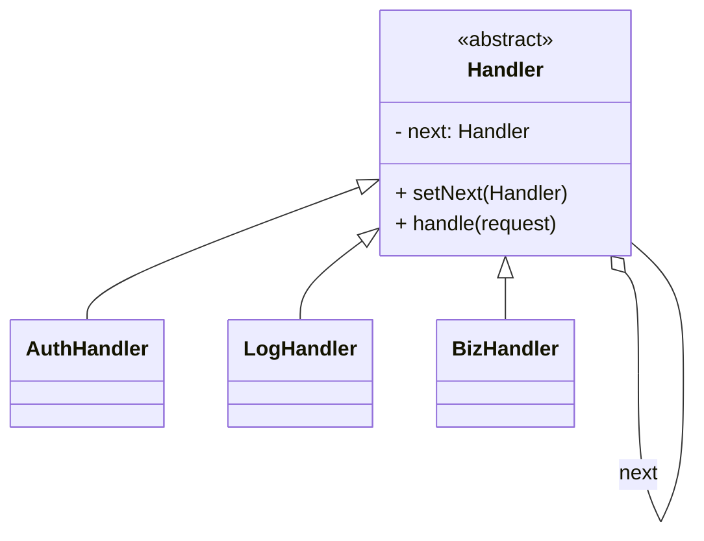
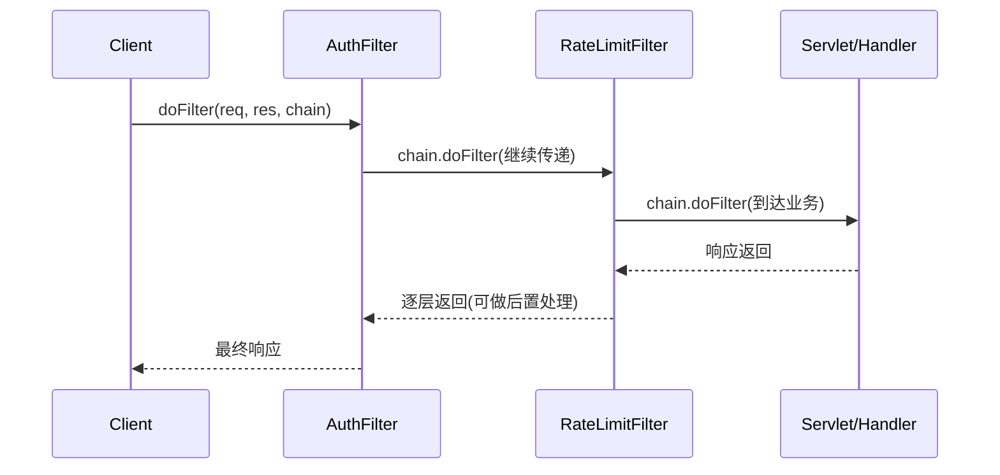

# 责任链模式（Chain of Responsibility）

> 所属分类：**行为型** 　|　 返回：[设计模式分类](../设计模式分类.md)

> **一句话定义**：让多个对象都有机会处理请求，把这些对象连成一条链，请求沿链传递，直到被处理——发送者与接收者**解耦**。
> **英文**：Chain of Responsibility Pattern 　|　 **意图（GoF）**：Avoid coupling the sender of a request to its receiver by giving more than one object a chance to handle the request. Chain the receiving objects and pass the request along the chain until an object handles it.

---

## 一、意图与解决的问题

入口处一长串"按顺序校验/处理"的逻辑，朴素写法是层层 `if`：

```java
// 坏味道：鉴权→限流→签名→业务 全写在一个方法，顺序与逻辑耦合，难增删节点
public void handle(Request req) {
    if (!auth(req)) return;
    if (!rateLimit(req)) return;
    if (!sign(req)) return;
    bizService.process(req);
}
```

痛点：
1. **强耦合**：处理顺序和每个处理者的逻辑都写死在调用方。
2. **难扩展**：加一个节点（如审计）要改调用方代码。
3. **难测试**：每个处理者无法独立单测。

责任链把每个处理者抽成 `Handler`，用 `next` 串成链，调用方只 `chain.handle(req)`：

> 💡 核心思想：**请求在链上传递，谁处理谁收手；发送者不知道最终谁处理。**

---

## 二、结构（类图）



- **Handler（抽象处理者）**：持有 `next` 引用 + `handle()`。
- **ConcreteHandler**：处理请求或转发给 `next`。
- **Client**：组装链（`auth → log → biz`），只调链头。

---

## 三、经典 Java 实现

```java
abstract class Handler {
    protected Handler next;
    void setNext(Handler n){ this.next = n; }
    abstract void handle(String req);
}
class AuthHandler extends Handler {
    void handle(String req){
        if (req.equals("auth")) { System.out.println("鉴权通过"); return; }
        if (next != null) next.handle(req);   // 传递给下一节点
    }
}
// 组装：auth -> log -> biz
Handler chain = new AuthHandler();
chain.setNext(new LogHandler()).setNext(new BizHandler());
```

---

## 四、深挖：Servlet FilterChain 与 Netty Pipeline 的执行模型



- **两种执行语义**：① **命中即止**（审批流、日志分级）；② **全链必经 + 后置**（Filter/Pipeline，每个节点前后各做一半）。
- **Netty**：`ChannelPipeline` 入站（head→tail）与出站（tail→head）双向链，`ChannelHandler` 可同时读写。
- **Servlet Filter**：`chain.doFilter()` 显式放行，放行前是前置逻辑，放行后是后置逻辑。

---

## 五、深挖：函数式/Spring 友好写法

```java
// 用 List<Handler> + @Order 注入，避免手写 next 指针，更易增删
@Component
public class AuthFilter implements OrderedHandler {
    public int getOrder() { return 1; }
    public boolean handle(Request r) { return auth(r); }   // 返回 false 即中断
}
// 执行：handlers.stream().sorted(byOrder).filter(h -> !h.handle(r)).findFirst();
```

---

## 六、适用场景

- 审批流、过滤器链（Servlet Filter、Netty Pipeline）、日志分级、中间件（责任树为变体）。
- 网关/中间件的「鉴权 → 限流 → 熔断 → 转发」标准链路。

---

## 七、与相似模式区别

| 对比 | 责任链 | 装饰器 | 观察者 |
|------|--------|--------|--------|
| 传递 | 请求沿链传递直到处理 | 层层增强同一调用 | 一对多广播 |
| 终止 | 可命中即止 | 必过全部层 | 全部接收 |

- 与**装饰器**：责任链**传递请求**直到处理；装饰器**逐层增强**返回同一对象。
- 与**观察者**：责任链是**单请求串行**；观察者**一对多广播**。

---

## 八、不适用场景（反例）

- 处理**只有一个确定节点**、或条件很简单——直接 if 即可。
- 链**过长且每个节点都做重 IO**——延迟高、排查难，宜控制链长或并行。
- 节点**顺序强依赖业务**却未在文档/命名中体现——易出错。

---

## 九、在 JDK / Spring / 开源中的真实应用

- **JDK**：类加载器 `loadClass` 的双亲委派链（向上委派，命中即返回）；`java.util.logging` 的 Filter 链。
- **Servlet**：`FilterChain` 过滤器链（鉴权/日志/压缩依次执行）。
- **MyBatis**：`Interceptor` 插件链（多插件拦截同一执行点）；**Spring Security** `FilterChain`；**Netty** `Pipeline` 的 `ChannelHandler` 链。

---

## 十、实现要点与常见坑

1. **是否终止**：节点处理完是『终止并响应』还是『继续往下传』需明确，避免请求被吞或重复处理。
2. **与装饰器区别**：责任链是『逐个节点尝试处理、命中即止』；装饰器是『层层增强同一调用』。
3. **链路顺序**：顺序敏感（如鉴权必须在业务前），注册/排序要可控。
4. **性能与可观测**：长链建议加 trace 日志，定位『哪环处理/中断』。

---

## 十一、生产实践与重构信号

1. **重构信号**：Controller 里一长串 `if (!auth) return; if (!rateLimit) return; if (!sign) return;` → 抽 Filter/Handler 链。
2. **网关/中间件**：鉴权 → 限流 → 熔断 → 转发，正是责任链（见 场景设计/稳定性三板斧：限流-熔断-降级.md）。
3. **可观测**：链路过长加日志与超时；异常要明确『谁中断了链』。
4. **动态性**：Spring Security 用 `SecurityFilterChain` 按路径绑定不同过滤链，是「责任链 + 路由」的实战形态。

---

## 十二、反模式案例

### 案例：请求被"静默吞掉"

```java
// 反模式：节点忘了传递，也没有兜底，请求无声消失
void handle(String req) {
    if (req.equals("auth")) { ...; return; }
    // 忘记 next.handle(req)，且无末节点兜底 → 请求丢失
}
```

**修正**：约定未处理的节点必须 `next.handle()`，末节点兜底处理或抛"未知请求"异常。

---

## 十三、面试高频追问（30 条）

1. Q：责任链解决什么？ A：将请求沿处理者链传递，直到有节点处理它，解耦发送者与接收者。
2. Q：责任链 vs 装饰器？ A：责任链是『逐节点尝试处理、命中即止』；装饰器是『层层增强同一调用』。
3. Q：JDK/Web 哪里用了责任链？ A：ClassLoader 双亲委派、Servlet FilterChain、Spring Security FilterChain、Netty Pipeline。
4. Q：如何防止请求被吞？ A：约定未处理的节点必须继续传递，或末节点兜底处理。
5. Q：责任链如何排序？ A：用 List 有序注册，或加 @Order；顺序敏感场景必须明确。
6. Q：责任链优点？ A：动态增删节点、单一职责、发送者无需知道谁处理。
7. Q：责任链 vs 观察者？ A：责任链单请求串行；观察者一对多广播并行。
8. Q：Filter 的前置/后置逻辑怎么实现？ A：chain.doFilter() 前是前置，返回后是后置。
9. Q：责任链怎么排查『卡在哪一环』？ A：每环打日志/埋点，或用 traceId 串联整链。
10. Q：链式与树式（责任树）？ A：复杂决策可树形化（每节点多个分支），本质是责任链 + 决策树。
11. Q：责任链的性能注意？ A：长链顺序执行、每环开销累加；非核心环节异步/短路。
12. Q：与「中间件（Middleware）」关系？ A：Express/Koa/网关中间件就是责任链的工程形态。
13. Q：如何动态增删节点？ A：链是运行时组装（setNext/List），发布配置即可调整，无需改代码。
14. Q：责任链节点共享状态吗？ A：通常不共享；需要传递上下文对象（如 request 对象贯穿全链）。
15. Q：与策略模式组合？ A：链上每环可用策略处理不同逻辑，节点选择策略、链决定顺序。
16. Q：责任链适合审批流吗？ A：非常适合，每级审批一个节点，通过则传下一级，拒绝即终止。
17. Q：责任链 vs if-else 链？ A：if-else 硬编码且耦合；责任链节点可独立测试、动态组合。
18. Q：Netty Pipeline 为什么是双向链？ A：入站和出站处理方向相反，双向链让同一节点既能处理读也能处理写。
19. Q：责任链能短路吗？ A：能，节点处理后 return 不再传递（如鉴权失败直接响应）。
20. Q：责任链在 Spring 中的最佳实践？ A：用 List<Handler> 注入 + @Order 排序，避免硬编码 next 指针。
21. Q：责任链和 AOP 拦截链？ A：Spring AOP 的 Advisor 链、拦截器链本质都是责任链。
22. Q：责任链适合并发处理吗？ A：链是顺序语义；若节点独立可并行 fan-out，但需汇聚结果，慎用。
23. Q：如何保证链节点顺序的幂等？ A：排序通过 @Order/配置声明；节点自身幂等，重复进入不产生副作用。
24. Q：责任链与"管道-过滤器"架构？ A：管道-过滤器是责任链的系统级放大版，节点间通过数据流连接。
25. Q：节点异常怎么处理？ A：try/catch 包裹，异常应终止链并统一响应，避免半链状态。
26. Q：责任链能回退吗？ A：标准责任链不回退；需要回退用"命令+补偿"或独立补偿链。
27. Q：如何测试责任链？ A：单测每个 Handler（输入→是否处理/转发），集成测整链顺序与短路。
28. Q：责任链与策略谁更适合"多条件路由"？ A：条件互斥选一个 → 责任链；运行时可换算法 → 策略。
29. Q：责任链节点数量上限？ A：无硬上限，但链过长应拆分或加短路，防止延迟与排查成本爆炸。
30. Q：责任链模式缺点？ A：请求可能从头到尾无节点处理（需兜底）、调试链路长、顺序依赖文档。

---

## 十四、速记口诀（Summary）

> **「请求上链走一遭，谁处理谁收手；网关中间件皆此道，if 链散落该重抽。」**
> 责任链（请求传递）≠ 装饰器（层层增强）≠ 观察者（一对多广播）。

---

## 十五、关联阅读

- 行为型：[装饰器模式](../结构型/装饰器模式.md)（增强 vs 传递） · [观察者模式](观察者模式.md) · [命令模式](命令模式.md)
- 架构实践：Servlet Filter、Spring Security `FilterChain`、Netty `Pipeline`、网关中间件
