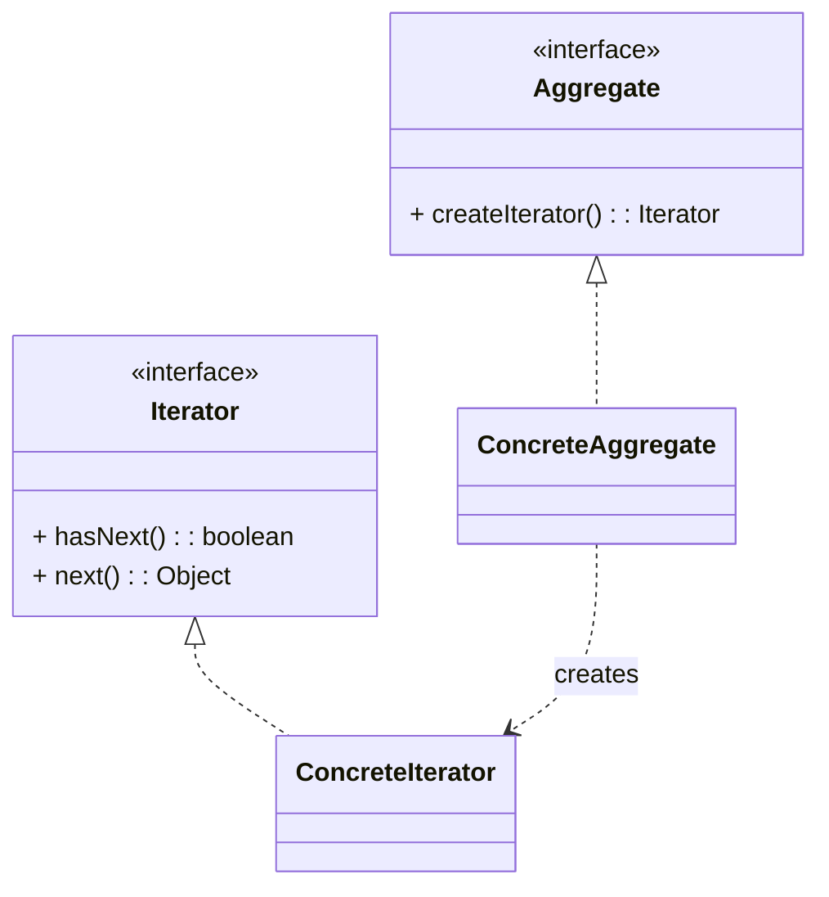

# 迭代器模式（Iterator）

> 所属分类：**行为型** 　|　 返回：[设计模式分类](../设计模式分类.md)


## 意图
提供一种方法顺序访问一个聚合对象中的各个元素，而又不暴露该对象的内部表示。

## 结构（类图）


## 示例代码
```java
interface Iterator<T> { boolean hasNext(); T next(); }
class NameIterator implements Iterator<String> {
    private String[] names; private int idx;
    NameIterator(String[] n){ names = n; }
    public boolean hasNext(){ return idx < names.length; }
    public String next(){ return names[idx++]; }
}
```

## 适用场景
- 自定义集合遍历（Java 的 `Iterable`/`Iterator`、foreach、Stream），隐藏底层数据结构。

## 与相似模式区别
- 与**访问者**：迭代器只遍历；访问者在遍历上施加操作且支持不同操作。
- 与**组合**：组合常配合迭代器遍历树。
