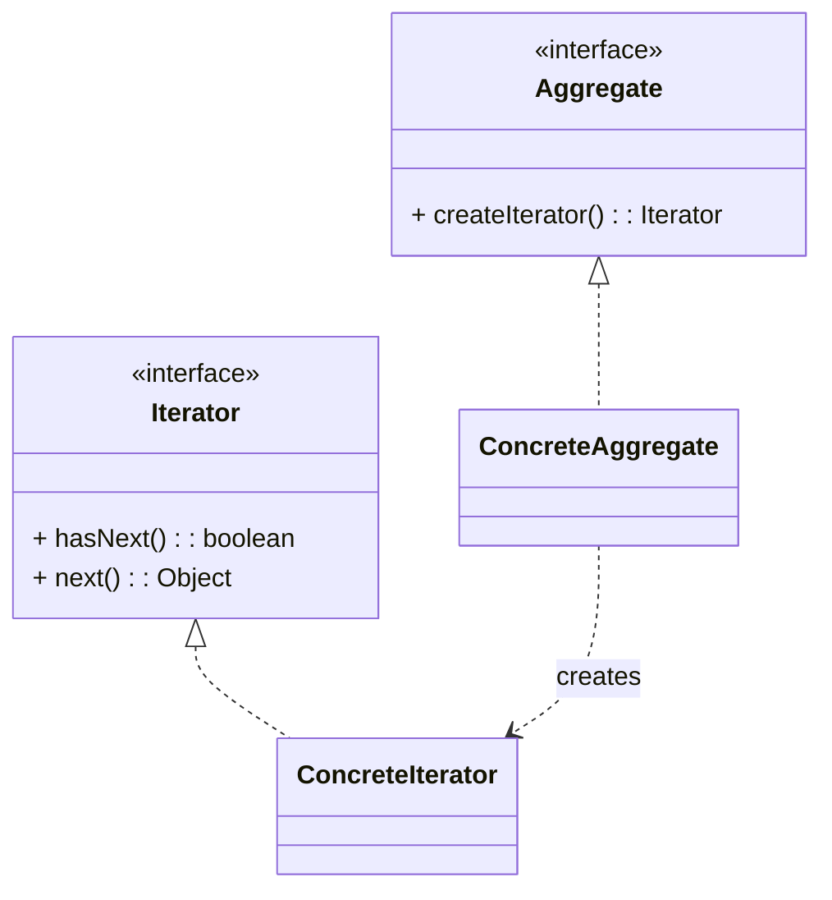

# 迭代器模式（Iterator）

> 所属分类：**行为型** 　|　 返回：[设计模式分类](../设计模式分类.md)


## 意图
提供一种方法顺序访问一个聚合对象中的各个元素，而又不暴露该对象的内部表示。

## 结构（类图）


## 示例代码
```java
interface Iterator<T> { boolean hasNext(); T next(); }
class NameIterator implements Iterator<String> {
    private String[] names; private int idx;
    NameIterator(String[] n){ names = n; }
    public boolean hasNext(){ return idx < names.length; }
    public String next(){ return names[idx++]; }
}
```

## 适用场景
- 自定义集合遍历（Java 的 `Iterable`/`Iterator`、foreach、Stream），隐藏底层数据结构。

## 与相似模式区别
- 与**访问者**：迭代器只遍历；访问者在遍历上施加操作且支持不同操作。
- 与**组合**：组合常配合迭代器遍历树。

## 不适用场景（反例）

- 容器**直接用 JDK 的 Iterable/Iterator** 已足够——无需自造。
- 迭代过程中**依赖被迭代集合的具体结构**才算迭代器——应让其只暴露 `hasNext/next`。
- 在并发修改下迭代却不处理 `ConcurrentModificationException`——需 fail-fast 或并发容器。

## 在 JDK / Spring / 开源中的真实应用

- **JDK**：`Collection.iterator()` 返回 `Iterator`；`Iterable` 是 for-each 的基础；`Stream` 底层也是迭代。
- **MyBatis**：`ResultHandler`/游标 `Cursor` 逐条取数据；`CompositeIterator` 合并多迭代器。
- **实战**：自定义树/图遍历器、聚合多个数据源的统一迭代。

## 实现要点与常见坑

- **fail-fast**：ArrayList 迭代时结构被改会抛 `ConcurrentModificationException`（用 modCount 检测）；并发场景用 `CopyOnWriteArrayList`/`ConcurrentHashMap` 的弱一致迭代器。
- **不要暴露内部表示**：迭代器只提供 `next/hasNext`，不应让外部直接操作底层集合。
- **与访问者配合**：遍历集合并对每个元素做操作，迭代器负责『走』，访问者负责『做』。

## 面试高频追问

1. Q：迭代器解决什么？ A：提供统一方式遍历聚合对象，且不暴露其内部结构。
2. Q：fail-fast 是什么？ A：迭代中集合被结构性修改，立刻抛 ConcurrentModificationException（modCount 检测）。
3. Q：如何实现安全并发迭代？ A：用 COW 容器或 ConcurrentHashMap 的弱一致迭代器，或加锁。
4. Q：JDK 哪里用了迭代器？ A：Collection.iterator()、for-each 依赖 Iterable。
5. Q：迭代器 vs 访问者？ A：迭代器负责『如何遍历』；访问者对元素『做什么』，常配合使用。
6. Q：为什么不让外部直接操作集合？ A：保持封装，使聚合内部表示可自由变化而不影响遍历代码。
