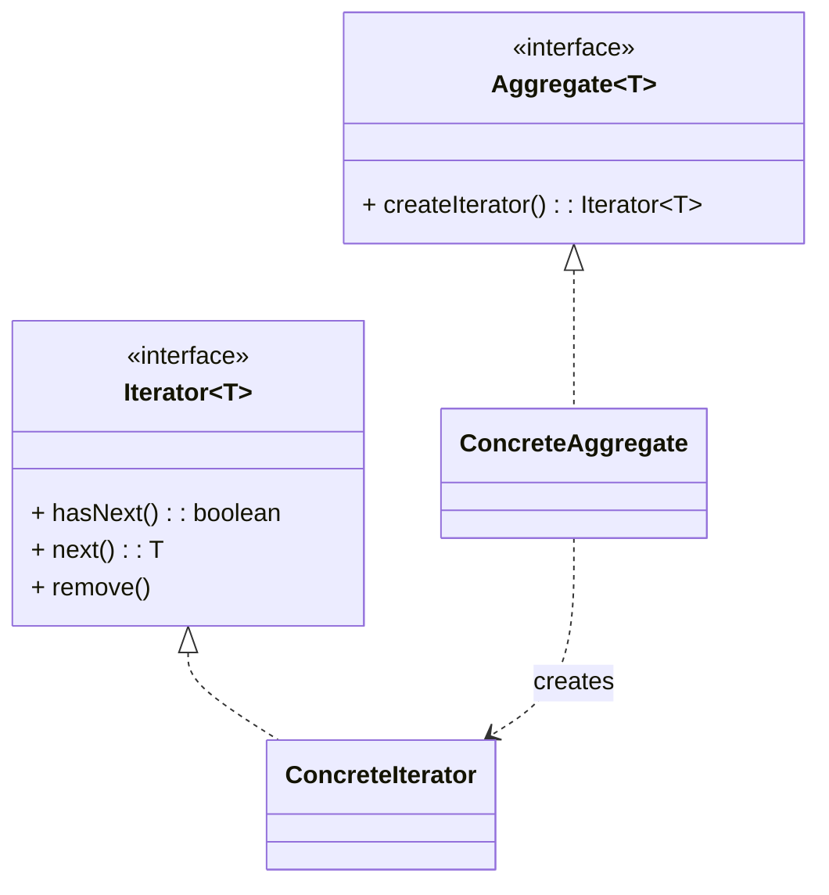

# 迭代器模式（Iterator）

> 所属分类：**行为型** 　|　 返回：[设计模式分类](../设计模式分类.md)

> **一句话定义**：提供一种方法**顺序访问**聚合对象的元素，而**不暴露其内部结构**——遍历逻辑与集合实现解耦。

## 意图

提供一种方法顺序访问一个聚合对象中的各个元素，而又不暴露该对象的内部表示。

## 结构（类图）



## 示例代码

```java
interface Iterator<T> { boolean hasNext(); T next(); }
class NameIterator implements Iterator<String> {
    private String[] names; private int idx;
    NameIterator(String[] n){ names = n; }
    public boolean hasNext(){ return idx < names.length; }
    public String next(){ return names[idx++]; }
}
interface Aggregate { Iterator<String> createIterator(); }
class NameRepository implements Aggregate {
    private String[] names = {"A","B","C"};
    public Iterator<String> createIterator(){ return new NameIterator(names); }
}
```

### 深挖：迭代器的「封装遍历」——for-each 与 Stream 的底层

```java
// for-each 本质是迭代器语法糖：
for (String s : list) { ... }
// 等价于：
for (Iterator<String> it = list.iterator(); it.hasNext(); ) {
    String s = it.next();
    ...
}
// Stream 的惰性管道（map/filter）也是迭代器思想 + 拉取式遍历
```

- **收益**：遍历代码与「集合内部结构」解耦——ArrayList 用索引、LinkedList 用指针、HashMap 用桶链，但 `for-each` 写法完全一致。
- **自定义迭代器场景**：树形结构遍历（前序/中序）、大文件逐行、数据库游标、分页遍历、多源合并（`CompositeIterator`）。
- **MyBatis Cursor**：游标迭代器逐条从 ResultSet 拉取，避免全量载入内存（见 源码系列/MyBatis源码.md）。

### 深挖：fail-fast vs 弱一致

| 迭代器类型 | 行为 | 典型 |
|-----------|------|------|
| fail-fast | 迭代中结构被改立即抛 CME | ArrayList（modCount 检测） |
| 弱一致（weakly consistent） | 不抛异常，可能看到旧/新数据 | ConcurrentHashMap、CopyOnWriteArrayList |

## 适用场景

- 自定义集合遍历（Java 的 `Iterable`/`Iterator`、foreach、Stream），隐藏底层数据结构。
- 树/图遍历器、数据库游标、大文件流式读取、多数据源统一迭代。

## 与相似模式区别

- 与**访问者**：迭代器只遍历；访问者在遍历上施加操作且支持不同操作。
- 与**组合**：组合常配合迭代器遍历树。

## 不适用场景（反例）

- 容器**直接用 JDK 的 Iterable/Iterator** 已足够——无需自造。
- 迭代过程中**依赖被迭代集合的具体结构**才算迭代器——应让其只暴露 `hasNext/next`。
- 在并发修改下迭代却不处理 `ConcurrentModificationException`——需 fail-fast 或并发容器。

## 在 JDK / Spring / 开源中的真实应用

- **JDK**：`Collection.iterator()` 返回 `Iterator`；`Iterable` 是 for-each 的基础；`Stream` 底层也是迭代。
- **MyBatis**：`ResultHandler`/游标 `Cursor` 逐条取数据；`CompositeIterator` 合并多迭代器。
- **实战**：自定义树/图遍历器、聚合多个数据源的统一迭代。

## 实现要点与常见坑

- **fail-fast**：ArrayList 迭代时结构被改会抛 `ConcurrentModificationException`（用 modCount 检测）；并发场景用 `CopyOnWriteArrayList`/`ConcurrentHashMap` 的弱一致迭代器。
- **不要暴露内部表示**：迭代器只提供 `next/hasNext`，不应让外部直接操作底层集合。
- **与访问者配合**：遍历集合并对每个元素做操作，迭代器负责『走』，访问者负责『做』。

## 生产实践与重构信号

1. **重构信号**：多处用 `for (int i=0; ...)` 直接摸内部数组/链表 → 提供 `iterator()` 收敛遍历。
2. **大数据量遍历**：DB 游标/流式读取用迭代器逐条处理，防 OOM（分页 vs 游标）。
3. **移除元素**：迭代器自带 `remove()` 安全；`for-each` 内删除会抛 CME——用 `iterator.remove()` 或收集后批量删。
4. **惰性迭代**：实现 `Iterable` + 惰性 `next()`，配合流式管道省内存。

## 面试高频追问（20+ 条）

1. Q：迭代器解决什么？ A：提供统一方式遍历聚合对象，且不暴露其内部结构。
2. Q：fail-fast 是什么？ A：迭代中集合被结构性修改，立刻抛 ConcurrentModificationException（modCount 检测）。
3. Q：如何实现安全并发迭代？ A：用 COW 容器或 ConcurrentHashMap 的弱一致迭代器，或加锁。
4. Q：JDK 哪里用了迭代器？ A：Collection.iterator()、for-each 依赖 Iterable。
5. Q：迭代器 vs 访问者？ A：迭代器负责『如何遍历』；访问者对元素『做什么』，常配合使用。
6. Q：为什么不让外部直接操作集合？ A：保持封装，使聚合内部表示可自由变化而不影响遍历代码。
7. Q：ArrayList 迭代删除为什么抛 CME？ A：modCount 变更检测；正确做法用 iterator.remove()。
8. Q：ConcurrentHashMap 迭代器安全吗？ A：弱一致性（不抛 CME、不保证最新），不阻塞但可读旧数据。
9. Q：迭代器与 Stream 区别？ A：Stream 是迭代器 + 惰性算子管道 + 并行化，语义更丰富。
10. Q：MyBatis Cursor 是什么？ A：游标迭代器逐条拉取 ResultSet，防大数据量全量载入内存。
11. Q：如何自定义树遍历迭代器？ A：内部维护栈/队列状态，hasNext/next 惰性推进（前序/中序/层序）。
12. Q：迭代器模式缺点？ A：访问顺序受限（单向迭代器）、迭代器自身状态管理易错。
13. Q：Iterable 和 Iterator 区别？ A：Iterable 可被 for-each（提供 iterator()）；Iterator 是遍历器本身。
14. Q：分页 vs 游标迭代？ A：分页有偏移/快照问题；游标基于位置索引，流式友好。
15. Q：迭代器能倒序遍历吗？ A：可以（ListIterator），但通用接口只定义单向。
16. Q：迭代器模式符合什么原则？ A：单一职责（遍历独立）、封装（隐藏内部结构）。
17. Q：迭代器在组合模式？ A：CompositeIterator 先深度优先展开子节点，对外提供统一迭代。
18. Q：for-each 为什么要求 Iterable？ A：编译器把 for-each 翻译成基于 iterator() 的循环。
19. Q：迭代器 remove 的实现要点？ A：维护 cursor 与 lastRet 指针，删除后调整，避免漏元素。
20. Q：迭代器在 Kafka 消费者？ A：ConsumerRecords 内部按分区维护迭代，逐条 poll 处理消息。

## 速记口诀

> **「遍历不露内结构，hasNext 与 next 走；fail-fast 抛异常，并发请用弱一致。」**
> 迭代器（负责走）≠ 访问者（负责做），二者常配合。
