# 设计模式

## 设计模式的分类

### 创建型

- **工厂模式**：简单工厂（if else 去选择）、工厂方法（多个工厂）、抽象工厂（对整个完整对象构建的抽象）。
- **单例模式**：饿汉、饱汉、DCL、内部类、enum。
- **建造者模式**：相比抽象工厂更关注实现的步骤和组合。
- **原型模式**：clone。

### 结构型

- **代理模式**：动态代理解决静态代理代码爆炸问题。
- **适配器模式**
- **桥梁模式**
- **装饰模式**：Java 的 IO。
- **门面模式**：当一个系统过于复杂，拥有大量接口时，可以通过门面模式为外部提供一组简化的高层接口。当需要降低各模块间的耦合度，使代码结构更加清晰时，可以引入门面模式作为模块间的通信中介。当希望控制子系统的访问权限或执行顺序时，通过门面模式可以更好地进行管理和控制。
- **组合模式**：当你想表示对象的部分-整体层次结构时，比如文件系统、组织架构、DOM（文档对象模型）等。当你需要用户以统一的方式处理单个对象和组合对象，并且希望简化客户端代码时。
- **享元模式**：当你的应用中存在大量的相似对象，而这些对象之间大部分状态都可以外部化时。当你想通过共享大量对象来节约内存时。

### 行为型

- **策略模式**
- **观察者模式**
- **责任链模式**：责任树。
- **模板方法模式**
- **状态模式**
- **访问者模式**：查看账单，账单原始数据是不变的，不同的访问者对应展示不同的数据，老板看总的收入支出，财务看税前税后等等。

## 六大设计原则

> 参考文章：[https://zhuanlan.zhihu.com/p/110130347](https://zhuanlan.zhihu.com/p/110130347)

### 单一职责原则（Single Responsibility Principle）

**定义**：应该有且仅有一个原因引起类的变更。

**好处**：

1. 类的复杂性降低，实现什么职责都有清晰明确的定义；
2. 可读性高，复杂性降低，可读性自然就提高了；
3. 可维护性提高，可读性提高了，那自然更容易维护了；
4. 变更引起的风险降低，变更是必不可少的，如果接口的单一职责做得好，一个接口修改只对相应的实现类有影响，对其他的接口无影响，这对系统的扩展性、维护性都有非常大的帮助。

### 开闭原则（Open Closed Principle）

**定义**：开闭原则是指一个软件实体如类、模块和函数应该对扩展开放，对修改关闭。也就是说一个软件实体应该通过扩展来实现变化，而不是通过修改已有的代码来实现变化。

**为什么要用开闭原则**：

1. 开闭原则非常著名，只要是做面向对象编程的，在开发时都会提及开闭原则。
2. 开闭原则是最基础的一个原则，前面介绍的 5 个原则都是开闭原则的具体形态，而开闭原则才是其精神领袖。
3. 开闭原则提高了复用性，以及可维护性。

### 里氏替换原则（Liskov Substitution Principle）

**定义**：就是只要父类能出现的地方，子类就可以出现，而且替换为子类也不会产生任何错误或异常。

### 迪米特法则（Law of Demeter）

又叫“最少知道法则”。

如果一个方法放在本类中，既不增加类间关系，也对本类不产生负面影响，那就放置在本类中。

### 接口隔离原则（Interface Segregation Principle）

接口隔离原则就是客户端不应该依赖它不需要的接口，或者说类间的依赖关系应该建立在最小的接口上。

### 依赖倒置原则（Dependence Inversion Principle）

依赖倒置原则可以减少类间的耦合性，提高系统的稳定性，降低并行开发引起的风险，提高代码的可读性和可维护性。

**使用建议**：

1. 每个类尽量都有接口或抽象类，或者接口和抽象类两者都具备。
2. 变量的表面类型尽量是接口或抽象类。
3. 任何类都不应该从具体类派生。
4. 尽量不要重写基类的方法。如果基类是一个抽象类，而且这个方法已经实现了，子类尽量不要重写。
5. 结合里氏替换原则使用。

**总结**：

1. **单一职责原则**：一个类或接口只承担一个职责。
2. **里氏替换原则**：在继承类时，务必重写（override）父类中所有的方法，尤其需要注意父类的 protected 方法（它们往往是让你重写的），子类尽量不要暴露自己的 public 方法供外界调用。
3. **依赖倒置原则**：高层模块不应该依赖于低层模块，而应该依赖于抽象。抽象不应依赖于细节，细节应依赖于抽象。
4. **接口隔离原则**：不要对外暴露没有实际意义的接口。
5. **迪米特法则**：尽量减少对象之间的交互，从而减小类之间的耦合。
6. **开闭原则**：对软件实体的改动，最好用扩展而非修改的方式。

---

# 创建型模式详解

> 创建型模式关注"对象如何被创建"，核心目标是**解耦对象的创建与使用**，提升系统的灵活性与可扩展性。

## 单例模式（Singleton）

### 意图
保证一个类只有一个实例，并提供一个全局访问点。

### 结构（类图）
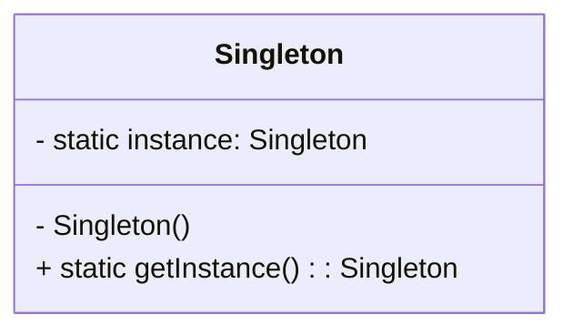
```mermaid
classDiagram
    class Singleton {
        - static instance: Singleton
        - Singleton()
        + static getInstance(): Singleton
    }
```

### 示例代码
```java
// 双重检查锁（DCL）+ volatile，线程安全且懒加载
public class Singleton {
    private static volatile Singleton instance;
    private Singleton() {}
    public static Singleton getInstance() {
        if (instance == null) {
            synchronized (Singleton.class) {
                if (instance == null) {
                    instance = new Singleton();
                }
            }
        }
        return instance;
    }
}

// 推荐：基于 enum 的单例（天然防反射、防反序列化破坏）
public enum SingletonEnum {
    INSTANCE;
    public void doSomething() { System.out.println("do"); }
}
```
> 饿汉（类加载即创建）、静态内部类（懒加载且线程安全）也是常用写法。

### 适用场景
- 配置中心、连接池、线程池、日志器、注册表等需全局唯一的资源管理者。
- 需要严格控制共享资源访问（如文件锁、计数器）。

### 与相似模式区别
- 与**静态工具类**：单例可延迟初始化、可被继承（enum 除外）、可实现接口；工具类只是静态方法的集合，无法被多态替换。
- 与**工厂**：单例约束"实例数量=1"，工厂关注"以何种方式产出对象"。

## 工厂方法模式（Factory Method）

### 意图
定义一个创建对象的接口，让子类决定实例化哪一个类，使一个类的实例化延迟到其子类。

### 结构（类图）
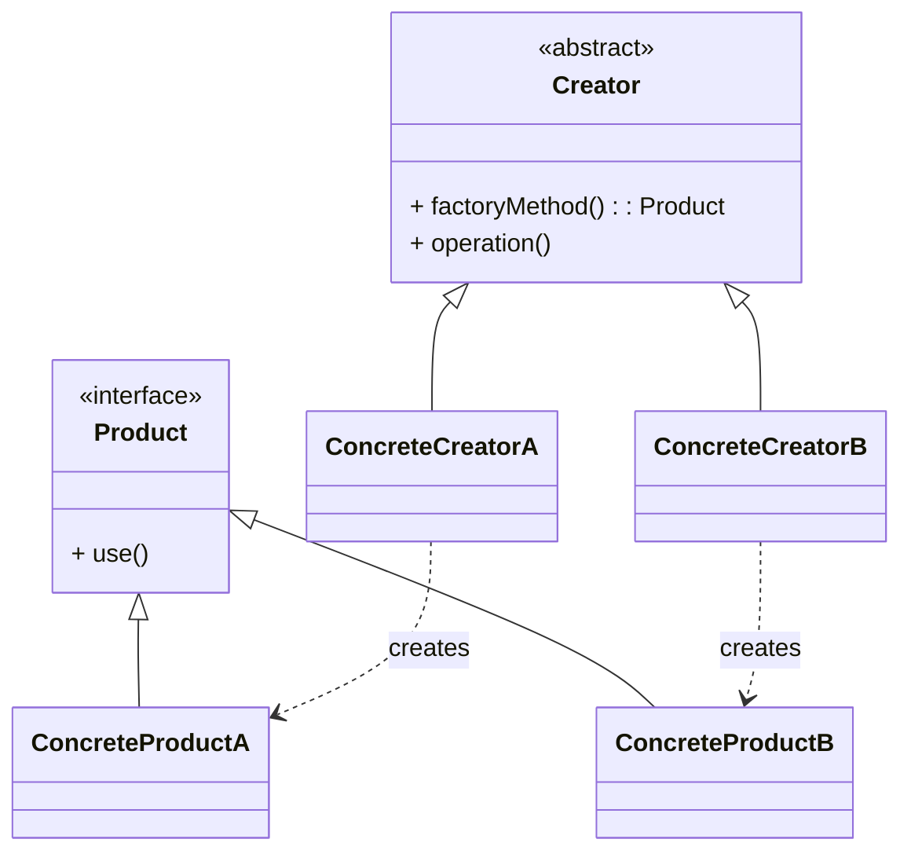
```mermaid
classDiagram
    class Product {
        <<interface>>
        + use()
    }
    class ConcreteProductA
    class ConcreteProductB
    class Creator {
        <<abstract>>
        + factoryMethod(): Product
        + operation()
    }
    class ConcreteCreatorA
    class ConcreteCreatorB
    Creator <|-- ConcreteCreatorA
    Creator <|-- ConcreteCreatorB
    Product <|-- ConcreteProductA
    Product <|-- ConcreteProductB
    ConcreteCreatorA ..> ConcreteProductA : creates
    ConcreteCreatorB ..> ConcreteProductB : creates
```

### 示例代码
```java
interface Transport { void deliver(); }
class Truck implements Transport { public void deliver() { System.out.println("公路运输"); } }
class Ship implements Transport { public void deliver() { System.out.println("海运"); } }

abstract class Logistics {
    public abstract Transport createTransport();   // 工厂方法
    public void plan() { createTransport().deliver(); }
}
class RoadLogistics extends Logistics {
    public Transport createTransport() { return new Truck(); }
}
class SeaLogistics extends Logistics {
    public Transport createTransport() { return new Ship(); }
}
```

### 适用场景
- 类无法预知它必须创建的对象的类。
- 希望将产品创建职责委托给子类，支持扩展新产品而不修改已有代码（符合开闭原则）。

### 与相似模式区别
- 与**抽象工厂**：工厂方法只创建**一种**产品；抽象工厂创建**一组相关产品（产品族）**。
- 与**简单工厂**：简单工厂用静态方法 + if/else 选择，不属于 GoF 23 种模式，扩展需改源码。

## 抽象工厂模式（Abstract Factory）

### 意图
提供一个创建一系列相关或相互依赖对象的接口，而无需指定它们具体的类。

### 结构（类图）
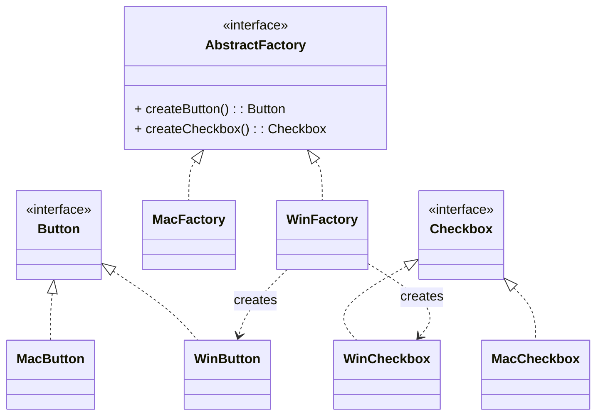
```mermaid
classDiagram
    class AbstractFactory {
        <<interface>>
        + createButton(): Button
        + createCheckbox(): Checkbox
    }
    class WinFactory
    class MacFactory
    class Button {
        <<interface>>
    }
    class Checkbox {
        <<interface>>
    }
    class WinButton
    class MacButton
    class WinCheckbox
    class MacCheckbox
    AbstractFactory <|.. WinFactory
    AbstractFactory <|.. MacFactory
    Button <|.. WinButton
    Button <|.. MacButton
    Checkbox <|.. WinCheckbox
    Checkbox <|.. MacCheckbox
    WinFactory ..> WinButton : creates
    WinFactory ..> WinCheckbox : creates
```

### 示例代码
```java
interface GUIFactory {
    Button createButton();
    Checkbox createCheckbox();
}
class WinFactory implements GUIFactory {
    public Button createButton() { return new WinButton(); }
    public Checkbox createCheckbox() { return new WinCheckbox(); }
}
class MacFactory implements GUIFactory {
    public Button createButton() { return new MacButton(); }
    public Checkbox createCheckbox() { return new MacCheckbox(); }
}
// 客户端只依赖 GUIFactory 与 Button/Checkbox 抽象
```

### 适用场景
- 系统要独立于产品创建、组合方式。
- 强调**产品之间必须配套使用**（同一风格 UI、同一数据库驱动族）。

### 与相似模式区别
- 与**工厂方法**：抽象工厂通常**组合多个工厂方法**，产出一组产品；工厂方法只产出一个。
- 与**建造者**：抽象工厂关注"生产什么产品"，建造者关注"如何一步步装配一个复杂产品"。

## 建造者模式（Builder）

### 意图
将一个复杂对象的构建与其表示分离，使得同样的构建过程可以创建不同的表示。

### 结构（类图）
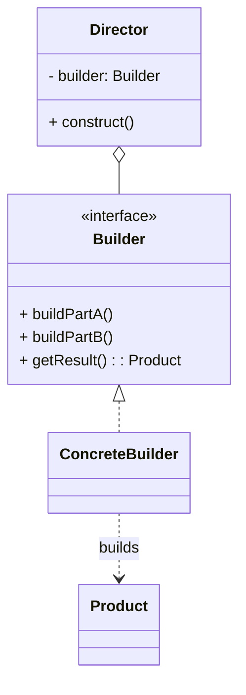
```mermaid
classDiagram
    class Builder {
        <<interface>>
        + buildPartA()
        + buildPartB()
        + getResult(): Product
    }
    class ConcreteBuilder
    class Director {
        - builder: Builder
        + construct()
    }
    class Product
    Director o-- Builder
    Builder <|.. ConcreteBuilder
    ConcreteBuilder ..> Product : builds
```

### 示例代码
```java
class Computer {
    private String cpu; private String ram; private String disk;
    // setter 省略
}
// 流式建造者（最常用写法，可省略 Director）
class ComputerBuilder {
    private Computer c = new Computer();
    public ComputerBuilder cpu(String cpu) { c.setCpu(cpu); return this; }
    public ComputerBuilder ram(String ram) { c.setRam(ram); return this; }
    public ComputerBuilder disk(String disk) { c.setDisk(disk); return this; }
    public Computer build() { return c; }
}
// 使用：Computer pc = new ComputerBuilder().cpu("i9").ram("32G").disk("1T").build();
```

### 适用场景
- 创建包含多个部件、且创建步骤/顺序易变的复杂对象（SQL 构造器、HTTP 请求构造器、文档生成器、Lombok `@Builder`）。
- 需要屏蔽客户端对内部装配细节的了解。

### 与相似模式区别
- 与**抽象工厂**：建造者侧重**分步构建单个复杂对象**；抽象工厂侧重**一次性获取一组配套产品**。
- 与**工厂方法**：工厂方法一步产出对象；建造者多步产出。

## 原型模式（Prototype）

### 意图
用原型实例指定创建对象的种类，并通过拷贝这些原型创建新对象。

### 结构（类图）
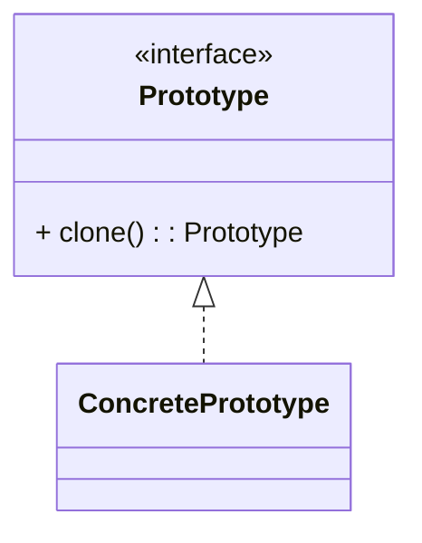
```mermaid
classDiagram
    class Prototype {
        <<interface>>
        + clone(): Prototype
    }
    class ConcretePrototype
    Prototype <|.. ConcretePrototype
```

### 示例代码
```java
class Shape implements Cloneable {
    public String type;
    @Override
    protected Shape clone() {
        try { return (Shape) super.clone(); }   // Object.clone() 为浅拷贝
        catch (CloneNotSupportedException e) { throw new RuntimeException(e); }
    }
}
```
> 注意：Java 的 `clone()` 为浅拷贝；含引用字段时建议手动深拷贝，或改用拷贝构造器 / 序列化（如 Kryo、Jackson）。

### 适用场景
- 对象创建成本高（如从数据库/网络读取后），复制比新建更划算。
- 需要动态增删产品类，或避免与具体产品类耦合的工厂层级。

### 与相似模式区别
- 与**单例**相反：单例限制唯一，原型鼓励复制。
- 与**工厂**：原型通过"自我复制"创建，无需独立的工厂类。

---

# 结构型模式详解

> 结构型模式关注"类与对象如何组合成更大结构"，以更灵活地获得新功能并保持结构清晰。

## 适配器模式（Adapter）

### 意图
将一个类的接口转换成客户希望的另一个接口，使原本因接口不兼容而不能一起工作的类可以协同。

### 结构（类图）
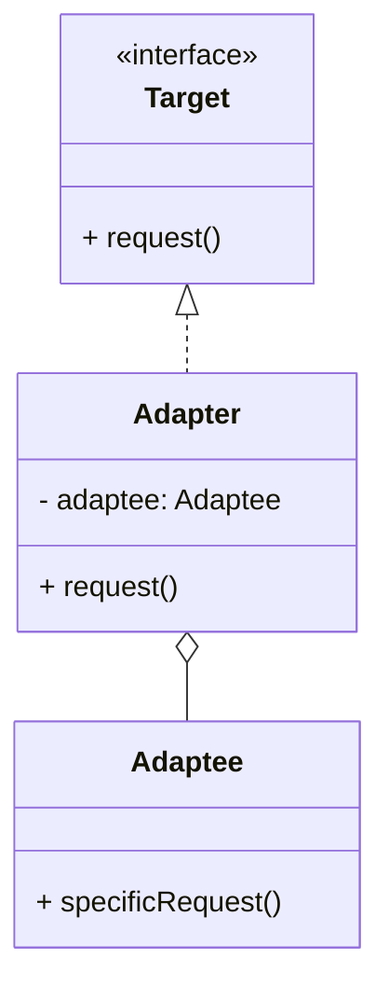
```mermaid
classDiagram
    class Target {
        <<interface>>
        + request()
    }
    class Adaptee {
        + specificRequest()
    }
    class Adapter {
        - adaptee: Adaptee
        + request()
    }
    Target <|.. Adapter
    Adapter o-- Adaptee
```

### 示例代码
```java
class Adaptee { public void specificRequest() { System.out.println("适配者原本的方法"); } }
interface Target { void request(); }
class Adapter implements Target {
    private Adaptee adaptee = new Adaptee();
    public void request() { adaptee.specificRequest(); }  // 转换调用
}
```

### 适用场景
- 复用老系统/第三方库，但其接口与当前系统不匹配。
- 需要统一多个不兼容接口的对外契约（类适配器用继承、对象适配器用组合）。

### 与相似模式区别
- 与**桥接**：适配器让两个**已有**不兼容接口协作；桥接在**设计之初**把抽象与实现解耦。
- 与**装饰器**：适配器改变接口；装饰器保持接口不变、增强功能。

## 装饰器模式（Decorator）

### 意图
动态地给一个对象添加一些额外的职责；就增加功能而言，装饰器比生成子类更为灵活。

### 结构（类图）
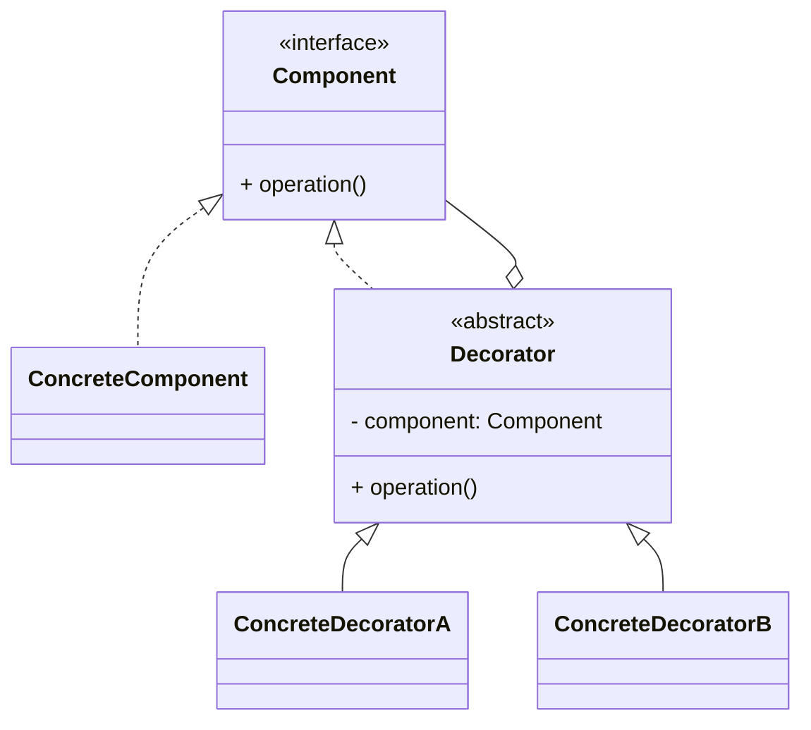
```mermaid
classDiagram
    class Component {
        <<interface>>
        + operation()
    }
    class ConcreteComponent
    class Decorator {
        <<abstract>>
        - component: Component
        + operation()
    }
    class ConcreteDecoratorA
    class ConcreteDecoratorB
    Component <|.. ConcreteComponent
    Component <|.. Decorator
    Decorator o-- Component
    Decorator <|-- ConcreteDecoratorA
    Decorator <|-- ConcreteDecoratorB
```

### 示例代码
```java
interface Coffee { double cost(); }
class SimpleCoffee implements Coffee { public double cost() { return 10; } }
abstract class CoffeeDecorator implements Coffee {
    protected Coffee coffee;
    public CoffeeDecorator(Coffee c) { this.coffee = c; }
}
class MilkDecorator extends CoffeeDecorator {
    public MilkDecorator(Coffee c) { super(c); }
    public double cost() { return coffee.cost() + 5; }
}
class SugarDecorator extends CoffeeDecorator {
    public SugarDecorator(Coffee c) { super(c); }
    public double cost() { return coffee.cost() + 2; }
}
// 使用：new SugarDecorator(new MilkDecorator(new SimpleCoffee())).cost();
```
> Java IO（`BufferedInputStream`、`DataInputStream`）即此模式的经典应用。

### 适用场景
- 需要在运行时动态、可组合地为对象增加职责，而不想用大量子类膨胀类层级。

### 与相似模式区别
- 与**适配器**：装饰器**不改接口**只加功能；适配器为兼容而**改接口**。
- 与**代理**：装饰器强调功能增强且可多层叠加；代理强调对原对象的访问控制。

## 代理模式（Proxy）

### 意图
为其他对象提供一种代理以控制对这个对象的访问。

### 结构（类图）
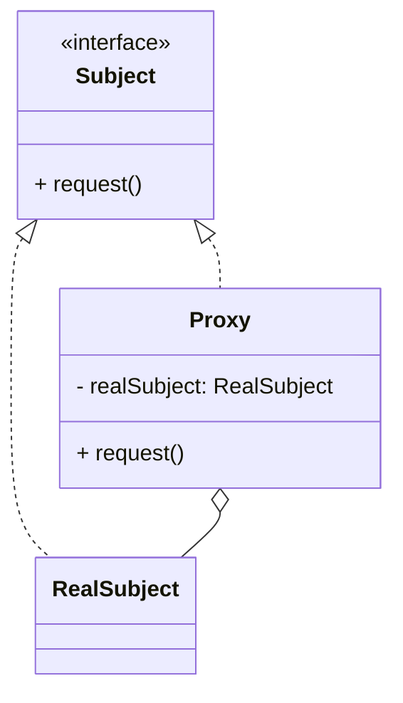
```mermaid
classDiagram
    class Subject {
        <<interface>>
        + request()
    }
    class RealSubject
    class Proxy {
        - realSubject: RealSubject
        + request()
    }
    Subject <|.. RealSubject
    Subject <|.. Proxy
    Proxy o-- RealSubject
```

### 示例代码
```java
interface Service { void request(); }
class RealService implements Service { public void request() { System.out.println("真实服务"); } }
class ProxyService implements Service {
    private RealService real;
    public void request() {
        if (real == null) real = new RealService(); // 虚拟代理：懒加载
        System.out.println("前置增强");
        real.request();
        System.out.println("后置增强");
    }
}
```
> JDK 动态代理（`java.lang.reflect.Proxy`）与 CGLIB 可消除静态代理"类爆炸"问题，是 Spring AOP 的底层基础。

### 适用场景
- 远程代理（RPC/RMI）、虚拟代理（懒加载大对象）、保护代理（权限控制）、缓存代理、AOP 增强。

### 与相似模式区别
- 与**装饰器**：代理通常在构造时确定被代理对象、偏访问控制；装饰器在运行时叠加、偏功能增强。
- 与**适配器**：代理接口与被代理对象通常一致；适配器改变接口。

## 桥接模式（Bridge）

### 意图
将抽象部分与其实现部分分离，使它们都可以独立地变化。

### 结构（类图）
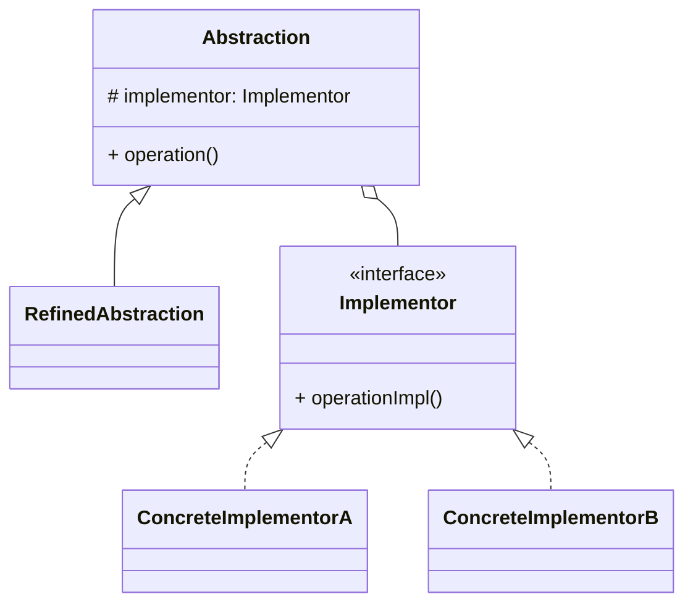
```mermaid
classDiagram
    class Abstraction {
        # implementor: Implementor
        + operation()
    }
    class RefinedAbstraction
    class Implementor {
        <<interface>>
        + operationImpl()
    }
    class ConcreteImplementorA
    class ConcreteImplementorB
    Abstraction o-- Implementor
    Abstraction <|-- RefinedAbstraction
    Implementor <|.. ConcreteImplementorA
    Implementor <|.. ConcreteImplementorB
```

### 示例代码
```java
interface DrawAPI { void draw(int x, int y); }            // 实现维度
class RedDraw implements DrawAPI { public void draw(int x, int y){ System.out.println("红点"); } }
class BlueDraw implements DrawAPI { public void draw(int x, int y){ System.out.println("蓝点"); } }

abstract class Shape {                                    // 抽象维度
    protected DrawAPI api;
    public Shape(DrawAPI api) { this.api = api; }
    public abstract void draw();
}
class Circle extends Shape {
    public Circle(DrawAPI api) { super(api); }
    public void draw() { api.draw(0, 0); }
}
```

### 适用场景
- 一个类存在两个（或多个）独立变化维度（形状×颜色、消息类型×发送渠道）。
- 避免"类爆炸"（维度乘积式继承，如 m×n 个子类）。

### 与相似模式区别
- 与**适配器**：桥接是**预先设计**解耦；适配器是事后**兼容**已有接口。
- 与**策略**：桥接结构上类似，但桥接关注结构维度拆分，策略关注算法可替换。

## 组合模式（Composite）

### 意图
将对象组合成树形结构以表示"部分-整体"的层次结构，使得用户对单个对象和组合对象的使用具有一致性。

### 结构（类图）
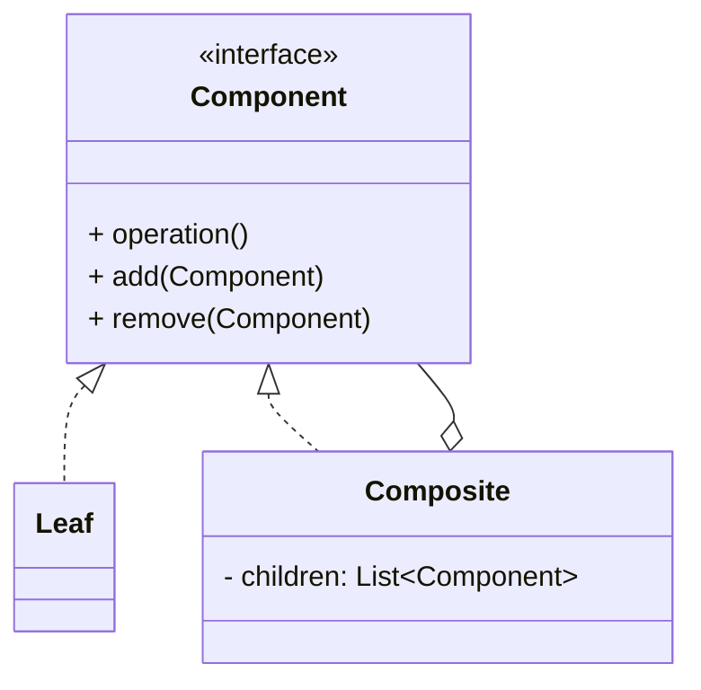
```mermaid
classDiagram
    class Component {
        <<interface>>
        + operation()
        + add(Component)
        + remove(Component)
    }
    class Leaf
    class Composite {
        - children: List~Component~
    }
    Component <|.. Leaf
    Component <|.. Composite
    Composite o-- Component
```

### 示例代码
```java
interface FileSystemNode { int getSize(); }
class File implements FileSystemNode {
    private int size;
    public File(int size) { this.size = size; }
    public int getSize() { return size; }
}
class Directory implements FileSystemNode {
    private List<FileSystemNode> children = new ArrayList<>();
    public void add(FileSystemNode n) { children.add(n); }
    public int getSize() { return children.stream().mapToInt(FileSystemNode::getSize).sum(); }
}
```

### 适用场景
- 文件系统、组织架构、菜单、DOM、UI 容器等树形结构。
- 希望客户端统一处理叶子节点与容器节点。

### 与相似模式区别
- 与**装饰器**：组合强调**树形聚合**；装饰器强调**层层包裹增强**。
- 与**享元**：组合管理结构，享元优化内存。

## 外观模式（Facade）

### 意图
为子系统中的一组接口提供一个一致的（高层）界面，使子系统更容易使用。

### 结构（类图）
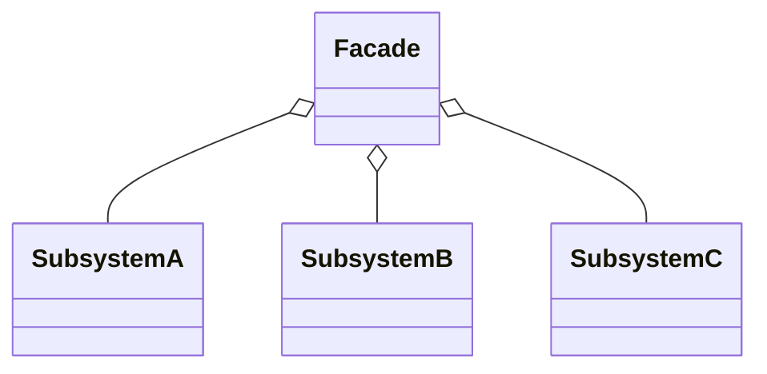
```mermaid
classDiagram
    class Facade
    class SubsystemA
    class SubsystemB
    class SubsystemC
    Facade o-- SubsystemA
    Facade o-- SubsystemB
    Facade o-- SubsystemC
```

### 示例代码
```java
class CPU { void freeze(){} void execute(){} }
class Memory { void load(){} }
class ComputerFacade {                       // 外观：封装启动细节
    private CPU cpu = new CPU();
    private Memory mem = new Memory();
    public void start() { cpu.freeze(); mem.load(); cpu.execute(); }
}
```

### 适用场景
- 复杂库/框架对外暴露精简 API；分层架构中上层只依赖下层外观。
- 希望降低模块耦合、集中调用顺序与权限控制。

### 与相似模式区别
- 与**适配器**：外观是**多对一**的简化封装；适配器是**一对一**接口转换。
- 与**中介者**：外观单向封装子系统；中介者双向协调多个同事对象。

## 享元模式（Flyweight）

### 意图
运用共享技术有效地支持大量细粒度对象的复用，从而节约内存。

### 结构（类图）
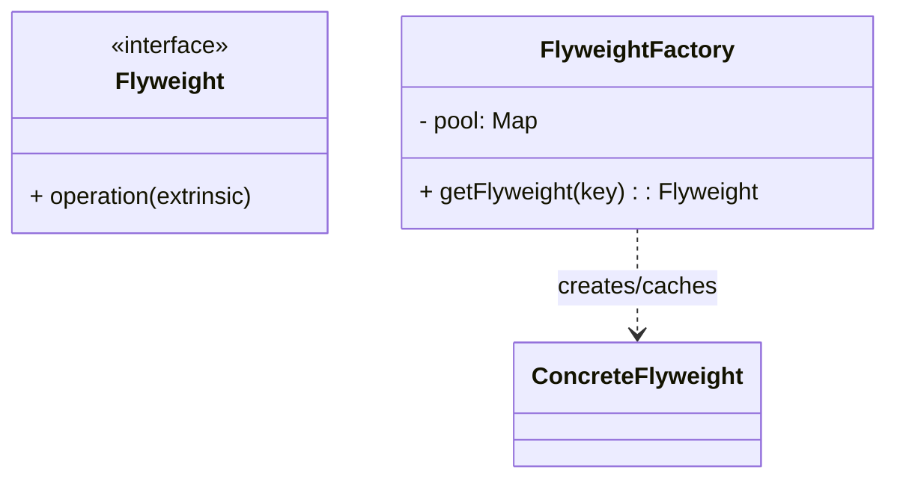
```mermaid
classDiagram
    class Flyweight {
        <<interface>>
        + operation(extrinsic)
    }
    class ConcreteFlyweight
    class FlyweightFactory {
        - pool: Map
        + getFlyweight(key): Flyweight
    }
    FlyweightFactory ..> ConcreteFlyweight : creates/caches
```

### 示例代码
```java
class TreeType {                 // 内部状态（可共享，不随场景变化）
    String name, color;
    void draw(int x, int y) { /* 使用 x,y 外部状态 */ }
}
class TreeFactory {
    private static Map<String, TreeType> pool = new HashMap<>();
    static TreeType get(String name, String color) {
        return pool.computeIfAbsent(name + color, k -> new TreeType(name, color));
    }
}
```

### 适用场景
- 存在大量相似对象、且对象可拆分为**内部状态（共享）**与**外部状态（不共享）**。
- 如字符渲染、游戏粒子、连接池、线程池。

### 与相似模式区别
- 与**单例**：享元是**多个可共享实例的池**；单例是**唯一实例**。
- 与**对象池**：思想相通；对象池强调"借还"生命周期管理，享元强调"按 key 复用"。

---

# 行为型模式详解

> 行为型模式关注"对象之间如何通信协作"，以更灵活地分配职责与算法。

## 策略模式（Strategy）

### 意图
定义一系列算法，把它们一个个封装起来，并且使它们可互相替换，使得算法可独立于使用它的客户而变化。

### 结构（类图）
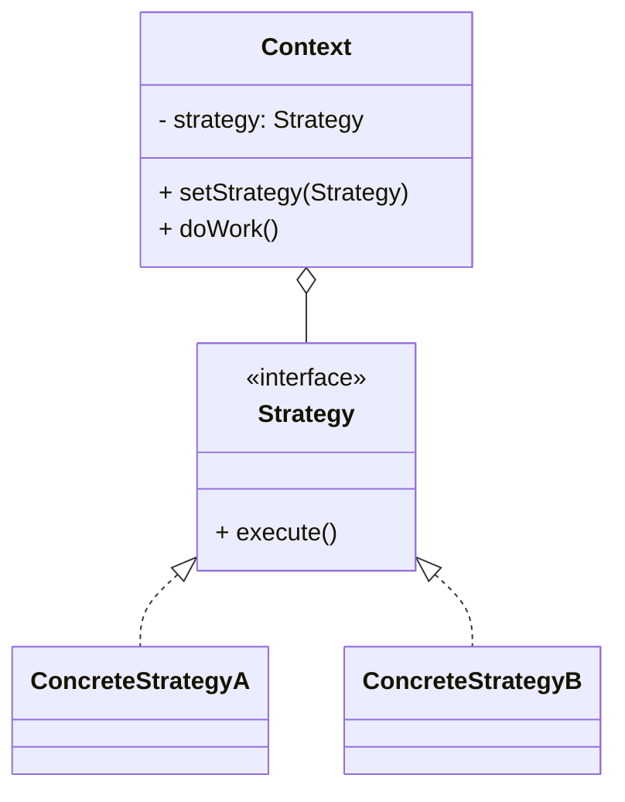
```mermaid
classDiagram
    class Strategy {
        <<interface>>
        + execute()
    }
    class ConcreteStrategyA
    class ConcreteStrategyB
    class Context {
        - strategy: Strategy
        + setStrategy(Strategy)
        + doWork()
    }
    Strategy <|.. ConcreteStrategyA
    Strategy <|.. ConcreteStrategyB
    Context o-- Strategy
```

### 示例代码
```java
interface DiscountStrategy { double calc(double price); }
class NoDiscount implements DiscountStrategy { public double calc(double p){ return p; } }
class HalfDiscount implements DiscountStrategy { public double calc(double p){ return p * 0.5; } }
class Cart {
    private DiscountStrategy strategy;
    public void setStrategy(DiscountStrategy s){ this.strategy = s; }
    public double checkout(double p){ return strategy.calc(p); }
}
```

### 适用场景
- 一个行为有多种可互换算法（排序、压缩、校验、促销）。
- 避免大量 if/else 或 switch 分支。

### 与相似模式区别
- 与**状态**：策略由**客户端主动选择**算法；状态由**对象内部状态自动切换**行为。
- 与**桥接**：桥接偏结构维度，策略偏算法替换。

## 观察者模式（Observer）

### 意图
定义对象间的一种一对多依赖关系，当一个对象状态发生改变时，所有依赖它的对象都得到通知并自动更新。

### 结构（类图）
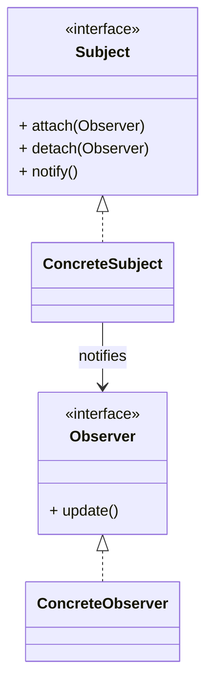
```mermaid
classDiagram
    class Subject {
        <<interface>>
        + attach(Observer)
        + detach(Observer)
        + notify()
    }
    class ConcreteSubject
    class Observer {
        <<interface>>
        + update()
    }
    class ConcreteObserver
    Subject <|.. ConcreteSubject
    Observer <|.. ConcreteObserver
    ConcreteSubject --> Observer : notifies
```

### 示例代码
```java
interface Observer { void update(String msg); }
class NewsAgency {                         // 主题
    private List<Observer> obs = new ArrayList<>();
    void add(Observer o){ obs.add(o); }
    void publish(String m){ obs.forEach(o -> o.update(m)); }
}
```

### 适用场景
- 事件总线、发布订阅、Model-View 数据绑定、消息通知。

### 与相似模式区别
- 与**中介者**：观察者对象间**松耦合**靠主题通知；中介者让对象**不直接引用**彼此，经中介协调。
- 与**责任链**：观察者**多接收者并行**通知；责任链**单请求串行**传递。

## 模板方法模式（Template Method）

### 意图
定义一个操作中的算法骨架，而将一些步骤延迟到子类中，使得子类可以不改变算法结构即可重定义该算法的某些特定步骤。

### 结构（类图）
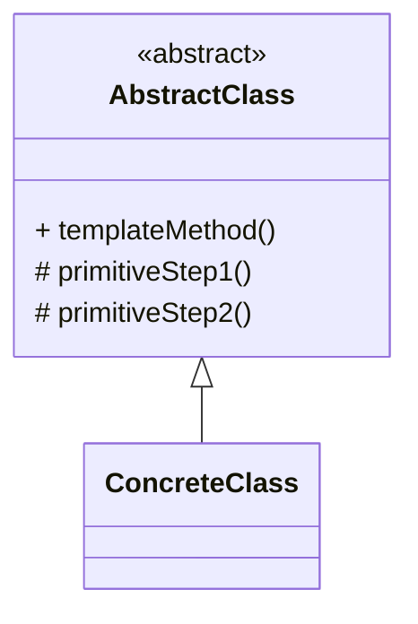
```mermaid
classDiagram
    class AbstractClass {
        <<abstract>>
        + templateMethod()
        # primitiveStep1()
        # primitiveStep2()
    }
    class ConcreteClass
    AbstractClass <|-- ConcreteClass
```

### 示例代码
```java
abstract class Beverage {
    final void prepare() {                  // 模板方法（final 防子类破坏流程）
        boil();
        brew();
        if (wantsCondiment()) add();        // 钩子方法
    }
    abstract void brew();
    void boil() { System.out.println("烧水"); }
    boolean wantsCondiment() { return true; }  // 钩子：子类可覆盖
    abstract void add();
}
```

### 适用场景
- 多个子类有相同算法流程、仅个别步骤不同（数据导入、报告生成、单元测试 setUp/tearDown）。

### 与相似模式区别
- 与**策略**：模板方法用**继承**复用流程；策略用**组合**替换算法。
- 与**建造者**：模板方法流程图固定；建造者步骤可灵活组合。

## 命令模式（Command）

### 意图
将一个请求封装为一个对象，从而使你可用不同的请求、队列或日志来参数化其他对象，并支持可撤销操作。

### 结构（类图）
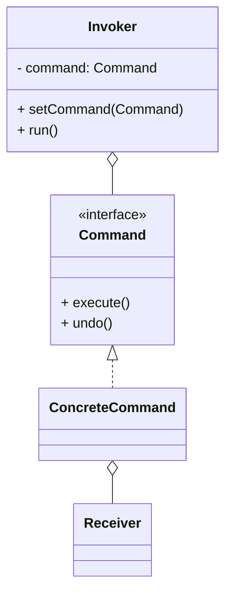
```mermaid
classDiagram
    class Command {
        <<interface>>
        + execute()
        + undo()
    }
    class ConcreteCommand
    class Receiver
    class Invoker {
        - command: Command
        + setCommand(Command)
        + run()
    }
    Command <|.. ConcreteCommand
    ConcreteCommand o-- Receiver
    Invoker o-- Command
```

### 示例代码
```java
interface Command { void execute(); void undo(); }
class LightOnCommand implements Command {
    private Light light;
    public void execute(){ light.on(); }
    public void undo(){ light.off(); }
}
class RemoteControl {                       // 调用者
    private Command slot;
    void setCommand(Command c){ slot = c; }
    void press(){ slot.execute(); }
}
```

### 适用场景
- 撤销/重做、事务、任务队列、宏命令、GUI 按钮动作绑定。

### 与相似模式区别
- 与**策略**：命令把"动作+参数"封装成对象，强调**发送者与执行者解耦**与可记录；策略强调算法替换。
- 与**观察者**：命令主动触发；观察者被动通知。

## 责任链模式（Chain of Responsibility）

### 意图
使多个对象都有机会处理请求，从而避免请求的发送者与接收者之间的耦合，将这些对象连成一条链，并沿着链传递请求直到被处理。

### 结构（类图）
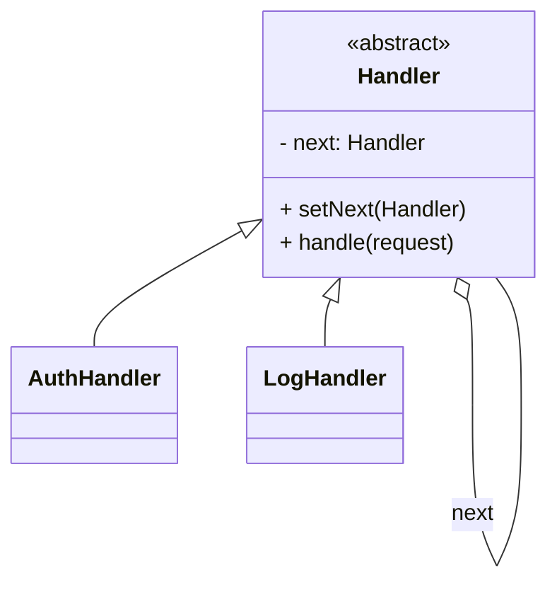
```mermaid
classDiagram
    class Handler {
        <<abstract>>
        - next: Handler
        + setNext(Handler)
        + handle(request)
    }
    class AuthHandler
    class LogHandler
    Handler <|-- AuthHandler
    Handler <|-- LogHandler
    Handler o-- Handler : next
```

### 示例代码
```java
abstract class Handler {
    protected Handler next;
    void setNext(Handler n){ this.next = n; }
    abstract void handle(String req);
}
class AuthHandler extends Handler {
    void handle(String req){
        if (req.equals("auth")) System.out.println("鉴权通过");
        else if (next != null) next.handle(req);   // 传递给下一节点
    }
}
```

### 适用场景
- 审批流、过滤器链（Servlet Filter、Netty Pipeline）、日志分级、中间件（责任树为变体）。

### 与相似模式区别
- 与**装饰器**：责任链**传递请求**直到处理；装饰器**逐层增强**返回同一对象。
- 与**观察者**：责任链是**单请求串行**；观察者**一对多广播**。

## 状态模式（State）

### 意图
允许一个对象在其内部状态改变时改变它的行为，对象看起来似乎修改了它所属的类。

### 结构（类图）
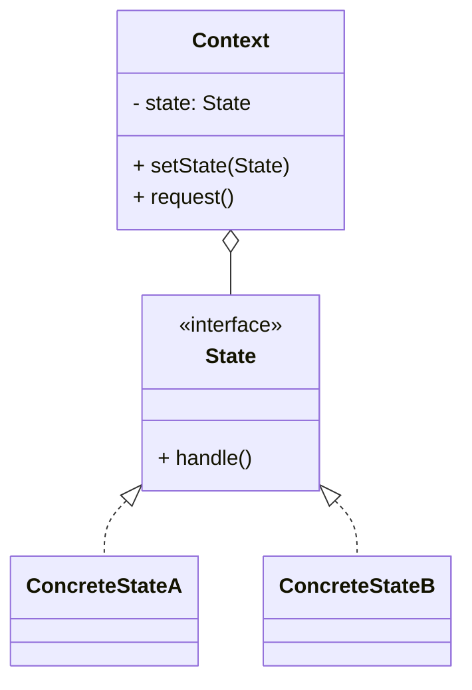
```mermaid
classDiagram
    class State {
        <<interface>>
        + handle()
    }
    class ConcreteStateA
    class ConcreteStateB
    class Context {
        - state: State
        + setState(State)
        + request()
    }
    State <|.. ConcreteStateA
    State <|.. ConcreteStateB
    Context o-- State
```

### 示例代码
```java
interface State { void handle(Context c); }
class IdleState implements State {
    public void handle(Context c){ System.out.println("开始运行"); c.setState(new RunningState()); }
}
class RunningState implements State {
    public void handle(Context c){ System.out.println("暂停"); c.setState(new PausedState()); }
}
class Context {
    private State state = new IdleState();
    void setState(State s){ state = s; }
    void request(){ state.handle(this); }    // 行为随状态自动切换
}
```

### 适用场景
- 对象行为依赖状态且状态多、转换复杂（订单状态机、电梯、游戏角色状态、TCP 连接）。

### 与相似模式区别
- 与**策略**：状态**内部自动切换**；策略**由客户端指定**且不自动变换。
- 与**责任链**：状态通常只有一个当前状态对象；责任链有多个处理者串联。

## 访问者模式（Visitor）

### 意图
表示一个作用于某对象结构中的各元素的操作，使得可以在不改变各元素的类的前提下定义作用于这些元素的新操作。

### 结构（类图）
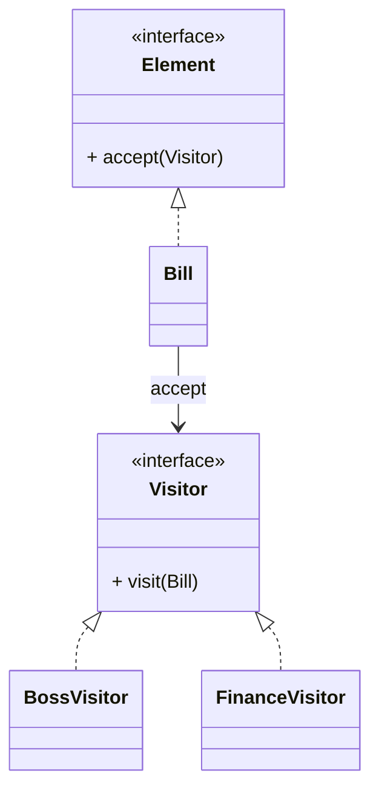
```mermaid
classDiagram
    class Element {
        <<interface>>
        + accept(Visitor)
    }
    class Bill
    class Visitor {
        <<interface>>
        + visit(Bill)
    }
    class BossVisitor
    class FinanceVisitor
    Element <|.. Bill
    Visitor <|.. BossVisitor
    Visitor <|.. FinanceVisitor
    Bill --> Visitor : accept
```

### 示例代码
```java
interface Visitor { void visit(Bill b); }
class Bill {                              // 元素（原始数据稳定不变）
    double amount;
    public void accept(Visitor v){ v.visit(this); }
}
class BossVisitor implements Visitor {    // 老板视角
    public void visit(Bill b){ System.out.println("总收入:" + b.amount); }
}
class FinanceVisitor implements Visitor { // 财务视角
    public void visit(Bill b){ System.out.println("税前:" + b.amount); }
}
```

### 适用场景
- 对象结构稳定、但**操作频繁变化**（编译器 AST、报表统计、账单多视角查看）。

### 与相似模式区别
- 与**策略**：访问者针对**多种元素类型**集中定义操作；策略只针对单一行为的算法替换。
- 与**迭代器**：访问者边遍历边操作；迭代器只负责遍历。

## 中介者模式（Mediator）

### 意图
用一个中介对象来封装一系列的对象交互，使得各对象不需要显式地相互引用，从而降低耦合，并可以独立改变它们之间的交互。

### 结构（类图）
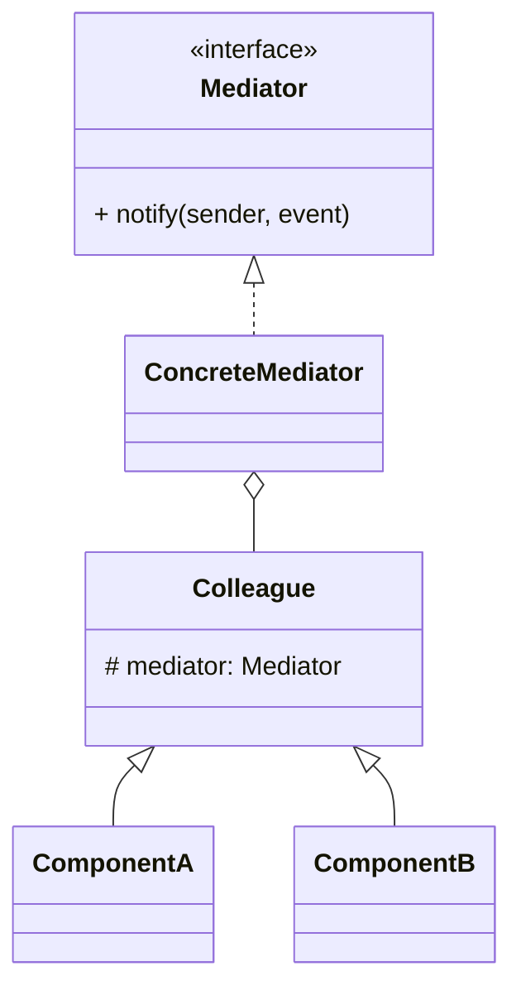
```mermaid
classDiagram
    class Mediator {
        <<interface>>
        + notify(sender, event)
    }
    class ConcreteMediator
    class Colleague {
        # mediator: Mediator
    }
    class ComponentA
    class ComponentB
    Mediator <|.. ConcreteMediator
    Colleague <|-- ComponentA
    Colleague <|-- ComponentB
    ConcreteMediator o-- Colleague
```

### 示例代码
```java
interface Mediator { void notify(Colleague s, String e); }
class ChatRoom implements Mediator {        // 中介者集中协调
    public void notify(Colleague s, String e){ System.out.println(s.name + ":" + e); }
}
abstract class Colleague {
    String name; Mediator m;
    Colleague(Mediator m, String n){ this.m = m; this.name = n; }
}
```

### 适用场景
- UI 控件的联动（表单校验、按钮启用）、聊天室、空中交通管制、微服务编排。

### 与相似模式区别
- 与**观察者**：中介者**双向/集中协调**；观察者**单向广播**且订阅关系松散。
- 与**外观**：中介者双向交互；外观单向封装。

## 迭代器模式（Iterator）

### 意图
提供一种方法顺序访问一个聚合对象中的各个元素，而又不暴露该对象的内部表示。

### 结构（类图）
```mermaid
classDiagram
    class Iterator {
        <<interface>>
        + hasNext(): boolean
        + next(): Object
    }
    class ConcreteIterator
    class Aggregate {
        <<interface>>
        + createIterator(): Iterator
    }
    class ConcreteAggregate
    Aggregate <|.. ConcreteAggregate
    Iterator <|.. ConcreteIterator
    ConcreteAggregate ..> ConcreteIterator : creates
```

### 示例代码
```java
interface Iterator<T> { boolean hasNext(); T next(); }
class NameIterator implements Iterator<String> {
    private String[] names; private int idx;
    NameIterator(String[] n){ names = n; }
    public boolean hasNext(){ return idx < names.length; }
    public String next(){ return names[idx++]; }
}
```

### 适用场景
- 自定义集合遍历（Java 的 `Iterable`/`Iterator`、foreach、Stream），隐藏底层数据结构。

### 与相似模式区别
- 与**访问者**：迭代器只遍历；访问者在遍历上施加操作且支持不同操作。
- 与**组合**：组合常配合迭代器遍历树。

## 备忘录模式（Memento）

### 意图
在不破坏封装性的前提下，捕获一个对象的内部状态，并在该对象之外保存这个状态，以便以后恢复。

### 结构（类图）
```mermaid
classDiagram
    class Originator {
        + save(): Memento
        + restore(Memento)
    }
    class Memento
    class Caretaker {
        - history: List~Memento~
    }
    Originator ..> Memento : creates
    Caretaker o-- Memento
```

### 示例代码
```java
class Editor {
    private String text;
    Memento save(){ return new Memento(text); }
    void restore(Memento m){ this.text = m.getState(); }
    static class Memento {                  // 私有内部类，保护封装
        private String state;
        Memento(String s){ state = s; }
        String getState(){ return state; }
    }
}
```

### 适用场景
- 撤销/重做、事务回滚、游戏存档、编辑器快照。

### 与相似模式区别
- 与**命令**：备忘录只存状态；命令存"动作"并可反向执行（undo）。
- 与**原型**：备忘录有意隐藏状态；原型暴露克隆。

## 解释器模式（Interpreter）

### 意图
给定一个语言，定义它的文法的一种表示，并定义一个解释器，该解释器使用该表示来解释语言中的句子。

### 结构（类图）
```mermaid
classDiagram
    class Expression {
        <<interface>>
        + interpret(ctx): boolean
    }
    class TerminalExpression
    class NonTerminalExpression
    Expression <|.. TerminalExpression
    Expression <|.. NonTerminalExpression
```

### 示例代码
```java
interface Expression { boolean interpret(String ctx); }
class TerminalExpression implements Expression {     // 终结符
    private String data;
    public TerminalExpression(String d){ data = d; }
    public boolean interpret(String ctx){ return ctx.contains(data); }
}
```

### 适用场景
- 规则引擎、正则表达式、SQL 解析、配置表达式、小型 DSL。**工程上复杂文法更推荐 ANTLR 等生成器。**

### 与相似模式区别
- 与**访问者**：解释器定义文法结构并解释执行；访问者对已有结构追加操作。
- 与**组合**：解释器常用组合表示语法树。

---

# SOLID 原则与设计模式关系

SOLID 是设计模式的"价值观"，模式是原则的具体落地。对应关系如下：

| 原则 | 含义 | 典型支撑模式 |
| --- | --- | --- |
| 单一职责 (SRP) | 一个类一个变更原因 | 外观、中介者（收敛职责）、命令（隔离请求） |
| 开闭 (OCP) | 对扩展开放、对修改关闭 | 策略、装饰器、观察者、模板方法、抽象工厂 |
| 里氏替换 (LSP) | 子类可替换父类而不出错 | 策略、状态、装饰器（均依赖抽象替换） |
| 接口隔离 (ISP) | 依赖最小接口 | 适配器、外观、桥接 |
| 依赖倒置 (DIP) | 依赖抽象而非细节 | 工厂方法、抽象工厂、建造者、桥接、观察者 |

> 记忆口诀：模式是"术"，SOLID 是"道"。优先满足原则，再选用模式；不要为用模式而违反原则。GoF 经典建议：**"Favor composition over inheritance（优先使用组合而非继承）"**，多数行为型与结构型模式都体现了这一点。

---

# 模式选型决策表

| 你的诉求 | 优先考虑的模式 |
| --- | --- |
| 控制实例数量 | 单例 |
| 屏蔽复杂构造过程 | 建造者、工厂方法、抽象工厂 |
| 复制已有对象更高效 | 原型 |
| 接口不兼容需打通 | 适配器 |
| 运行时动态增强功能 | 装饰器 |
| 控制对象访问 / 懒加载 / AOP | 代理 |
| 多维度独立变化 | 桥接 |
| 树形部分-整体结构 | 组合 |
| 简化庞大子系统调用 | 外观 |
| 大量细粒度对象省内存 | 享元 |
| 算法可互换 | 策略 |
| 一对多事件通知 | 观察者 |
| 固定流程、可变步骤 | 模板方法 |
| 请求封装 / 撤销 | 命令 |
| 多处理器接力 | 责任链 |
| 状态驱动行为 | 状态 |
| 稳定结构 + 易变操作 | 访问者 |
| 对象交互解耦 | 中介者 |
| 自定义遍历 | 迭代器 |
| 状态快照恢复 | 备忘录 |
| 解析领域语言 | 解释器 |

---

# 反模式与过度设计

## 常见反模式
- **上帝类（God Class）**：一个类承担过多职责，违反 SRP，难以测试与维护。
- **霰弹式修改（Shotgun Surgery）**：一处需求变更需改动多处，说明职责分散。
- **循环依赖**：模块互相引用，违背 DIP 与迪米特法则。
- **硬编码依赖**：直接 `new` 具体类，无法替换/测试。
- **重复的 if/else 分支**：本可用策略 / 状态 / 责任链消除。

## 过度设计的信号
- 用五六个类解决一个 `if` 能搞定的问题（如给只有一个实现的地方硬上抽象工厂）。
- 提前引入扩展性，但需求半年不变 —— **YAGNI（You Aren't Gonna Need It）**。
- 滥用单例导致全局可变状态、难以并发与测试。
- 为"显得专业"而堆砌模式，反而增加理解成本。

## 实践建议
1. **先朴素实现，再重构引入模式**（三次重复后再抽象）。
2. 优先组合而非继承。
3. 以**可测试性**为标尺：难测试往往意味着耦合过重。
4. 模式服务于业务清晰度，而非相反。
