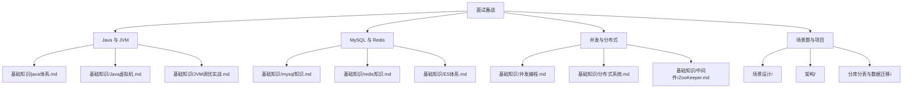

# 面试备战 · 板块导航

> 后端工程师的「八股」不是死记硬背，而是**把地基知识用面试官的方式重新组织**——从"会用"到"讲清原理、对比取舍、说清踩坑"。
> 本板块直接对齐一个目标：**后端学习以面试为导向**，把仓库里散落的原理、源码、场景，收口成一套可上场的复习体系。

---

## 一、板块定位：三层备战法

面试考察的不是单一知识点，而是**知识的三层结构**：

| 层 | 名称 | 考察什么 | 本板块对应文档 | 仓库关联 |
|----|------|----------|----------------|----------|
| L1 | **八股精读** | 知识广度与原理深度（"HashMap 为什么用红黑树？"） | `Java与JVM八股精讲` `MySQL与Redis八股精讲` `并发与分布式八股精讲` `操作系统与网络八股精讲` `消息队列八股精讲` | 基础知识 / 中间件 / 源码系列 |
| L2 | **场景题** | 知识运用与权衡（"设计一个短链系统"） | `场景题与项目深挖` | 场景设计 / 架构 / 分库分表 |
| L3 | **项目深挖** | 个人差异化与复盘（"你这个项目最难的点？"） | `场景题与项目深挖` | 你自己的项目仓库 |

> **口诀：八股打底、场景练手、项目见真章；原理→对比→踩坑→升华，四步一套才完整。**

---

## 二、复习路线图（按模块映射到本仓库）

> 面试复习不是从零造轮子，而是**顺着本仓库已有板块做"收敛式回顾"**。下面每个模块都指向仓库里更深的正文。

**推荐节奏（渐进式，不要一次性赶工）：**
1. 第一轮：通读本板块 4 篇八股，建立"高频考点"肌肉记忆；
2. 第二轮：遇到不懂的，回到 `基础知识/` 对应长文深读（如 HashMap 回到 `java体系.md`）；
3. 第三轮：刷场景题，把 `场景设计/` 46 篇当成题库；
4. 第四轮：精修简历项目，按 `场景题与项目深挖` 的追问清单自问自答。

---

## 三、考点地图（按出现频率排序）

| 模块 | 高频考点 | 难度 | 对应文档 | 仓库深读 |
|------|----------|------|----------|----------|
| Java | HashMap 底层 / 扩容 / 1.8 优化 | ⭐⭐ | Java与JVM八股精讲 | java体系.md |
| Java | String 常量池 / intern | ⭐ | Java与JVM八股精讲 | java体系.md |
| JVM | 类加载双亲委派 / 打破 | ⭐⭐⭐ | Java与JVM八股精讲 | Java虚拟机.md |
| JVM | GC 算法 / G1 vs ZGC | ⭐⭐⭐ | Java与JVM八股精讲 | JVM调优实战.md |
| JVM | JMM / happens-before | ⭐⭐⭐ | Java与JVM八股精讲 | 并发编程.md |
| MySQL | 索引 B+树 / 覆盖索引 / 最左前缀 | ⭐⭐⭐ | MySQL与Redis八股精讲 | mysql知识.md |
| MySQL | 事务隔离 / MVCC / UndoLog | ⭐⭐⭐ | MySQL与Redis八股精讲 | mysql知识.md |
| MySQL | 锁 / 间隙锁 / 死锁 | ⭐⭐⭐ | MySQL与Redis八股精讲 | mysql知识.md |
| MySQL | Redo/Undo/Binlog 两阶段提交 | ⭐⭐⭐ | MySQL与Redis八股精讲 | mysql知识.md |
| Redis | 数据结构与底层编码 | ⭐⭐ | MySQL与Redis八股精讲 | redis知识.md |
| Redis | 缓存三大问题（击穿/穿透/雪崩） | ⭐⭐⭐ | MySQL与Redis八股精讲 | redis知识.md |
| Redis | 缓存一致性 / 分布式锁 | ⭐⭐⭐ | MySQL与Redis八股精讲 | redis知识.md |
| 并发 | synchronized 锁升级 | ⭐⭐⭐ | 并发与分布式八股精讲 | 并发编程.md |
| 并发 | volatile 语义（可见/有序/不原子） | ⭐⭐ | 并发与分布式八股精讲 | 并发编程.md |
| 并发 | 线程池参数 / Executors 隐患 | ⭐⭐⭐ | 并发与分布式八股精讲 | 并发编程.md |
| 并发 | AQS / CAS / ABA | ⭐⭐⭐ | 并发与分布式八股精讲 | 并发编程.md |
| 分布式 | CAP / BASE / 一致性模型 | ⭐⭐ | 并发与分布式八股精讲 | 分布式系统.md |
| 分布式 | 分布式锁对比（Redis/ZK/etcd） | ⭐⭐⭐ | 并发与分布式八股精讲 | 中间件/ZooKeeper.md |
| 分布式 | 分布式事务（2PC/TCC/Saga/消息） | ⭐⭐⭐ | 并发与分布式八股精讲 | 架构/分布式事务实战.md |
| 分布式 | 分布式 ID（雪花/号段/Leaf） | ⭐⭐ | 并发与分布式八股精讲 | 中间件/ |
| 操作系统 | 进程/线程/协程、虚拟内存/分页/缺页、死锁、IO模型/零拷贝 | ⭐⭐⭐ | 操作系统与网络八股精讲 | 操作系统.md |
| 网络 | TCP握手挥手/拥塞、HTTP状态码/HTTPS-TLS、HTTP2/3/QUIC | ⭐⭐⭐ | 操作系统与网络八股精讲 | 网络.md / 网络协议深挖.md |
| 消息队列 | 为什么用MQ/对比/丢失防法/重复幂等/顺序/积压/事务消息 | ⭐⭐⭐ | 消息队列八股精讲 | 中间件/Kafka · RocketMQ |
| 真题 | 大厂高频问答（Java/MySQL/Redis/并发/分布式/网络/MQ/场景） | ⭐⭐⭐ | 大厂真题与标准答 | 全部八股文档 |
| 场景 | 短链 / 排行榜 / 秒杀 / 限流 | ⭐⭐⭐ | 场景题与项目深挖 | 场景设计/ |
| 项目 | STAR + 技术深度追问 | ⭐⭐⭐ | 场景题与项目深挖 | 你的项目 |

---

## 四、答题方法论（四步一套）

无论是八股还是场景题，统一用这套结构，比"想到哪说到哪"得分高一个档次：

1. **原理（What & Why）**：先给定义，再讲底层机制。例："HashMap 在 JDK8 链表长度 ≥8 且数组容量 ≥64 时转红黑树，是为了把最坏查询从 O(n) 降到 O(log n)。"
2. **对比（Trade-off）**：横向比方案。例："为什么不用二叉搜索树？树高过高退化成链表；为什么不用 AVL？插入删除旋转成本高；红黑树是查询与维护的平衡点。"
3. **踩坑（Pitfall）**：说一个真实雷区。例："初始容量设太小会频繁 resize，扩容要 rehash 全量元素，批量导入应先 `new HashMap(expectedSize/0.75f + 1)`。"
4. **升华（Scale/Extend）**：把话题拉到更高维度。例："单机 HashMap 到 `ConcurrentHashMap`，再到分布式 `Redis/分片`，本质都是在解决'并发×容量×一致性'三角。"

> **口诀：先原理、再对比、甩踩坑、最后升华；答不全就说边界，别编。**

---

## 五、与其他板块的关联

- **八股 ← 基础知识**：本板块是"索引"，`基础知识/` 是"正文"。八股背不住原理时，回 `java体系.md` / `mysql知识.md` / `Java虚拟机.md` 深读。
- **场景题 ← 场景设计 / 架构**：`场景设计/` 已有 46 篇高并发系统设计实战，`架构/` 有分布式事务/容灾多活，是场景题的"标准答案库"。
- **并发/分布式八股 ← 中间件 / 源码系列**：分布式锁、ZK、etcd、RocketMQ 事务消息的底层，在 `中间件/` 与 `源码系列/` 有源码级展开。
- **项目深挖 ← 你自己的仓库**：把 NL-to-SQL 平台、macOS Workbench、安卓记账 APP 当成"项目素材库"，用本板块的追问清单打磨。

---

[← 返回首页](../README.md)
