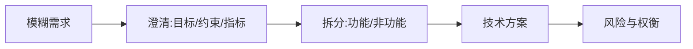

# 产品与技术协作面试精讲

> 高阶工程师不仅要会写代码，还要能和产研高效协作：把模糊需求翻译成技术方案、评估可行性、权衡取舍、管理预期。面试中常通过"需求拆解""技术选型辩论""排期与风险"考察综合素养。

## 1. 需求拆解

- **先问为什么**：业务目标比功能列表更重要。
- **量化指标**：延迟、成本、用户数，而非"要好"。
- **边界与异常**：正常路径之外是什么。

## 2. 可行性评估

- 技术可行性：现有能力能否支撑。
- 成本可行性：研发/资源/时间。
- 风险可行性：合规、稳定性、依赖。
- 给出"能做/不做/分期做"的明确结论。

## 3. 权衡表达

| 维度 | 取舍示例 |
| --- | --- |
| 速度 vs 质量 | 先 MVP 后打磨 |
| 一致 vs 可用 | 最终一致换吞吐 |
| 自研 vs 复用 | 非核心复用 |

- 用"如果…那么…"表达权衡，而非非黑即白。

## 4. 排期与风险

- 拆解任务 + 依赖识别 + 关键路径。
- 识别风险点，提前预案。
- 管理预期：明确"不确定项"和"需联调"。

## 5. 常见考察题

1. 给你一个需求，怎么落地？
2. 时间紧功能多，如何取舍？
3. 技术方案被产品否了怎么办？
4. 如何评估一个需求的优先级？
5. 跨团队依赖卡住怎么推进？

## 6. 答题框架

- STAR + 结构化：目标 → 拆解 → 方案 → 权衡 → 风险。
- 体现"主动沟通、结果导向、技术判断力"。

## 7. 小结

协作面试 = 需求拆解 + 可行性 + 权衡 + 风险。核心是"用结构化思维把模糊变清晰、把技术语言翻译成业务价值"。
