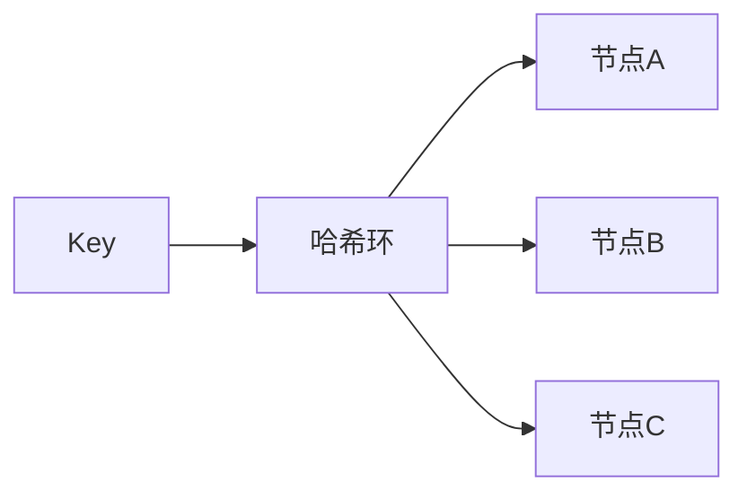

# 分布式与微服务面试实战（Distributed & Microservices Interview）

> 配套：[并发与分布式八股精讲](并发与分布式八股精讲.md) · [系统设计面试实战](系统设计面试实战.md) · [架构/分布式系统核心问题](../架构/分布式系统核心问题.md)
> 分布式与微服务是中高级后端面试的"深水区"。本文按"概念 → 痛点 → 方案 → 对比"组织，给出可口述的答题骨架。

---

## 一、为什么需要分布式

单机瓶颈：CPU/内存/磁盘/连接终有上限；高可用要求无单点。分布式用**多机协作**突破单机并消除单点，但引入：网络不可靠、部分失败、无全局时钟、一致性难题。

> 核心代价：**分布式系统的复杂度，本质是"失败成为常态"带来的**。详见[分布式系统核心问题](../架构/分布式系统核心问题.md)（CAP/共识/时钟）。

---

## 二、CAP 与 BASE（开口即答）

- **CAP**：分区发生时 C 与 A 二选一，P 必选 → 选 CP 或 AP；
- **BASE**：基本可用 + 软状态 + 最终一致，是 AP 的工程落地；
- 实战：**关键路径强一致（CP），非关键最终一致（AP）**。

---

## 三、分布式 ID / 发号器

| 方案 | 优点 | 缺点 | 适用 |
|------|------|------|------|
| UUID | 无中心、简单 | 无序、长、索引差 | 非业务主键 |
| 雪花 Snowflake | 趋势递增、短 | 时钟回拨问题 | 多数场景 |
| 号段 Segment | 数据库批量取段、可控 | 依赖 DB | 内部系统 |
| Redis/Ledis 自增 | 简单 | 可靠性依赖 Redis | 中低要求 |

> 雪花时钟回拨：用 `lastTimestamp` 校验 + 等待/扩展位兜底（见[高并发·热点](../架构/高并发架构实战.md)）。

---

## 四、分布式锁

| 方案 | 优点 | 缺点 |
|------|------|------|
| Redis SET NX + 过期 | 简单、快 | 过期时间内未释放→误删；需看门狗续期 |
| Redlock | 多节点容错 | 争议（时钟假设）；实现复杂 |
| ZooKeeper 临时节点 | 会话断开自动释放、可靠 | 依赖 ZK、较重 |
| 数据库唯一约束 | 简单 | 性能差、DB 压力 |

> 关键三问：**谁释放（防误删他人锁）→ 用唯一 token + Lua 原子释放**；**过期了任务没跑完怎么办 → 看门狗续期**；**获取不到怎么办 → 自旋/排队/直接失败**。

---

## 五、分布式事务

| 方案 | 一致性 | 复杂度 | 适用 |
|------|--------|--------|------|
| 2PC | 强一致 | 高（阻塞、单点） | 短事务、强一致诉求 |
| TCC | 最终一致 | 高（三方法手写） | 高并发、可补偿 |
| Saga | 最终一致 | 中（长事务拆分） | 跨多服务长流程 |
| 本地消息表 / 事务发件箱 | 最终一致 | 低（同库事务） | 最常见、易落地 |

> 选型心法：**能最终一致就别强一致**；大多数业务用「本地事务 + 消息/Outbox + 幂等消费 + 对账」即可。详见[分布式事务实战](../架构/分布式事务实战.md)。

---

## 六、服务拆分与治理

- **拆分依据**：业务变化原因一致、独立演进、独立团队 ownership（见[单体到微服务演进](../架构/单体到微服务演进.md)）；
- **服务发现**：注册中心（Nacos/Eureka/Consul/ZK）；
- **配置中心**：动态配置、灰度；
- **熔断/限流/降级**：保护核心链路（见[微服务治理全链路](../架构/微服务治理全链路.md)）；
- **链路追踪**：trace_id 全链路透传（见[云原生/可观测性](../云原生/可观测性.md)）。

---

## 七、一致性哈希（负载均衡 / 缓存分片）

- 普通取模：`hash(key) % N`，节点增删导致**大量 key 重新映射**；
- 一致性哈希：环上均布节点，key 映射到顺时针最近节点；节点增删只影响环上邻近区间；
- **虚拟节点**：解决数据倾斜（热点节点）。

---

## 八、幂等性（分布式必答）

- **为什么需要**：重试/重复消息/网络重发导致同请求多次到达；
- **方案**：
  - 唯一 ID + 去重表（数据库唯一约束）；
  - 乐观锁版本号（`UPDATE ... WHERE version=?`）；
  - 状态机（已处理则跳过）；
  - Token 机制（提交前发令牌，提交即消费）。

---

## 九、经典场景题

### 9.1 如何保证消息不丢不重？
- 不丢：生产者确认 + 持久化 + 消费者手动 ACK + 重试；
- 不重：消费者幂等（去重表/版本号）。

### 9.2 分布式缓存与 DB 双写不一致？
- 写时删缓存（或延迟双删），读未命中回源回填，最终一致 + 对账；
- 强一致要求高的走"读 DB + 短 TTL 缓存"。

### 9.3 秒杀超卖？
- Redis Lua 原子预扣 + 售罄快速失败 + MQ 异步落库（见[高并发·秒杀](../架构/高并发架构实战.md)）。

---

## 十、面试高频追问

1. Q：CAP 怎么理解？ A：分区下 C/A 二选一，P 必选；按业务选 CP/AP。
2. Q：分布式锁要注意什么？ A：唯一 token 防误删、看门狗续期防过期、获取失败策略。
3. Q：分布式事务选型？ A：能最终一致用 Outbox+Saga；强一致短事务才 2PC。
4. Q：一致性哈希解决什么？ A：节点增减只影响局部 key，避免全量重映射；虚拟节点防倾斜。
5. Q：幂等怎么实现？ A：去重表/版本号/状态机/Token，应对重试与重复消息。
6. Q：为什么最终一致优于强一致？ A：强一致代价高（延迟/可用/阻塞），多数业务可接受窗口期不一致。
7. Q：服务拆分依据？ A：变化原因一致、独立演进、独立团队 ownership，而非按技术分层。
8. Q：消息不丢不重？ A：确认+持久化+手动ACK 防丢；幂等消费防重。

---

## 十一、Cheat Sheet

| 主题 | 要点 |
|------|------|
| CAP/BASE | 分区选 C/A；AP 落地为最终一致 |
| 发号器 | 雪花（时钟回拨）、号段、UUID |
| 分布式锁 | 唯一token释放、看门狗续期 |
| 事务 | 最终一致优先（Outbox/Saga） |
| 一致性哈希 | 局部重映射、虚拟节点防倾斜 |
| 幂等 | 去重表/版本号/状态机/Token |
