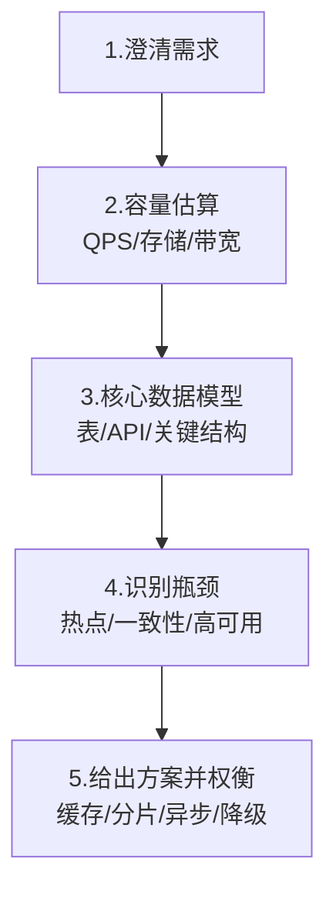

# 场景题与项目深挖

> 八股是"会不会"，场景题是"用得活不活"，项目深挖是"你到底做没做"。本篇给**答题框架 + 高频场景题套路 + 项目 STAR 追问清单**。
> 真实场景题库见 [场景设计/](../场景设计/)（46 篇高并发系统设计实战）。

---

## 一、场景题通用答题框架（五步法）

遇到"设计一个 XXX 系统"，**别急着写代码**，按以下顺序展开，面试官看的是你的拆解能力：



1. **澄清需求**：问清楚规模（日活？QPS？读写比？一致性要求？）。例："短链系统，日活百万，读多写少，允许短链生成后秒级可用。"
2. **容量估算**：用 2/8 法则算峰值 QPS，估算存储（URL 平均 100B × 万亿条？不，按年算）。
3. **数据模型**：表结构 / 核心 API（如 `POST /shorten` 返回 `abc`，`GET /abc` 302 跳转）。
4. **识别瓶颈**：热点 key、单表过大、缓存一致性、单点故障。
5. **方案+权衡**：给 2~3 套方案说取舍，别只给一个"完美方案"。

> **口诀：先问规模再设计，先画模型再优化；每步给取舍，别装全都会。**

---

## 二、高频场景题套路

### 2.1 设计短链系统（URL Shortener）

| 维度 | 要点 |
|------|------|
| 发号 | 分布式 ID（雪花/号段）或 `hash(url+盐)` 取 base62；冲突重试 |
| 存储 | `short_code → long_url` 映射，KV 或 MySQL + 短码索引 |
| 跳转 | `GET /{code}` 返回 **302**（临时重定向，可被 CDN 缓存；301 则浏览器缓存不利统计） |
| 缓存 | 热门短码放 Redis，降低 DB 压力 |
| 高可用 | 短码可预生成批量入池；DB 主从；限流防刷 |

### 2.2 设计排行榜 / 热搜（ZSet 经典）

- `ZADD board score member` + `ZREVRANGE board 0 9` 取 Top10；
- 热搜：分数 = 点击量 + 时间衰减（`score = clicks / (age+1)`），定时重算；
- 分片：按榜单维度（游戏榜/总榜）拆 key，超大体量用 `Redis Cluster` 分槽。

### 2.3 秒杀系统（综合考点）

```
请求 → 静态资源CDN → 网关限流(令牌桶) → 答题/风控
     → Redis 预扣库存(原子 DECR) → 库存>0 才落单
     → MQ 异步下单(削峰) → DB 最终一致
```
- **绝不**让请求直接打 DB；库存用 Redis 原子扣减，`DECR` 返回值 <0 直接返回"售罄"；
- 超卖防护：Redis Lua 脚本保证"判断+扣减"原子；
- 防超卖终极：DB 层 `UPDATE stock SET n=n-1 WHERE id=? AND n>0`，受影响行数=0 即失败。

### 2.4 分布式限流计数器

- **固定窗口**：简单但有"临界突刺"（窗口交界双倍流量）；
- **滑动窗口**：更平滑；
- **令牌桶**：允许突发（桶里有余量），`Guava RateLimiter` 实现；
- **漏桶**：恒定速率，平滑但无突发；
- 分布式：Redis + Lua 实现集群级限流（count + TTL）。

### 2.5 延迟队列（定时任务）

| 方案 | 实现 |
|------|------|
| Redis ZSet | `score=到期时间`，轮询 `ZRANGEBYSCORE` 取到期任务 |
| RabbitMQ 死信 | 消息 TTL 过期进死信队列 |
| RocketMQ 定时 | 内置延迟级别（18 级） |
| 时间轮 | Netty/HashedWheelTimer，高精度低开销 |

---

## 三、项目深挖：STAR + 追问清单

面试官问项目，本质是验证"**这活是不是你干的**"。用 STAR 组织，并预演下面的"技术深度追问"。

### 3.1 STAR 结构

- **Situation**：项目背景与痛点（一句话）
- **Task**：你的职责与目标
- **Action**：你**具体**做了什么（技术决策 + 难点）
- **Result**：量化结果（QPS 提升 X%、耗时降 Y%、稳定性 Z 个 9）

> **反例**："我负责后端开发，用 Spring Boot 写了接口。"——无任何信息量。
> **正例**："营销系统大促前压测 QPS 800 就雪崩（S）；我负责订单链路优化（T）；把同步扣库存改成 Redis 预扣+MQ 异步落库，并加了 Sentinel 熔断（A）；大促峰值 1.2w QPS 零超卖、P99 < 80ms（R）。"

### 3.2 技术深度追问清单（自问自答）

每个项目准备时，逼自己回答这 8 个问题：

| # | 追问 | 你该怎么答 |
|---|------|-----------|
| 1 | 你项目的 **QPS / 数据量** 是多少？ | 给真实数字，没有就估算并说明假设 |
| 2 | 最大难点是什么？**怎么解决**的？ | 讲一个具体技术决策与权衡 |
| 3 | 为什么选这个方案，**不选** X？ | 对比表 / 取舍理由 |
| 4 | 出过什么 **故障**？怎么排查？ | 讲一次真实排查（日志/链路/火焰图） |
| 5 | 怎么保证 **一致性 / 高可用**？ | 结合事务 / 副本 / 熔断 |
| 6 | 如果量**涨 10 倍**怎么扩展？ | 分库分表 / 缓存 / 异步化 |
| 7 | 监控报警怎么做的？ | 指标 / 链路 / 大盘 |
| 8 | 如果重做，你会**改**什么？ | 体现复盘能力，最加分 |

### 3.3 结合你的真实项目举例

> 以下基于你当前在做的项目，面试时可作"项目素材"打磨（注意不要泄露敏感业务细节）：

- **NL-to-SQL 智能问数平台（Dify + RAGFlow + Claude）**
  - 难点：自然语言"**最近几天/上个月**"等相对时间翻译成精确 SQL 时间段；
  - 技术点：LLM 节点 + 代码节点协同、RAGFlow 检索、AWS Bedrock Rerank（`numberOfResults` 参数调优）；
  - 扩展：关系表/字典表映射到 SQL 关键词的解析难点。

- **macOS 原生仪表盘 Workbench（Swift/SwiftUI/AppKit）**
  - 难点：原生性能 vs 跨平台方案取舍；SwiftUI 状态管理；
  - 体现：对"原生体验"的坚持与工程化思维。

- **安卓本地自动记账 APP（纯本地 APK）**
  - 难点：无联网下的本地存储选型（Room/SQLite）、隐私合规；
  - 体现：明确拒绝 H5/PWA，选原生方案的判断力。

> **口诀：项目讲 STAR，数字说话；八问自答透，重做见复盘；真实项目当素材，深挖不过夜。**

---

## 四、反例与踩坑总结

1. **一上来写代码**：场景题先聊设计，代码是最后 10%；
2. **只给单一方案**：永远给"主方案 + 备选 + 取舍"；
3. **编造没做过的项目**：STAR 细节一问就露馅，不如讲清小项目；
4. **忽视容量估算**：不估算就设计，等于"不看地基建楼"；
5. **一致性说死**：说"强一致"要能讲清代价，否则被追问到哑火。

---

[← 返回面试备战](../面试备战/README.md) · [Java 与 JVM 八股精讲](Java与JVM八股精讲.md)
