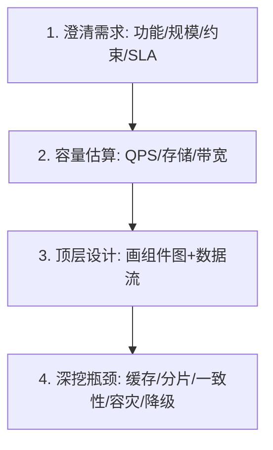

# 系统设计面试实战（System Design Interview）

> 配套：[README](README.md) · [并发与分布式八股精讲](并发与分布式八股精讲.md) · [场景题与项目深挖](场景题与项目深挖.md)
> 系统设计面试是校招/社招高阶必备，也是最容易被"背八股"带偏的环节。本文给出**通用解题框架 + 高频题型套路 + 评分要点**，让回答有结构、不漏项。

---

## 一、面试官在考察什么

系统设计面试**不是考你背出某个架构**，而是考察：
- **需求拆解能力**：功能需求 vs 非功能需求（性能/可用性/一致性/成本）；
- **权衡意识**：没有银弹，能否说清"为什么选 A 不选 B"；
- **演进思维**：从 MVP 到规模化的渐进路径，而不是一步到位；
- **边界意识**：容量、瓶颈、故障、降级是否都考虑到。

> 核心心法：**先问清楚需求再画架构，先 MVP 再演进，每步说取舍。**

---

## 二、通用解题四步法（背下来）

### 步骤 1：澄清需求（别急着画图）
- 功能范围：用户能做什么？核心用例是哪些？
- 规模：日活多少、峰值 QPS、数据量、读写比？
- 约束：延迟要求（p99）、一致性要求（强/最终）、预算？
- 非功能：可用性目标几个 9、合规要求？

### 步骤 2：容量估算（给数字才专业）
- 读多写少？计算存储：`日活 × 人均写 × 单条大小 × 留存天数`；
- 计算 QPS：`日请求 / 86400 × 峰值系数(3~5)`；
- 计算带宽、缓存命中收益（参见[高并发架构实战](../架构/高并发架构实战.md)容量公式）。

### 步骤 3：顶层设计（先粗后细）
- 画出核心组件：客户端 / 网关 / 服务 / 存储 / 缓存 / MQ；
- 标注数据流与依赖方向；
- 先给 MVP（单体+单库也能跑），再谈演进。

### 步骤 4：深挖瓶颈（展示深度）
- 热点怎么破？缓存、分片、异步、限流；
- 一致性怎么保？CAP 取舍、事务方案；
- 挂了怎么办？冗余、故障转移、降级、限流熔断；
- 怎么扩容？无状态、水平扩展。

---

## 三、高频题型套路

### 题型 1：短链/URL 生成（tinyurl）
- 需求：长 URL → 短码，可跳转、可统计；
- 核心：短码生成（发号器/哈希/Base62）、跳转 302、防遍历；
- 存储：KV 即可（Redis + 持久化），读多写少，缓存扛量；
- 坑：短码冲突、防爆破、过期清理。

### 题型 2：秒杀/抢购
- 套路见[高并发架构实战·秒杀](../架构/高并发架构实战.md)：客户端限流 → 网关令牌桶 → Redis Lua 预扣 → MQ 异步下单 → 独立集群；
- 必提：超卖防护、库存预占+超时回滚、售罄快速失败。

### 题型 3：Feed 流（朋友圈/抖音）
- 推/拉/混合：普通用户推、大 V 拉+热榜；
- 翻页用 cursor 而非 offset；读扩散 vs 写扩散权衡；
- 存储：收件箱用有序结构（Redis ZSet/时间线）。

### 题型 4：排行榜/计数器
- 实时榜：Redis ZSet（ZADD/ZREVRANGE）；
- 海量计数：分桶计数 + 定时聚合；
- 精度：先增量缓存、异步落库、对账兜底。

### 题型 5：限流器设计
- 算法：令牌桶（允许突发）/ 漏桶（平滑）/ 滑动窗口（见[高并发·限流](../架构/高并发架构实战.md)）；
- 分布式：Redis Lua 原子 + 网关本地兜底；
- 维度：按用户/IP/接口，令牌级 vs 请求级。

### 题型 6：分布式 ID / 发号器
- 雪花算法（时间戳+机器+序列）；号段模式（数据库批量取段）；
- 趋势递增 vs 无规律（防爬）；时钟回拨处理。

---

## 四、一致性方案速查（面试常问）

| 场景 | 方案 |
|------|------|
| 强一致、短事务 | 本地事务 / 2PC（慎用） |
| 跨服务最终一致 | Saga / 本地消息表 / 事务发件箱（Outbox） |
| 读多写少缓存一致 | 写时删缓存 + 延迟双删 + 对账 |
| 跨分片查询 | CQRS 读模型 / 冗余宽表 |

---

## 五、容灾与可用性（必答维度）

- **冗余**：无状态多副本、主从/多活；
- **故障转移**：健康检查 + 自动切流；
- **限流/熔断/降级**：保护核心链路；
- **可回滚**：灰度发布 + 回滚预案；
- **可观测**：Metrics/Log/Trace 三件套（见[云原生/可观测性](../云原生/可观测性.md)）。

> 可用性数学：n 个 99.9% 串联 ≈ 0.999^n。4 个依赖串联 ≈ 99.6%（差一个量级）——这就是链路要短、要加降级的原因。

---

## 六、回答评分要点（对照自检）

| 维度 | 加分项 | 减分项 |
|------|--------|--------|
| 需求 | 先澄清范围与 SLA | 拿到题直接画架构 |
| 估算 | 给数字（QPS/存储） | 全凭感觉"应该够" |
| 架构 | MVP→演进、有取舍 | 一上来全链路微服务 |
| 深度 | 点到缓存/分片/一致/容灾 | 只讲 happy path |
| 权衡 | 说清为什么选 A | 罗列所有技术无取舍 |

---

## 七、避坑清单

- ❌ 不问需求直接画图 → 先澄清；
- ❌ 一上来微服务 → 先 MVP 单体；
- ❌ 只讲正常流程 → 必讲故障/降级；
- ❌ 只背名词 → 每步说取舍与数字；
- ❌ 忽略容量 → 先估算再设计。

---

## 八、面试高频追问

1. Q：系统设计从哪开始？ A：澄清需求（功能/规模/SLA）→ 容量估算 → 顶层 MVP → 深挖瓶颈。
2. Q：短链系统核心？ A：短码生成+跳转+防遍历+缓存扛读。
3. Q：Feed 推拉怎么选？ A：普通用户推、大 V 拉+热榜混合，cursor 翻页。
4. Q：分布式限流怎么实现？ A：Redis Lua 原子令牌桶 + 网关本地兜底防 Redis 抖动。
5. Q：怎么保证高可用？ A：无状态冗余、故障转移、限流熔断降级、可回滚、可观测。
6. Q：容量怎么估算？ A：日活×人均×留存算存储，日请求/86400×峰值系数算 QPS。
7. Q：一致性怎么选？ A：核心资金强一致（本地事务），跨服务最终一致（Saga/Outbox）。
8. Q：为什么链路要短？ A：n 个 99.9% 串联≈0.999^n，链路越长可用性被乘性稀释。

---

## 九、Cheat Sheet

| 步骤 | 口诀 |
|------|------|
| 1 澄清 | 功能/规模/SLA/约束，先问再画 |
| 2 估算 | QPS/存储/带宽，给数字 |
| 3 顶层 | MVP 单体 → 演进微服务 |
| 4 深挖 | 缓存/分片/一致/容灾/降级 |
| 权衡 | 每步说为什么选 A 不选 B |
